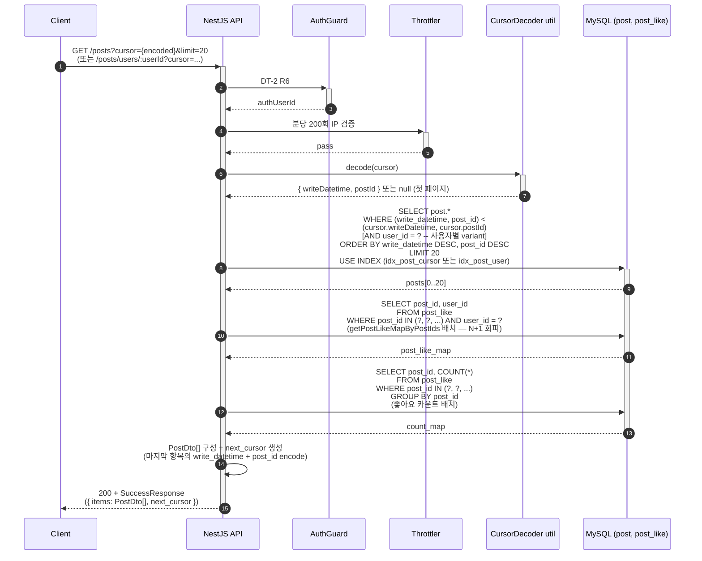

# Flow: blog-post-list

## 헤더

- flow-id: blog-post-list
- 커버 UC: UC-7 (Main Success Scenario + Extensions 1a, 2a)
- 관련 Aggregate: Post (Post Root + PostLike 배치 집계)
- runtime-behavior 참조: 없음 (단일 SELECT + 배치 좋아요 조회, 시각화 가치 낮음 — runtime-behavior.md §2 단순 단일 Aggregate 흐름 미작성 정합)
- Endpoint Variants: 전체 목록 (`GET /posts`) + 사용자별 목록 (`GET /posts/users/:userId`) — dedup 통합 (처리 단계 동일, 인덱스만 다름)

본 flow는 Phase 1 TP4 핵심 — offset 페이징에서 cursor 페이징으로 전환. `(write_datetime DESC, post_id DESC)` 복합 키 커서 사용.

## 1. 정상 흐름 (Main Success Scenario)

Cursor 인코딩 [가이드 — application-arch.md §Cursor-based Pagination]: base64url(JSON `{w: write_datetime ISO8601, p: post_id_encrypted}`). 구체 인코딩 결정은 implementation-guide.md §8.1 Cursor 인코딩/디코딩 (시그니처 §3.14).

본 flow는 GET이므로 Idempotency-Key 적용 대상 아님.

## 2. Alternate 분기

### 2.1 첫 페이지 (cursor 미지정)

조건: query param `cursor` 부재 또는 빈 문자열.

처리: WHERE 절의 cursor 조건 생략 → 최신 20건 반환. next_cursor는 마지막 항목 기준 생성.

### 2.2 결과 빈 배열 (UC-7 Extension 2a)

조건: 쿼리 결과 0건 (cursor가 가장 오래된 항목 이후 또는 사용자별 variant에서 작성 글 없음).

처리: `200 + SuccessResponse({ items: [], next_cursor: null })`. 실패 아님.

## 3. Exception 분기

### 3.1 UC-7 Extension 1a (cursor 형식 오류)

조건: CursorDecoder가 base64url decode 또는 JSON parse 실패.

처리:
- 옵션 1 (관대): cursor 무시하고 첫 페이지 반환 — 클라이언트 UX 우위
- 옵션 2 (엄격): `200 + FailureResponse(COMMON_BAD_REQUEST)` 반환

Phase 1 권장: **옵션 2** — 무시하면 클라이언트가 페이징 끊김을 인지하지 못함 (학습 프로젝트 명시성 우위).

cursor에 암호화 PK 포함 시(post_id 암호화 형식) 복호화 실패: `InvalidEncryptedParameterException` 변환.

### 3.2 사용자별 variant — 사용자 미존재

조건: `GET /posts/users/:userId`에서 userId가 user 테이블에 미존재.

처리:
- 옵션 1: 빈 배열 반환 (UC-7 Extension 2a 동일)
- 옵션 2: `USER_NOT_FOUND` 반환

Phase 1 권장: **옵션 1** — 글 목록 조회 흐름에서 사용자 존재 여부 구분은 가치 낮음. 추가 SELECT 비용 회피.

## 4. Endpoint Variants

| variant | HTTP | 경로 | 차이점 | 인덱스 |
|---------|------|------|--------|--------|
| 전체 목록 | GET | `/posts` | 모든 사용자 글 | `idx_post_cursor (write_datetime DESC, post_id DESC)` |
| 사용자별 | GET | `/posts/users/:userId` | WHERE user_id = ? 추가 | `idx_post_user (user_id, write_datetime DESC, post_id DESC)` |

dedup 결정: 처리 단계 시퀀스 동일 (인덱스 선택만 다름), 분기 구조 동일 → 통합. variants로 메모.

## 5. 인터페이스 계약

| 노드 | 메시지 | 인터페이스 | implementation-guide.md 섹션 |
|------|--------|-----------|------------------------------|
| Controller→Service | listPosts(query, authUserId) | `PostService.list(query: ListPostQuery): Promise<CursorPage<PostDto>>` | §3.6 |
| Controller→Service | listUserPosts | `PostService.listByUser(userId, query): Promise<CursorPage<PostDto>>` | §3.6 |
| Service→Util | decode/encode cursor | `cursorUtils.decode(cursor) / encode(lastItem): string` | §8.1 (시그니처 §3.14) |
| Service→Repository | findByCursor | `PostRepository.findByCursor(cursor, limit, userId?): Promise<PostEntity[]>` | §3.7 |
| Service→Repository | getPostLikeMap | `PostLikeRepository.getPostLikeMapByPostIds(postIds, authUserId): Promise<Map<bigint, boolean>>` (기존 N+1 회피 패턴 유지) | §3.8 |
| Service→Repository | countLikesBatch | `PostLikeRepository.countByPostIds(postIds): Promise<Map<bigint, number>>` | §3.8 |
| Query DTO | CursorPaginationDto | `CursorPaginationDto { cursor?: string, limit?: number = 20 }` | §5 dto/cursor-pagination.dto |

[가이드 — arch-increment.md] `PaginationDto`를 cursor 기반으로 전환 vs 신규 `CursorPaginationDto` 도입. Phase 1 권장: **신규 CursorPaginationDto 도입** — 기존 PaginationDto의 offset 기반 호출자 코드를 점진 마이그레이션 가능. 단, Phase 1 종료 시점에 PaginationDto 미사용 시 제거.

## 6. 테스트 매핑

| TC-N | 커버 노드/분기 | 종류 |
|------|---------------|------|
| TC-45 | §1 + §2.1 (첫 페이지 — 최신 20건) | E2E |
| TC-46 | §1 (cursor 사용 — 2페이지) — 정렬 일관성 | E2E |
| TC-47 | §1 동시 쓰기 중 cursor 페이징 (중복/누락 없음) — UC-7 Success Guarantees | 통합 |
| TC-48 | §1 N+1 회피 — 좋아요 정보 1쿼리 검증 | 통합 |
| TC-49 | §2.2 빈 결과 → empty array + next_cursor null | E2E |
| TC-50 | §3.1 cursor 형식 오류 → COMMON_BAD_REQUEST | E2E |
| TC-51 | §3.2 미존재 userId 변형 → empty array (옵션 1) | E2E |
| TC-52 | Endpoint variants 인덱스 사용 검증 (EXPLAIN: idx_post_cursor / idx_post_user) | 통합 |
| TC-53 | Cursor 인코딩/디코딩 round-trip Property (any (writeDatetime, postId) → encode → decode → 동일) | 단위 (PBT) |

## Sources

- docs/problem/use-cases.md §UC-7
- docs/solution/common/application-arch.md §Cursor-based Pagination [가이드]
- docs/solution/common/data-design.md §post (idx_post_cursor, idx_post_user)
- docs/solution/phase-1/scope.md §범위 내 3 커서 페이징
- docs/solution/phase-1/arch-increment.md §post 조회 API 변경 §PaginationDto 전환
- 업계 참고: Facebook/Twitter API 커서 페이징
