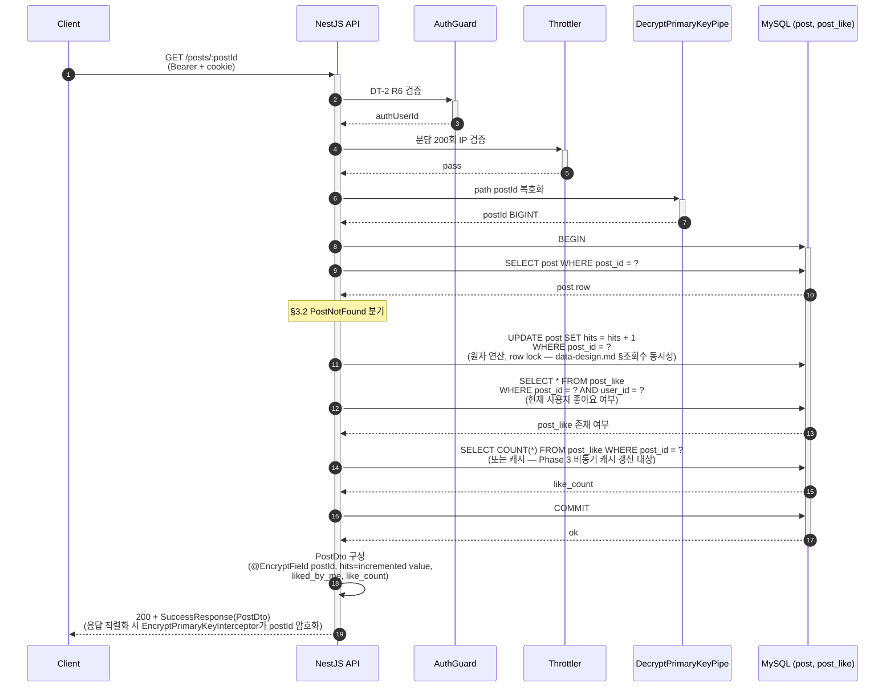

# Flow: blog-post-read-detail

## 헤더

- flow-id: blog-post-read-detail
- 커버 UC: UC-5 (Main Success Scenario + Extensions 2a, 3a)
- 관련 Aggregate: Post (Post Root + PostLike 집계)
- runtime-behavior 참조: **SEQ-1 (common/runtime-behavior.md §3.1)의 Phase 1 부분 instantiation**. SEQ-1 전체는 Phase 3 비동기 hits 집계까지 포함 — 본 flow는 동기 hits 증가 + 응답 반환까지가 Phase 1 범위. Outbox INSERT + Kafka publish + hits-aggregator consumer 경로는 Phase 3 위임. 재시각화 금지
- Endpoint Variants: 없음 (GET /posts/:postId 단일)

## 1. 정상 흐름 (Main Success Scenario — Phase 1 동기)

본 flow는 GET이므로 Idempotency-Key 적용 대상 아님 (async-deployment.md). 단, hits UPDATE가 동기 부수 효과 — Phase 3 비동기 전환 시 본 flow의 step 8(UPDATE post SET hits)이 "outbox INSERT(PostViewed)"로 변경되며 hits 응답값이 eventual consistency로 약화 (Known Issue, use-cases.md UC-5).

트랜잭션 경계 결정: SEQ-1 §3.1 결정 인용 — SELECT + UPDATE 단일 트랜잭션. 게시글 부재 시 hits UPDATE 미발생을 트랜잭션 일관성으로 보장. REPEATABLE READ 격리에서 SELECT 시점 post 상태를 UPDATE가 그대로 반영.

## 2. Alternate 분기

없음.

## 3. Exception 분기

### 3.1 UC-5 Extension 2a (PK 복호화 실패)

조건: DecryptPrimaryKeyPipe가 path postId 복호화 실패.

처리: `InvalidEncryptedParameterException` throw → `200 + FailureResponse(INVALID_ENCRYPTED_PARAMETER)`. Service 진입 없음. hits 불변.

### 3.2 UC-5 Extension 3a (Post 미존재)

조건: `SELECT post WHERE post_id = ?` 결과 empty.

처리: `PostNotFoundException` throw → `200 + FailureResponse(POST_NOT_FOUND)`. hits UPDATE 미수행. 트랜잭션 ROLLBACK.

INV-7(hits 단조 증가) 보호: Post 미존재 시 hits 증가 자체가 발생하지 않으므로 침해 가능성 없음.

## 4. Endpoint Variants

없음.

## 5. 인터페이스 계약

| 노드 | 메시지 | 인터페이스 | implementation-guide.md 섹션 |
|------|--------|-----------|------------------------------|
| Controller→Service | getPost(postId, authUserId) | `PostService.findOne(postId, authUserId): Promise<PostDto>` | §3.6 post.service |
| Service→Repository | findByIdLocked | `PostRepository.findById(postId, qr): Promise<PostEntity \| null>` | §3.7 |
| Service→Repository | incrementHits | `PostRepository.incrementHits(postId, qr): Promise<void>` (UPDATE post SET hits = hits + 1) | §3.7 |
| Service→Repository | findOwnLike | `PostLikeRepository.exists(postId, userId): Promise<boolean>` | §3.8 post-like.repository |
| Service→Repository | countLikes | `PostLikeRepository.countByPostId(postId): Promise<number>` | §3.8 |
| Path Pipe | decryptPostId | `DecryptPrimaryKeyPipe` | §4.3 |
| Response Interceptor | encryptPostId | `EncryptPrimaryKeyInterceptor` | §4.4 |

## 6. 테스트 매핑

| TC-N | 커버 노드/분기 | 종류 |
|------|---------------|------|
| TC-40 | §1 정상 흐름 (PostDto + hits +1) | E2E |
| TC-41 | §1 hits 동시 증가 (동시 5요청 후 hits +5) — INV-7 단조 증가 | 통합 (Property-Based — fast-check Race) |
| TC-42 | §3.1 PK 복호화 실패 → INVALID_ENCRYPTED_PARAMETER | E2E |
| TC-43 | §3.2 Post 미존재 → POST_NOT_FOUND + hits 불변 | E2E |
| TC-44 | INV-7 hits 단조 증가 Property (어떤 시퀀스의 GET 호출이든 최종 hits = 호출 횟수) | 단위 (PBT) |

## Sources

- docs/problem/use-cases.md §UC-5
- docs/problem/domain-spec.md INV-7, INV-10
- docs/solution/common/application-arch.md §Post Aggregate (ViewPost → PostViewed)
- docs/solution/common/data-design.md §post, §조회수 동시성 [확정]
- docs/solution/common/runtime-behavior.md §3.1 SEQ-1 (Phase 1 부분 instantiation)
- docs/solution/common/async.md §1.1 UC별 분류 (UC-5 Phase 3 비동기 전환 대상)
- docs/solution/common/security.md §5 Rate Limiting
