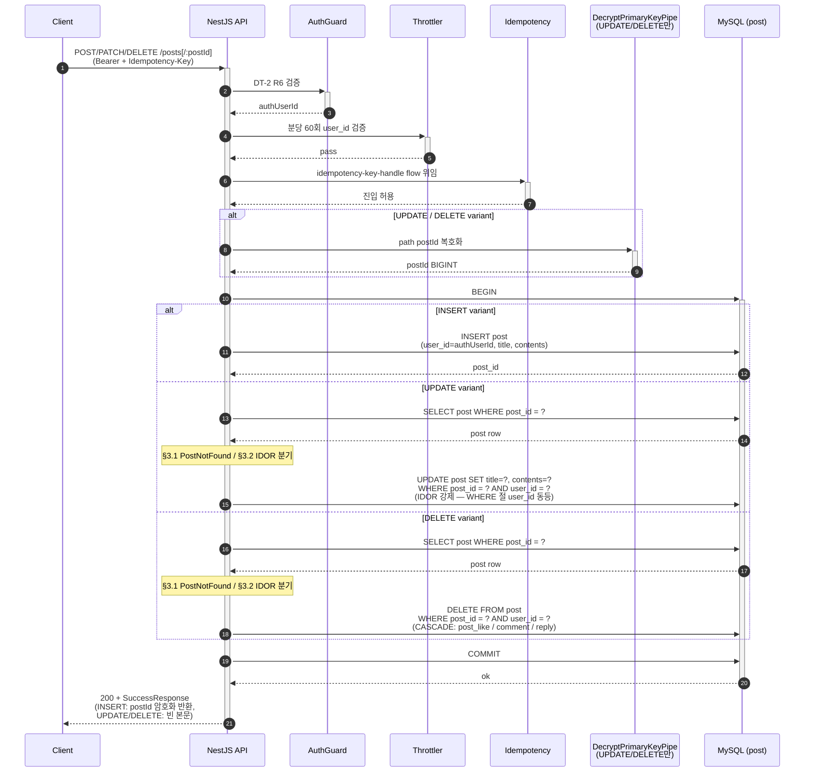
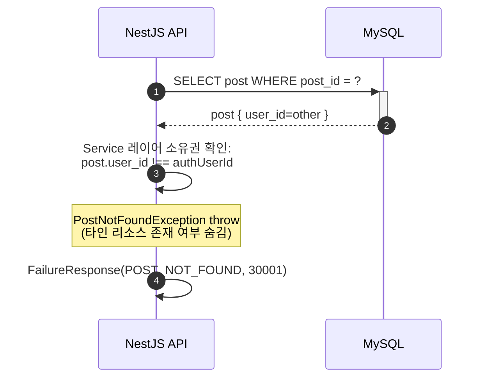

# Flow: blog-post-write

## 헤더

- flow-id: blog-post-write
- 커버 UC: 단순 CRUD (use-cases.md §UC 인벤토리 — 글 작성/수정/삭제는 UC 분리 안 됨, INV-6 본인만 수정/삭제 적용)
- 관련 Aggregate: Post (Post Root, 외부 참조 User.user_id BIGINT)
- runtime-behavior 참조: 없음. Phase 1은 INSERT/UPDATE/DELETE만 동기. Phase 3 진입 시 PostCreated/PostUpdated/PostDeleted Outbox INSERT 추가 (SEQ-1·SEQ-2 패턴 준용)
- Endpoint Variants: INSERT (POST /posts), UPDATE (PATCH /posts/:postId), DELETE (DELETE /posts/:postId) — dedup 통합 (처리 단계 시퀀스 동일, 데이터 연산 차이만)

## 1. 정상 흐름 (Main Success Scenario — Endpoint Variants 공통)

PK 응답 암호화: EncryptPrimaryKeyInterceptor가 `@EncryptField()` 적용 DTO 필드를 자동 암호화 (현 구조 유지, Phase 5 AES-GCM 전환 대기).

본 flow의 모든 variant는 Idempotency-Key 적용 대상 (async-deployment.md §대상 엔드포인트).

## 2. Alternate 분기

없음 (UC 분리 안 된 단순 CRUD라 alternate path 없음).

## 3. Exception 분기

### 3.1 Post 미존재 (UPDATE/DELETE variant)

조건: `SELECT post WHERE post_id = ?` 결과 empty.

처리: `PostNotFoundException` throw → `200 + FailureResponse(POST_NOT_FOUND)`. DB 상태 불변.

### 3.2 IDOR — 타 사용자 Post 수정/삭제 시도 (UPDATE/DELETE variant)

조건: `Post.user_id !== authUserId` (security-deployment.md §IDOR 방어).

처리: `PostNotFoundException` throw → `200 + FailureResponse(POST_NOT_FOUND)` (404 응답 정책 — security-deployment.md §응답 코드 정책 "Comment/Reply/Post는 404"로 존재 여부 자체 보호).

UPDATE/DELETE WHERE 절에 `user_id = ?` 동등 조건 추가하여 DB-level 2차 방어 + Service 레이어 1차 방어. WHERE 절 미일치 시 affected rows 0 → IDOR 또는 race condition 시그널.

### 3.3 Idempotency-Key 4분기 (모든 variant)

DT-1(idempotency-key-handle.md) 본체 위임.

### 3.4 Validation 실패

조건: title/contents class-validator 검증 실패.

처리: NestJS ValidationPipe가 자동 변환 → `200 + FailureResponse(COMMON_BAD_REQUEST)`. 트랜잭션 미시작.

### 3.5 PK 복호화 실패 (UPDATE/DELETE variant)

조건: DecryptPrimaryKeyPipe가 path postId 복호화 실패.

처리: `InvalidEncryptedParameterException` throw → `200 + FailureResponse(INVALID_ENCRYPTED_PARAMETER)` (91xxx). Service 진입 없음.

#89(Phase 0)의 PathParamAwareValidationPipe 우회 보장 검증 대상 — TC-32 참조.

## 4. Endpoint Variants

| variant | HTTP | 경로 | 차이점 | IDOR 검증 | Idempotency |
|---------|------|------|--------|-----------|-------------|
| INSERT | POST | `/posts` | 신규 post_id 생성, user_id=authUserId 자동 주입 | 없음 (작성자 본인 자동 = authUserId) | 적용 |
| UPDATE | PATCH | `/posts/:postId` | 기존 post 조회 후 UPDATE, WHERE 절 + Service 레이어 IDOR | 적용 (Service + WHERE) | 적용 |
| DELETE | DELETE | `/posts/:postId` | 기존 post 조회 후 DELETE, CASCADE 전파 (post_like/comment/reply) | 적용 (Service + WHERE) | 적용 |

dedup 결정 (flow-format.md §Dedup 판별 4단계):
- 처리 단계 시퀀스: AuthGuard → Throttler → Idempotency → (UPDATE/DELETE만 Pipe) → Service → DB transaction. 동일
- 분기 구조: PostNotFound / IDOR / Validation / Idempotency 모두 공통
- Aggregate: 동일 Post Root
- 트랜잭션 경계: 동일 단일 트랜잭션
→ 통합 (Endpoint Variants로 메모)

## 5. 인터페이스 계약

| 노드 | 메시지 | 인터페이스 | implementation-guide.md 섹션 |
|------|--------|-----------|------------------------------|
| Controller→Service | createPost(dto, authUserId) | `PostService.create(cmd: CreatePostCommand): Promise<PostDto>` | §3.6 post.service |
| Controller→Service | updatePost(postId, dto, authUserId) | `PostService.update(cmd: UpdatePostCommand): Promise<void>` | §3.6 |
| Controller→Service | deletePost(postId, authUserId) | `PostService.delete(cmd: DeletePostCommand): Promise<void>` | §3.6 |
| Service→Repository | findById | `PostRepository.findById(postId): Promise<PostEntity \| null>` | §3.7 post.repository |
| Service→Repository | insertOwned | `PostRepository.insertOwned(post, qr): Promise<bigint>` | §3.7 |
| Service→Repository | updateByIdAndOwner | `PostRepository.updateByIdAndOwner(postId, userId, patch, qr): Promise<number>` (returns affected rows) | §3.7 |
| Service→Repository | deleteByIdAndOwner | `PostRepository.deleteByIdAndOwner(postId, userId, qr): Promise<number>` | §3.7 |
| Path Pipe | decryptPostId | `DecryptPrimaryKeyPipe` (기존 유지, #89 우회 보장) | §4.3 |
| Response Interceptor | encryptResponsePK | `EncryptPrimaryKeyInterceptor` (기존 유지) | §4.4 |

## 6. 테스트 매핑

| TC-N | 커버 노드/분기 | 종류 |
|------|---------------|------|
| TC-29 | §1 INSERT 정상 (PostDto 반환, postId 응답 암호화) | E2E |
| TC-30 | §1 UPDATE 정상 (소유자, 본문 변경) | E2E |
| TC-31 | §1 DELETE 정상 (CASCADE: post_like/comment/reply 삭제) | E2E |
| TC-32 | §3.5 PK 복호화 실패 → INVALID_ENCRYPTED_PARAMETER (#89 회귀) | E2E |
| TC-33 | §3.1 UPDATE 미존재 postId → POST_NOT_FOUND | E2E |
| TC-34 | §3.2 IDOR — 타인 Post UPDATE/DELETE 시도 → POST_NOT_FOUND (404 정책) | E2E (security) |
| TC-35 | §3.2 DB WHERE 절 IDOR 2차 방어 — affected rows 0 시 적절 처리 | 통합 |
| TC-36 | §3.4 title/contents 누락 → COMMON_BAD_REQUEST | E2E |
| TC-37 | §3.3 Idempotency 4분기 (idempotency-key-handle TC-IDEM-01~05 공유) | E2E |
| TC-38 | Throttler 분당 60회 user_id 초과 → COMMON_TOO_MANY_REQUESTS | E2E (security) |
| TC-39 | INV-6 Property: 어떤 (postId, userId) 조합이든 user_id ≠ authUserId면 UPDATE/DELETE 거부 | 단위 (PBT, fast-check) |

## Sources

- docs/problem/use-cases.md §UC 인벤토리 (단순 CRUD)
- docs/problem/domain-spec.md INV-6, INV-9
- docs/solution/common/application-arch.md §Post Aggregate (CreatePost/UpdatePost/DeletePost Command)
- docs/solution/common/data-design.md §post (외래키 user_id BIGINT)
- docs/solution/common/security.md §2.2 IDOR 방어, §5 Rate Limiting, §8 Idempotency
- docs/solution/phase-1/arch-increment.md §post 외래키 변경
- docs/solution/phase-1/security-deployment.md §IDOR 방어 §응답 코드 정책
- GitHub Issue #89 (PathParamAwareValidationPipe — Phase 0 회귀 보장)
