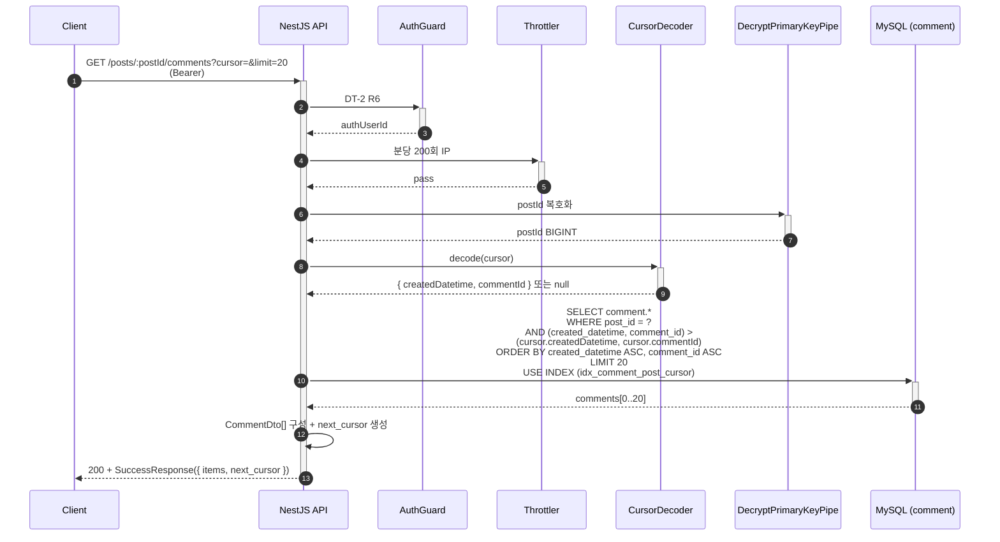
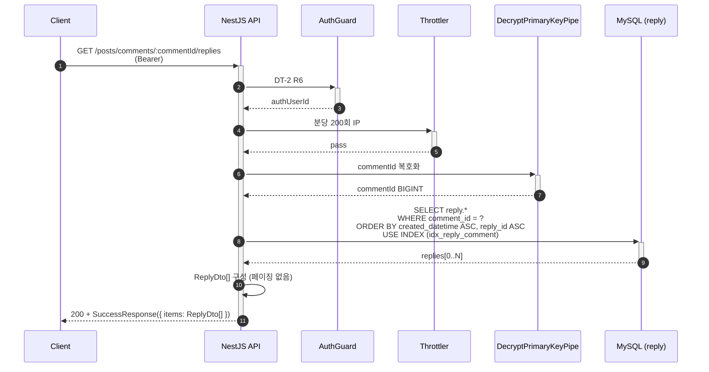

# Flow: comment-list-read

## 헤더

- flow-id: comment-list-read
- 커버 UC: 단순 CRUD (use-cases.md §UC 인벤토리 — 댓글/답글 조회는 UC 분리 안 됨)
- 관련 Aggregate: Post (Comment + Reply 내부 Entity 배치 조회)
- runtime-behavior 참조: 없음 (단순 SELECT 흐름)
- Endpoint Variants: 댓글 커서 페이징 (`GET /posts/:postId/comments`) + 답글 전체 조회 (`GET /posts/comments/:commentId/replies`) — dedup **분리** (인덱스/페이징 전략 다름)

본 flow는 두 variant를 단일 flow로 유지하되 §4 Endpoint Variants에서 차이를 명시. 두 variant 모두 GET이라 처리 단계 단순.

scope.md §범위 내 3 커서 페이징: Comment는 `(post_id, created_datetime ASC, comment_id ASC)`, Reply는 comment 단위 전체 조회(보통 N 작음, 페이징 불필요).

## 1. 정상 흐름 (Main Success Scenario)

### 1.1 댓글 커서 페이징 variant

댓글 정렬 방향: `ASC`(오래된순) — UC 의도(댓글은 시간 순 읽기) 정합. blog-post-list의 `DESC`(최신순)과 다름.

### 1.2 답글 전체 조회 variant

답글 페이징 미적용 근거 (data-design.md §reply): "보통 N 작음". 댓글당 답글 수가 작은 도메인 특성. 향후 트리거(특정 댓글에 답글 100건+ 일반화)에 cursor 페이징 도입 검토.

본 flow는 GET이므로 Idempotency-Key 적용 대상 아님.

## 2. Alternate 분기

### 2.1 빈 결과

조건: 쿼리 결과 0건 (Post에 댓글 없음 또는 Comment에 답글 없음).

처리: `200 + SuccessResponse({ items: [], next_cursor: null })`. 실패 아님.

## 3. Exception 분기

### 3.1 Post / Comment 미존재

조건: postId 또는 commentId가 부모 테이블에 미존재.

처리: 옵션 1 (빈 배열 반환) vs 옵션 2 (NotFound 응답).

Phase 1 권장: **옵션 1 (빈 배열)** — blog-post-list §3.2 일관. 단 댓글/답글 조회 목적상 부모 미존재를 명시 시그널이 UX 우위로 판단되면 옵션 2 채택 가능.

implementation-guide.md §3.10/§3.12에서 결정.

### 3.2 cursor 형식 오류 (댓글 variant만)

조건: CursorDecoder 실패.

처리: blog-post-list §3.1 패턴 동일 — `200 + FailureResponse(COMMON_BAD_REQUEST)`.

### 3.3 PK 복호화 실패

postId 또는 commentId 복호화 실패 → INVALID_ENCRYPTED_PARAMETER.

## 4. Endpoint Variants

| variant | HTTP | 경로 | 페이징 | 인덱스 | 정렬 |
|---------|------|------|--------|--------|------|
| 댓글 | GET | `/posts/:postId/comments` | cursor (limit 20) | `idx_comment_post_cursor (post_id, created_datetime ASC, comment_id ASC)` | created_datetime ASC, comment_id ASC |
| 답글 | GET | `/posts/comments/:commentId/replies` | 없음 (전체) | `idx_reply_comment (comment_id, created_datetime ASC, reply_id ASC)` | created_datetime ASC, reply_id ASC |

dedup 결정: 두 variant 모두 같은 flow에 묶음 (Aggregate 동일 Post, 처리 단계 단순). 그러나 blog-post-list와는 분리(Aggregate 내부 Entity 다름 + 정렬 방향 차이 — DESC vs ASC, 페이징 적용 여부 차이).

## 5. 인터페이스 계약

| 노드 | 메시지 | 인터페이스 | implementation-guide.md 섹션 |
|------|--------|-----------|------------------------------|
| Controller→Service | listComments(postId, query, authUserId) | `CommentService.list(postId, query): Promise<CursorPage<CommentDto>>` | §3.10 |
| Controller→Service | listReplies(commentId, authUserId) | `ReplyService.listByComment(commentId): Promise<ReplyDto[]>` | §3.12 |
| Service→Repository | findByCursor | `CommentRepository.findByCursor(postId, cursor, limit): Promise<CommentEntity[]>` | §3.11 |
| Service→Repository | listByComment | `ReplyRepository.listByComment(commentId): Promise<ReplyEntity[]>` | §3.13 |
| Service→Util | cursor encode/decode | `cursorUtils` (blog-post-list와 공유) | §6.8 |
| Path Pipe | decrypt id | `DecryptPrimaryKeyPipe` | §4.3 |

## 6. 테스트 매핑

| TC-N | 커버 노드/분기 | 종류 |
|------|---------------|------|
| TC-82 | §1.1 댓글 커서 페이징 (첫 페이지 + 2페이지) | E2E |
| TC-83 | §1.1 ASC 정렬 일관성 (오래된순) | E2E |
| TC-84 | §1.2 답글 전체 조회 정상 | E2E |
| TC-85 | §2.1 빈 결과 (Post에 댓글 없음) → empty array | E2E |
| TC-86 | §3.1 미존재 postId → empty array (옵션 1) | E2E |
| TC-87 | §3.2 cursor 형식 오류 → COMMON_BAD_REQUEST | E2E |
| TC-88 | §3.3 PK 복호화 실패 → INVALID_ENCRYPTED_PARAMETER | E2E |
| TC-89 | 댓글/답글 EXPLAIN 인덱스 사용 검증 (idx_comment_post_cursor / idx_reply_comment) | 통합 |

## Sources

- docs/problem/use-cases.md §UC 인벤토리 (단순 CRUD)
- docs/solution/common/application-arch.md §Cursor-based Pagination [가이드] §Adjacency List for Reply
- docs/solution/common/data-design.md §comment (idx_comment_post_cursor) §reply (idx_reply_comment)
- docs/solution/phase-1/scope.md §범위 내 3 커서 페이징
- docs/solution/phase-1/arch-increment.md §blog 모듈 확장
