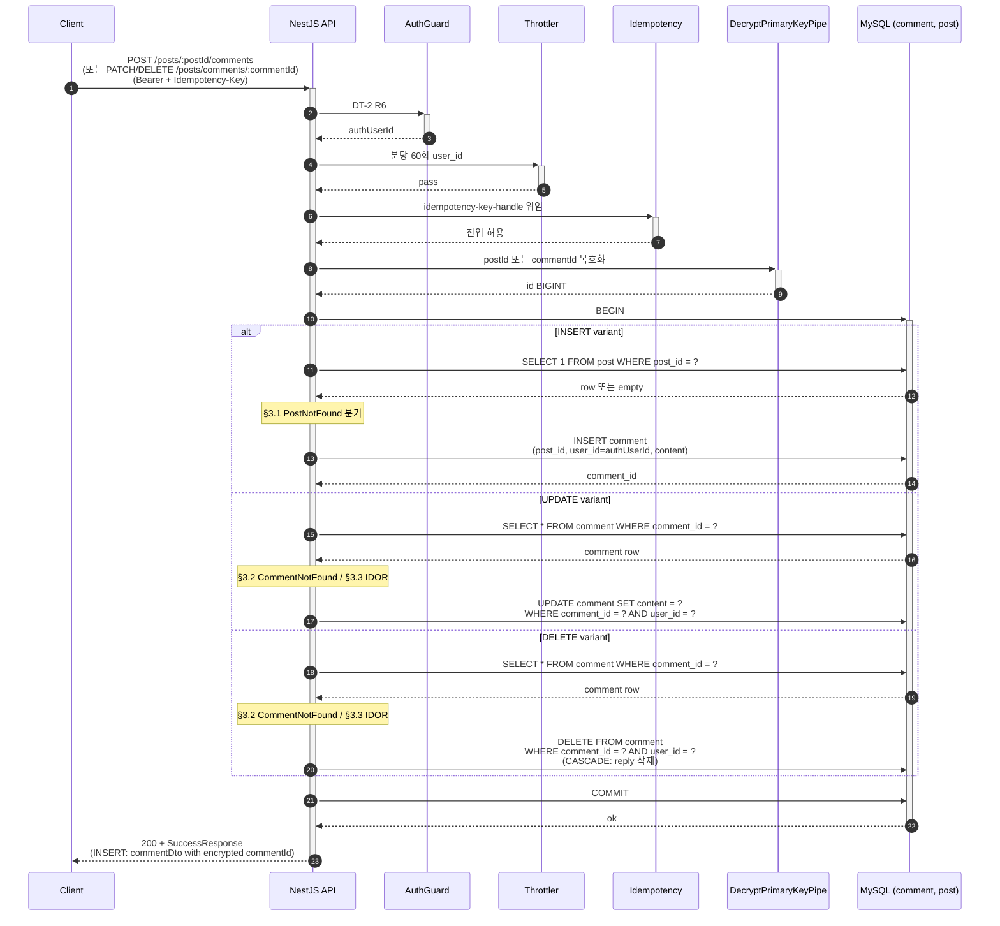

# Flow: comment-write

## 헤더

- flow-id: comment-write
- 커버 UC: UC-8 (Main Success Scenario + Extension 3a, *a) + 댓글 수정/삭제 variant (use-cases.md §UC-8 "본 UC의 수정/삭제 흐름은 본 UC의 변형")
- 관련 Aggregate: Post (Comment 내부 Entity, 외래키 post_id BIGINT + user_id BIGINT)
- runtime-behavior 참조: **SEQ-4a (common/runtime-behavior.md §3.4.1)의 Phase 1 부분 instantiation**. SEQ-4a 전체는 Phase 3에서 INSERT comment + outbox INSERT(CommentCreated)까지 — 본 flow는 INSERT comment까지가 Phase 1 범위. Outbox 추가는 Phase 3. SEQ-4b(BullMQ notification 발송)는 본 flow 비대상. 재시각화 금지
- Endpoint Variants: INSERT (POST), UPDATE (PATCH), DELETE (DELETE) — dedup 통합

## 1. 정상 흐름 (Main Success Scenario — Endpoint Variants 공통)

Phase 1에는 outbox INSERT(CommentCreated) 없음. Phase 3 진입 시 동일 트랜잭션 내 outbox INSERT 단계 추가 (async-deployment.md §Comment/Reply 이벤트 발행 준비 — 의도적 보류).

신규 INV (Phase 1 추가 — domain-spec.md §Phase 진화에 따른 Invariant 변경 예고):
- Comment.postId 참조 무결성 (`fk_comment_post`)
- Comment.userId 참조 무결성 (`fk_comment_user`)

## 2. Alternate 분기

없음.

## 3. Exception 분기

### 3.1 UC-8 Extension 3a (Post 미존재, INSERT variant)

조건: INSERT variant에서 `SELECT 1 FROM post WHERE post_id = ?` 결과 empty.

처리: `PostNotFoundException` throw → `200 + FailureResponse(POST_NOT_FOUND)`. INSERT 미수행. ROLLBACK.

대안: Post SELECT 생략 + INSERT comment에서 FK 충돌 발생 → catch (post-like-toggle.md §3.5 패턴). 어느 쪽이든 결과 동일. 명시적 SELECT 채택 (도메인 의도 가시화 + 에러 메시지 명확).

### 3.2 Comment 미존재 (UPDATE/DELETE variant)

조건: `SELECT * FROM comment WHERE comment_id = ?` 결과 empty.

처리: 신규 `CommentNotFoundException` throw (arch-increment.md §ErrorCode 추가 — Comment 도메인 32xxx) → `200 + FailureResponse(COMMENT_NOT_FOUND)`. 신규 ErrorCode 추가: `COMMENT_NOT_FOUND` (32001).

### 3.3 IDOR — 타 사용자 Comment 수정/삭제 (UPDATE/DELETE variant)

조건: `Comment.user_id !== authUserId`.

처리: blog-post-write §3.2 패턴 동일 — `CommentNotFoundException` throw (404 정책 — security-deployment.md §응답 코드 정책 "Comment/Reply/Post는 404"). 존재 여부 자체 보호.

WHERE 절 2차 방어: UPDATE/DELETE WHERE에 `user_id = ?` 동등 추가 → affected rows 0 시그널로 사후 검증 가능.

### 3.4 UC-8 Extension *a (Idempotency 4분기)

idempotency-key-handle.md 위임.

### 3.5 Validation 실패 (content 길이 / 공백)

조건: content class-validator 검증 실패 (예: 빈 문자열, 1000자 초과).

처리: ValidationPipe 자동 변환 → `200 + FailureResponse(COMMON_BAD_REQUEST)`.

### 3.6 PK 복호화 실패

조건: postId 또는 commentId 복호화 실패.

처리: `InvalidEncryptedParameterException` throw → `200 + FailureResponse(INVALID_ENCRYPTED_PARAMETER)`.

## 4. Endpoint Variants

| variant | HTTP | 경로 | Path Param 복호화 | 데이터 연산 | IDOR 검증 |
|---------|------|------|---------------------|------------|-----------|
| INSERT | POST | `/posts/:postId/comments` | postId | INSERT comment | 없음 (작성자 자동) |
| UPDATE | PATCH | `/posts/comments/:commentId` | commentId | UPDATE comment | 적용 |
| DELETE | DELETE | `/posts/comments/:commentId` | commentId | DELETE comment (CASCADE: reply) | 적용 |

dedup 결정 (vs reply-write): Aggregate는 동일(Post Root, Comment 내부 Entity), 처리 단계 시퀀스 유사. 그러나 외래키 대상(post_id vs comment_id) 다름 + 깊이 1 강제(Reply는 Comment에만 답글 가능) → **분리 flow** 유지 (사용자 분석 단계 확정).

## 5. 인터페이스 계약

| 노드 | 메시지 | 인터페이스 | implementation-guide.md 섹션 |
|------|--------|-----------|------------------------------|
| Controller→Service | createComment(postId, dto, authUserId) | `CommentService.create(cmd): Promise<CommentDto>` | §3.10 comment.service |
| Controller→Service | updateComment(commentId, dto, authUserId) | `CommentService.update(cmd): Promise<void>` | §3.10 |
| Controller→Service | deleteComment(commentId, authUserId) | `CommentService.delete(cmd): Promise<void>` | §3.10 |
| Service→Repository | findById | `CommentRepository.findById(commentId, qr): Promise<CommentEntity \| null>` | §3.11 comment.repository |
| Service→Repository | postExists | `PostRepository.existsById(postId, qr): Promise<boolean>` | §3.7 |
| Service→Repository | insertOwned | `CommentRepository.insertOwned(comment, qr): Promise<bigint>` | §3.11 |
| Service→Repository | updateByIdAndOwner | `CommentRepository.updateByIdAndOwner(commentId, userId, patch, qr): Promise<number>` | §3.11 |
| Service→Repository | deleteByIdAndOwner | `CommentRepository.deleteByIdAndOwner(commentId, userId, qr): Promise<number>` | §3.11 |
| Exception | CommentNotFoundException | `extends BaseException { uid: bigint; commentId: bigint }` (32001) | §9.1 Exception |

## 6. 테스트 매핑

| TC-N | 커버 노드/분기 | 종류 |
|------|---------------|------|
| TC-63 | §1 INSERT 정상 (commentDto + encrypted commentId) | E2E |
| TC-64 | §1 UPDATE 정상 (소유자) | E2E |
| TC-65 | §1 DELETE 정상 + CASCADE reply 삭제 | E2E |
| TC-66 | §3.1 INSERT — Post 미존재 → POST_NOT_FOUND | E2E |
| TC-67 | §3.2 UPDATE/DELETE — Comment 미존재 → COMMENT_NOT_FOUND | E2E |
| TC-68 | §3.3 IDOR — 타인 Comment UPDATE/DELETE → COMMENT_NOT_FOUND | E2E (security) |
| TC-69 | §3.4 Idempotency 4분기 (idempotency-key-handle 공유) | E2E |
| TC-70 | §3.5 content 빈 문자열 → COMMON_BAD_REQUEST | E2E |
| TC-71 | §3.6 PK 복호화 실패 → INVALID_ENCRYPTED_PARAMETER | E2E |
| TC-72 | INV (신규) — Comment.user_id 참조 무결성 (User 삭제 시 CASCADE) | 통합 |

## Sources

- docs/problem/use-cases.md §UC-8
- docs/problem/domain-spec.md §Phase 진화에 따른 Invariant 변경 예고 (Comment 신규 INV)
- docs/solution/common/application-arch.md §Post Aggregate (CreateComment/UpdateComment/DeleteComment → CommentCreated/Updated/Deleted)
- docs/solution/common/data-design.md §comment
- docs/solution/common/runtime-behavior.md §3.4.1 SEQ-4a (Phase 1 부분 instantiation)
- docs/solution/common/security.md §2.2 IDOR §응답 코드 정책 §5 Rate Limiting §8 Idempotency
- docs/solution/phase-1/arch-increment.md §blog 모듈 확장 §ErrorCode 추가
- docs/solution/phase-1/security-deployment.md §IDOR 방어
- docs/solution/phase-1/async-deployment.md §Comment/Reply 이벤트 발행 준비 (Phase 3 위임)
- docs/solution/phase-1/runtime-deployment.md §1.2
