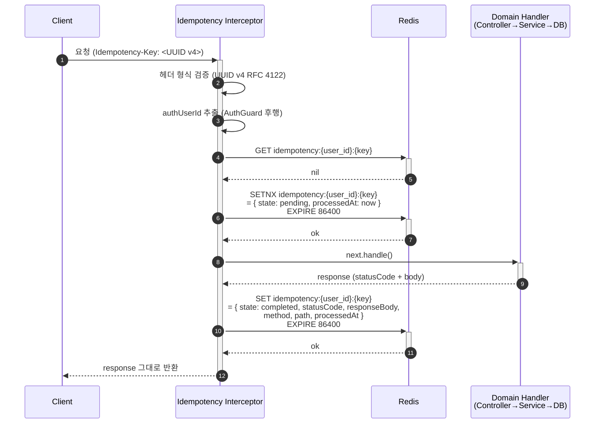
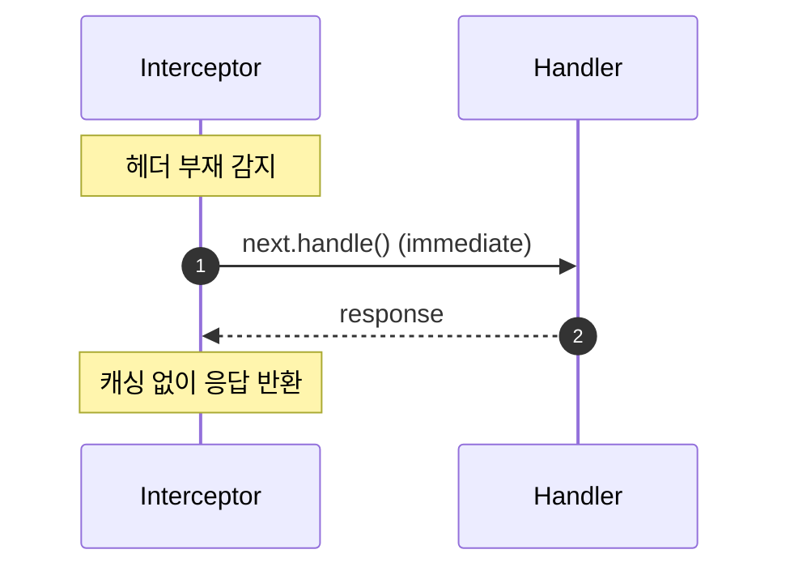
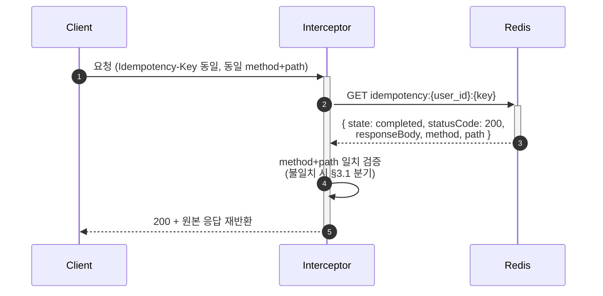
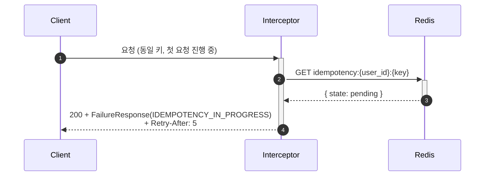

# Flow: idempotency-key-handle

## 헤더

- flow-id: idempotency-key-handle
- 커버 UC: UC-1·UC-6·UC-8·UC-9의 `*a` Extension cross-cutting (DT-1 본체 instantiation)
- 관련 Aggregate: cross-cutting (Redis 외부 저장소만 의존, 도메인 Aggregate 비종속)
- runtime-behavior 참조: SEQ-2(좋아요)의 Idempotency 분기 부분이 본 flow의 instantiation. 재시각화 금지
- Endpoint Variants: 없음 (모든 Write API에 동일 패턴 적용)

본 flow는 NestJS Interceptor 단일 구현이 모든 Write API에 cross-cutting으로 적용된다. domain flow(user-register / blog-post-write / post-like-toggle / comment-write / reply-write)의 `*a` Extension 분기는 본 flow를 §5 인터페이스 계약에서 역참조한다.

대상 엔드포인트 (async-deployment.md §대상 엔드포인트):
- `POST/PATCH/DELETE /posts*`, `POST/DELETE /posts/:postId/likes`
- `POST/PATCH/DELETE /posts/:postId/comments*`, `POST/PATCH/DELETE /posts/comments/:commentId/replies*`
- `POST /users/auth/join`, `PATCH/DELETE /users/info`

미대상: 모든 GET(읽기 idempotent), login/refresh/oauth(인증 자격 검증 흐름은 응답 캐싱 부적합).

## 1. 정상 흐름 (DT-1 R2 — 키 제공 + miss → 신규 처리)

키 형식: `Idempotency-Key: <UUID v4>` (RFC 4122). 형식 위반 시 `200 + FailureResponse(COMMON_BAD_REQUEST)`.

Redis 키 구조 (data-design.md §Redis 키 구조):
- 키: `idempotency:{user_id}:{idempotency_key}`
- 값: JSON `{ statusCode, responseBody, method, path, processedAt, state: "pending"|"completed" }`
- TTL: 24시간

## 2. Alternate 분기

### 2.1 DT-1 R1 (키 미제공)

조건: `Idempotency-Key` 헤더 부재.

처리: Interceptor가 즉시 `next.handle()` 위임. Redis 조회/저장 미수행. 정상 처리 진행. 응답 캐싱 없음.

미인증 요청 처리: async-deployment.md "정책상 미적용" 채택. authUserId 부재 시 본 R1 분기로 처리 (학습 프로젝트 단순성). IP 기반 대체 키는 사용하지 않음.

### 2.2 DT-1 R3 (키 제공 + hit-stored — 캐시 완료 응답 재반환)

조건: Redis GET 결과 `state: completed`.

처리: 저장된 `statusCode + responseBody`로 응답 즉시 반환. 핸들러 진입 없음 (Service/DB 호출 0회).

method+path 검증: 동일 user_id가 동일 키를 다른 엔드포인트에 사용하는 시도는 의도적 키 충돌 또는 오용 — §3.1 Exception 분기.

## 3. Exception 분기

### 3.1 키 충돌 (동일 키, 다른 method/path)

조건: Redis cached `method+path` ≠ 요청 `method+path`.

처리: `200 + FailureResponse(COMMON_BAD_REQUEST)` 반환. Warning 로그 (잠재 클라이언트 오작동 시그널). Redis 캐시 변경 없음.

근거: Stripe Idempotency API 표준 — 동일 키 재사용 시 원본 요청 의미와 동일해야 함.

### 3.2 DT-1 R4 (키 제공 + hit-in-flight — 진행 중 요청)

조건: Redis GET 결과 `state: pending`.

처리: `200 + FailureResponse(COMMON_TOO_MANY_REQUESTS 또는 신규 IDEMPOTENCY_IN_PROGRESS) + Retry-After: 5` 헤더. 핸들러 진입 없음.

Phase 1 결정: 새 ErrorCode `IDEMPOTENCY_IN_PROGRESS` 신설 또는 기존 `COMMON_TOO_MANY_REQUESTS` 재사용. 의미 명확성 관점에서 신설 권고 (implementation-guide.md §5 ErrorCode 변경 — 90xxx 영역).

근거: security.md §8.3 + Stripe Idempotency API "in-flight returns 409 with Retry-After".

### 3.3 핸들러 실패 시 처리

조건: `next.handle()`이 throw (예: 도메인 예외 — UserAlreadyExistsException 등).

처리: BaseExceptionFilter가 throw를 `FailureResponse`로 변환한 응답을 Interceptor가 수신 → state=completed로 마킹 + 실패 응답 스냅샷 저장. 같은 키로 재요청 시 동일 실패 응답 재반환 (DT-1 R3).

이유: "같은 키로 같은 결과 보장" 원칙 — 성공/실패 무관 (Stripe/IETF 표준).

unhandled 예외(500 변환): UnhandledExceptionFilter가 처리한 응답도 동일하게 캐싱. 단, pending → completed 전환 실패 시(예: Redis 장애) Redis 키는 24h TTL로 자연 만료.

### 3.4 Graceful Shutdown 중 pending 처리

SIGTERM 수신 시 Interceptor는 진행 중 요청(`state: pending`)의 완료 응답 저장을 30초 대기 (security.md §Graceful Shutdown). 초과 시 강제 종료. 미완료 pending 키는 24h TTL로 자연 만료되며, 재시도 시 R4 분기로 진입하여 클라이언트가 일정 시간 후 재요청.

## 4. Endpoint Variants

없음. 모든 대상 엔드포인트가 동일 Interceptor 단일 구현으로 처리.

## 5. 인터페이스 계약

| 노드 | 메시지 | 인터페이스 | implementation-guide.md 섹션 |
|------|--------|-----------|------------------------------|
| Nest framework→Interceptor | intercept(ctx, next) | `IdempotencyKeyInterceptor implements NestInterceptor` | §4.2 idempotency-key.interceptor |
| Interceptor→IdempotencyService | get/setPending/setCompleted | `IdempotencyService.get(userId, key) / setPending / setCompleted` | §3.14 유틸 |
| IdempotencyService→Redis | GET/SETNX/SET/EXPIRE | `RedisClient` (REDIS_CLIENT 토큰 inject, Phase 0 ioredis 단일 Provider 활용) | §6.3 Redis 키 구조 |
| Decorator (선택) | @SkipIdempotency() | login/refresh/oauth 핸들러에 부착하여 Interceptor 우회 | §4.2 |

전역 등록 위치: `app.module.ts` APP_INTERCEPTOR Provider로 등록. AuthGuard 후행(authUserId 추출 의존). NestJS 실행 순서: Guard → Interceptor → Handler.

## 6. 테스트 매핑

| TC-N | 커버 노드/분기 | 종류 |
|------|---------------|------|
| TC-IDEM-01 | §1 DT-1 R2 (키 + miss → 처리 후 캐싱) | 계약 |
| TC-IDEM-02 | §2.1 DT-1 R1 (키 미제공 → 정상 처리, 캐시 없음) | 단위 |
| TC-IDEM-03 | §2.2 DT-1 R3 (키 + hit-stored → 원본 응답 재반환, Service 미호출) | 계약 |
| TC-IDEM-04 | §3.1 동일 키 + 다른 path → COMMON_BAD_REQUEST | 통합 |
| TC-IDEM-05 | §3.2 DT-1 R4 (키 + pending → IDEMPOTENCY_IN_PROGRESS + Retry-After 5) | 계약 |
| TC-IDEM-06 | §3.3 핸들러 throw 시 실패 응답 캐싱 → 재요청 시 동일 실패 응답 | 계약 |
| TC-IDEM-07 | 헤더 형식 위반 (non-UUID v4) → COMMON_BAD_REQUEST | 단위 |
| TC-IDEM-08 | DT-1 4분기 RuleBasedStateMachine Property-Based Test (fast-check) | 단위 (PBT) |

종류 주: IDEM-01·03·05·06은 멱등 API 계약(DT-1 R2·R3·R4 + 실패 응답 캐싱)을 검증하므로 계약(contract). IDEM-02·07·08은 순수 로직(단위), IDEM-04는 path 검증(통합). testing-strategy.md §2 Pyramid 계약 4건과 정합.

TC-IDEM-08은 testing-strategy.md §3 Property-Based Testing의 RuleBasedStateMachine 후보 — 키 상태(absent → pending → completed) 전이의 모든 invariant 검증. domain flow(user-register / blog-post-write / post-like-toggle / comment-write / reply-write)에서 `*a` Extension 분기는 본 매핑을 cross-reference (예: TC-05 user-register `*a` 분기는 TC-IDEM-02/03/05 셋을 공유 적용).

## Sources

- docs/problem/use-cases.md §UC-1·6·8·9 Extension *a
- docs/problem/domain-spec.md §DT-1 [가이드]
- docs/solution/common/application-arch.md §Idempotency Key Pattern
- docs/solution/common/data-design.md §Redis 키 구조 (idempotency:{user_id}:{idempotency_key})
- docs/solution/common/security.md §8 API 수신 측 Idempotency-Key 헤더, §Graceful Shutdown
- docs/solution/phase-1/async-deployment.md §API 수신 측 Idempotency-Key 적용
- IETF draft-ietf-httpapi-idempotency-key-header
- Stripe Idempotency API 표준
