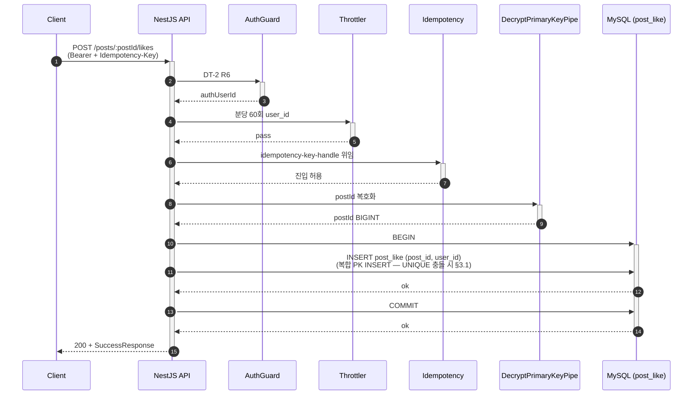
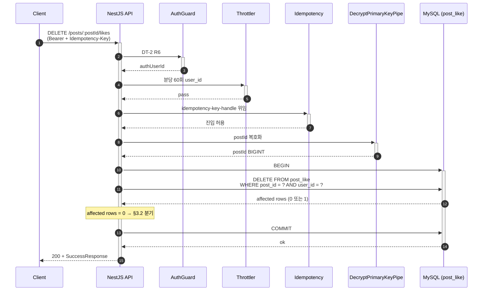
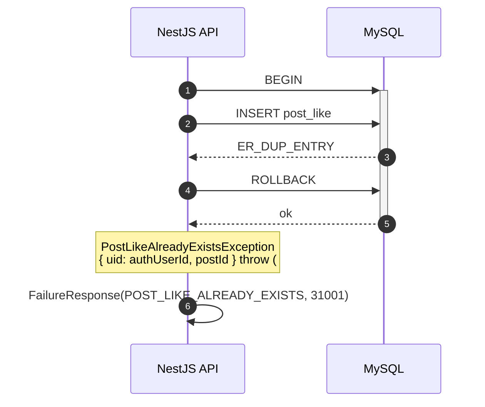

# Flow: post-like-toggle

## 헤더

- flow-id: post-like-toggle
- 커버 UC: UC-6 (Main Success Scenario 추가/취소 + Extensions 추가-3a, 취소-3a, *a)
- 관련 Aggregate: Post (PostLike 내부 Entity, 복합 PK (post_id, user_id) UNIQUE INV-8)
- runtime-behavior 참조: **SEQ-2 (common/runtime-behavior.md §3.2)의 Phase 1 부분 instantiation**. SEQ-2 전체는 Phase 3 비동기 캐시 갱신까지 포함. Phase 1은 INSERT/DELETE까지가 범위. Outbox INSERT(PostLiked/PostUnliked) + Kafka publish + like-counter consumer 경로는 Phase 3 위임. 재시각화 금지
- Endpoint Variants: 추가 (POST /posts/:postId/likes), 취소 (DELETE /posts/:postId/likes) — dedup 통합

## 1. 정상 흐름 (Main Success Scenario)

### 1.1 추가 variant

INV-8(1인 1회) 보장: 복합 PK (post_id, user_id) UNIQUE 제약이 동시 요청 race를 DB-level에서 차단. application-level 사전 SELECT 불필요 (data-design.md §좋아요 동시성 [확정]).

### 1.2 취소 variant

IDOR 검증: DELETE WHERE 절에 `user_id = ?` 동등 조건으로 자동 강제 — 타인 좋아요 삭제 불가. Service 레이어 별도 SELECT 불필요.

## 2. Alternate 분기

없음.

## 3. Exception 분기

### 3.1 UC-6 추가-3a (이미 존재 — INV-8 침해 시도)

조건: INSERT post_like 시 (post_id, user_id) UNIQUE 충돌.

처리:
1. TypeORM이 `QueryFailedError (ER_DUP_ENTRY)` throw
2. PostRepository에서 catch → `PostLikeAlreadyExistsException` (#73 흡수: 컨텍스트 정보 uid, postId 포함)
3. ROLLBACK + `200 + FailureResponse(POST_LIKE_ALREADY_EXISTS)`

#73 흡수: PostLike 예외 클래스에 컨텍스트 정보(`uid`, `postId`) 추가 — 디버깅 메시지 보강. implementation-guide.md §7 Exception 계층에 반영.

### 3.2 UC-6 취소-3a (PostLike 미존재)

조건: DELETE 결과 affected rows = 0.

처리: `PostLikeNotFoundException` throw (#73 컨텍스트 포함) → `200 + FailureResponse(POST_LIKE_NOT_FOUND)`. ROLLBACK 또는 COMMIT 무관 (변경 없음).

DELETE의 멱등성: SQL 자체는 멱등(WHERE 조건 미일치 시 0 rows). 본 flow는 의도적으로 미존재 시 NotFound 응답으로 클라이언트에게 명시적 시그널 전달 (UC-6 Extensions 정합). Idempotency-Key 분기로는 동일 키 재요청 시 동일 NotFound 응답 캐시 재반환 (idempotency-key-handle.md §3.3).

### 3.3 PK 복호화 실패

조건: DecryptPrimaryKeyPipe 실패.

처리: `InvalidEncryptedParameterException` throw → `200 + FailureResponse(INVALID_ENCRYPTED_PARAMETER)`. Service 진입 없음.

### 3.4 UC-6 추가/취소 *a (Idempotency 4분기)

idempotency-key-handle.md 위임 (DT-1 R1·R2·R3·R4).

### 3.5 Post 미존재 (FK 충돌)

조건: 추가 variant에서 INSERT post_like 시 post_id가 post 테이블에 미존재 → FK 충돌 (`fk_pl_post`).

처리: `QueryFailedError (ER_NO_REFERENCED_ROW)` catch → `PostNotFoundException` throw → `200 + FailureResponse(POST_NOT_FOUND)`. ROLLBACK.

application-level 사전 SELECT 없이 DB FK 제약으로 처리 — 동시 Post 삭제 race를 DB-level 일관성으로 차단.

## 4. Endpoint Variants

| variant | HTTP | 경로 | 데이터 연산 | 충돌 처리 |
|---------|------|------|------------|----------|
| 추가 | POST | `/posts/:postId/likes` | INSERT post_like | UNIQUE 충돌 → AlreadyExists, FK 충돌 → PostNotFound |
| 취소 | DELETE | `/posts/:postId/likes` | DELETE WHERE | affected rows 0 → NotFound |

dedup 결정: 처리 단계 시퀀스 동일 (AuthGuard → Throttler → Idempotency → Pipe → DB), 분기 구조의 차이는 §3.1/§3.2 데이터 연산 차이만 → 통합. variants로 메모.

## 5. 인터페이스 계약

| 노드 | 메시지 | 인터페이스 | implementation-guide.md 섹션 |
|------|--------|-----------|------------------------------|
| Controller→Service | likePost(postId, authUserId) | `PostLikeService.like(postId: bigint, userId: bigint): Promise<void>` | §3.9 post-like.service |
| Controller→Service | unlikePost(postId, authUserId) | `PostLikeService.unlike(postId: bigint, userId: bigint): Promise<void>` | §3.9 |
| Service→Repository | insertLike | `PostLikeRepository.insert(postId, userId, qr): Promise<void>` (UNIQUE / FK 충돌은 Repository에서 도메인 예외 변환) | §3.8 |
| Service→Repository | deleteLike | `PostLikeRepository.delete(postId, userId, qr): Promise<number>` (affected rows 반환) | §3.8 |
| Exception | PostLikeAlreadyExistsException | `extends BaseException { uid: bigint; postId: bigint }` (#73 컨텍스트) | §7 Exception |
| Exception | PostLikeNotFoundException | `extends BaseException { uid: bigint; postId: bigint }` (#73 컨텍스트) | §7 Exception |
| Path Pipe | decryptPostId | `DecryptPrimaryKeyPipe` | §4.3 |

## 6. 테스트 매핑

| TC-N | 커버 노드/분기 | 종류 |
|------|---------------|------|
| TC-54 | §1.1 추가 정상 (post_like row 생성) | E2E |
| TC-55 | §1.2 취소 정상 (post_like row 삭제) | E2E |
| TC-56 | §3.1 INV-8 위반 (이미 존재) → POST_LIKE_ALREADY_EXISTS + 컨텍스트 (uid, postId) | E2E |
| TC-57 | §3.1 동시 INSERT race (5 동시 요청, 4개 실패) — INV-8 DB-level 보장 | 통합 (PBT — Property: 어떤 동시성 시퀀스든 like row count ≤ 1) |
| TC-58 | §3.2 취소 미존재 → POST_LIKE_NOT_FOUND + 컨텍스트 | E2E |
| TC-59 | §3.3 PK 복호화 실패 → INVALID_ENCRYPTED_PARAMETER | E2E |
| TC-60 | §3.4 Idempotency 4분기 (idempotency-key-handle 공유) | E2E |
| TC-61 | §3.5 Post 미존재 시 INSERT → POST_NOT_FOUND (FK 충돌 처리) | E2E |
| TC-62 | §1.2 IDOR — DELETE WHERE 절이 타인 PostLike 미삭제 | E2E (security) |

## Sources

- docs/problem/use-cases.md §UC-6
- docs/problem/domain-spec.md INV-8 ((post_id, user_id) UNIQUE), INV-9 (CASCADE)
- docs/solution/common/application-arch.md §Post Aggregate (LikePost/UnlikePost → PostLiked/PostUnliked)
- docs/solution/common/data-design.md §post_like, §좋아요 동시성 [확정]
- docs/solution/common/runtime-behavior.md §3.2 SEQ-2 (Phase 1 부분 instantiation)
- docs/solution/common/security.md §5 Rate Limiting, §8 Idempotency
- docs/solution/phase-1/security-deployment.md §IDOR 방어 (`DELETE /posts/:postId/likes`)
- GitHub Issue #73 (PostLike 예외 컨텍스트 — Phase 1 흡수)
