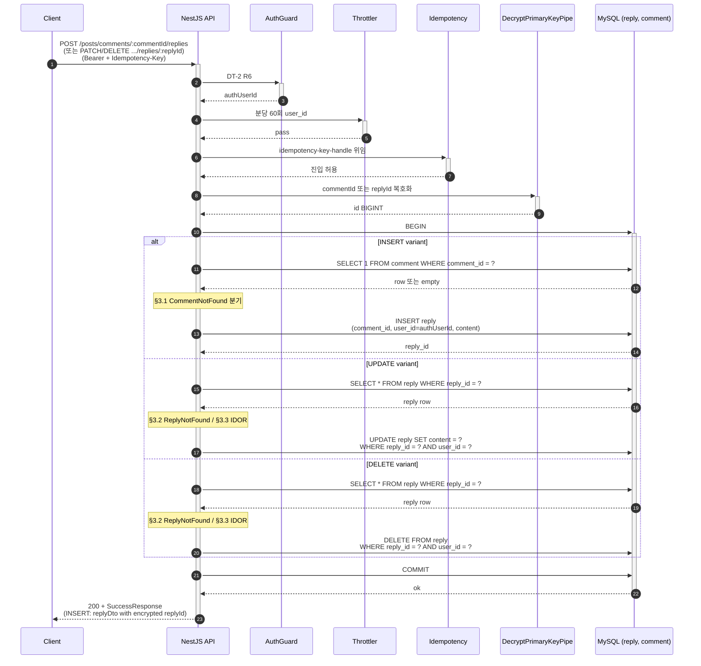

# Flow: reply-write

## 헤더

- flow-id: reply-write
- 커버 UC: UC-9 (Main Success Scenario + Extension 3a, *a) + 답글 수정/삭제 variant
- 관련 Aggregate: Post (Reply 내부 Entity, Adjacency List 모델, 외래키 comment_id BIGINT + user_id BIGINT)
- runtime-behavior 참조: comment-write의 SEQ-4a 패턴 준용 (재시각화 금지). 본 flow는 comment_id 외래키 + 깊이 1 강제만 다름. Outbox INSERT(ReplyCreated) + Phase 3 위임 (async-deployment.md §Comment/Reply 이벤트 발행 준비)
- Endpoint Variants: INSERT (POST), UPDATE (PATCH), DELETE (DELETE) — dedup 통합

## 1. 정상 흐름 (Main Success Scenario — Endpoint Variants 공통)

깊이 1 강제 (application-arch.md §Adjacency List for Reply): Reply 테이블은 `comment_id BIGINT` 단일 외래키 (parent_reply_id 없음). API 자체에 "Reply에 대한 Reply 작성" 엔드포인트 미제공으로 깊이 1 강제 (스키마 표현 불가, application-level 규칙).

신규 INV (Phase 1 추가):
- Reply.commentId 참조 무결성 (`fk_reply_comment`)
- Reply.userId 참조 무결성 (`fk_reply_user`)
- 계층 깊이 1단 제한 (API 엔드포인트 부재로 강제)

## 2. Alternate 분기

없음.

## 3. Exception 분기

### 3.1 UC-9 Extension 3a (Comment 미존재, INSERT variant)

조건: INSERT variant에서 `SELECT 1 FROM comment WHERE comment_id = ?` 결과 empty.

처리: `CommentNotFoundException` throw (comment-write §3.2와 동일 ErrorCode 32001) → `200 + FailureResponse(COMMENT_NOT_FOUND)`. INSERT 미수행. ROLLBACK.

### 3.2 Reply 미존재 (UPDATE/DELETE variant)

조건: `SELECT * FROM reply WHERE reply_id = ?` 결과 empty.

처리: 신규 `ReplyNotFoundException` throw (Phase 1 신규 ErrorCode `REPLY_NOT_FOUND` 32002 — arch-increment.md §ErrorCode 추가 32xxx 영역) → `200 + FailureResponse(REPLY_NOT_FOUND)`.

### 3.3 IDOR — 타 사용자 Reply 수정/삭제

조건: `Reply.user_id !== authUserId`.

처리: 404 정책 — `ReplyNotFoundException` throw. WHERE 절 2차 방어 동일.

### 3.4 UC-9 Extension *a (Idempotency 4분기)

idempotency-key-handle.md 위임.

### 3.5 Validation 실패

content class-validator 실패 → COMMON_BAD_REQUEST.

### 3.6 PK 복호화 실패

commentId 또는 replyId 복호화 실패 → INVALID_ENCRYPTED_PARAMETER.

## 4. Endpoint Variants

| variant | HTTP | 경로 | Path Param | 데이터 연산 | IDOR 검증 |
|---------|------|------|------------|------------|-----------|
| INSERT | POST | `/posts/comments/:commentId/replies` | commentId | INSERT reply | 없음 (작성자 자동) |
| UPDATE | PATCH | `/posts/comments/:commentId/replies/:replyId` | commentId, replyId | UPDATE reply | 적용 |
| DELETE | DELETE | `/posts/comments/:commentId/replies/:replyId` | commentId, replyId | DELETE reply | 적용 |

UPDATE/DELETE의 `:commentId` Path Param 활용: 경로 일관성을 위해 commentId도 전달받지만, Service에서 reply_id 단일 키로 조회. commentId는 URL 의미 명확성용. 또는 부가 검증(reply.comment_id === path.commentId)으로 일관성 확인 가능 — implementation-guide.md §3.12에서 결정.

dedup 결정 (vs comment-write): 사용자 분석 단계에서 **분리 권고 확정**. 사유: 외래키 대상 다름(post_id vs comment_id) + 깊이 1 강제 (Reply는 새 자식 미허용).

## 5. 인터페이스 계약

| 노드 | 메시지 | 인터페이스 | implementation-guide.md 섹션 |
|------|--------|-----------|------------------------------|
| Controller→Service | createReply(commentId, dto, authUserId) | `ReplyService.create(cmd): Promise<ReplyDto>` | §3.12 reply.service |
| Controller→Service | updateReply(replyId, dto, authUserId) | `ReplyService.update(cmd): Promise<void>` | §3.12 |
| Controller→Service | deleteReply(replyId, authUserId) | `ReplyService.delete(cmd): Promise<void>` | §3.12 |
| Service→Repository | findById | `ReplyRepository.findById(replyId, qr): Promise<ReplyEntity \| null>` | §3.13 reply.repository |
| Service→Repository | commentExists | `CommentRepository.existsById(commentId, qr): Promise<boolean>` | §3.11 |
| Service→Repository | insertOwned | `ReplyRepository.insertOwned(reply, qr): Promise<bigint>` | §3.13 |
| Service→Repository | updateByIdAndOwner | `ReplyRepository.updateByIdAndOwner(replyId, userId, patch, qr): Promise<number>` | §3.13 |
| Service→Repository | deleteByIdAndOwner | `ReplyRepository.deleteByIdAndOwner(replyId, userId, qr): Promise<number>` | §3.13 |
| Exception | ReplyNotFoundException | `extends BaseException { uid: bigint; replyId: bigint }` (32002) | §9.1 Exception |

## 6. 테스트 매핑

| TC-N | 커버 노드/분기 | 종류 |
|------|---------------|------|
| TC-73 | §1 INSERT 정상 (replyDto + encrypted replyId) | E2E |
| TC-74 | §1 UPDATE 정상 (소유자) | E2E |
| TC-75 | §1 DELETE 정상 | E2E |
| TC-76 | §3.1 INSERT — Comment 미존재 → COMMENT_NOT_FOUND | E2E |
| TC-77 | §3.2 UPDATE/DELETE — Reply 미존재 → REPLY_NOT_FOUND | E2E |
| TC-78 | §3.3 IDOR — 타인 Reply UPDATE/DELETE → REPLY_NOT_FOUND | E2E (security) |
| TC-79 | §3.4 Idempotency 4분기 (idempotency-key-handle 공유) | E2E |
| TC-80 | 깊이 1 강제: Reply에 대한 Reply 작성 엔드포인트 미존재 (라우팅 매트릭스 검증) | 단위 (routing inspection) |
| TC-81 | INV (신규) — Reply CASCADE: Comment 삭제 시 reply 자동 삭제 | 통합 |

## Sources

- docs/problem/use-cases.md §UC-9
- docs/problem/domain-spec.md §Phase 진화에 따른 Invariant 변경 예고 (Reply 신규 INV, 깊이 1 제한)
- docs/solution/common/application-arch.md §Post Aggregate (CreateReply/UpdateReply/DeleteReply) §Adjacency List for Reply [확정]
- docs/solution/common/data-design.md §reply
- docs/solution/common/runtime-behavior.md §3.4.1 SEQ-4a (comment-write와 패턴 공유)
- docs/solution/common/security.md §2.2 IDOR §5 Rate Limiting §8 Idempotency
- docs/solution/phase-1/arch-increment.md §blog 모듈 확장 §ErrorCode 추가
- docs/solution/phase-1/security-deployment.md §IDOR 방어
- docs/solution/phase-1/async-deployment.md §Comment/Reply 이벤트 발행 준비 (Phase 3 위임)
