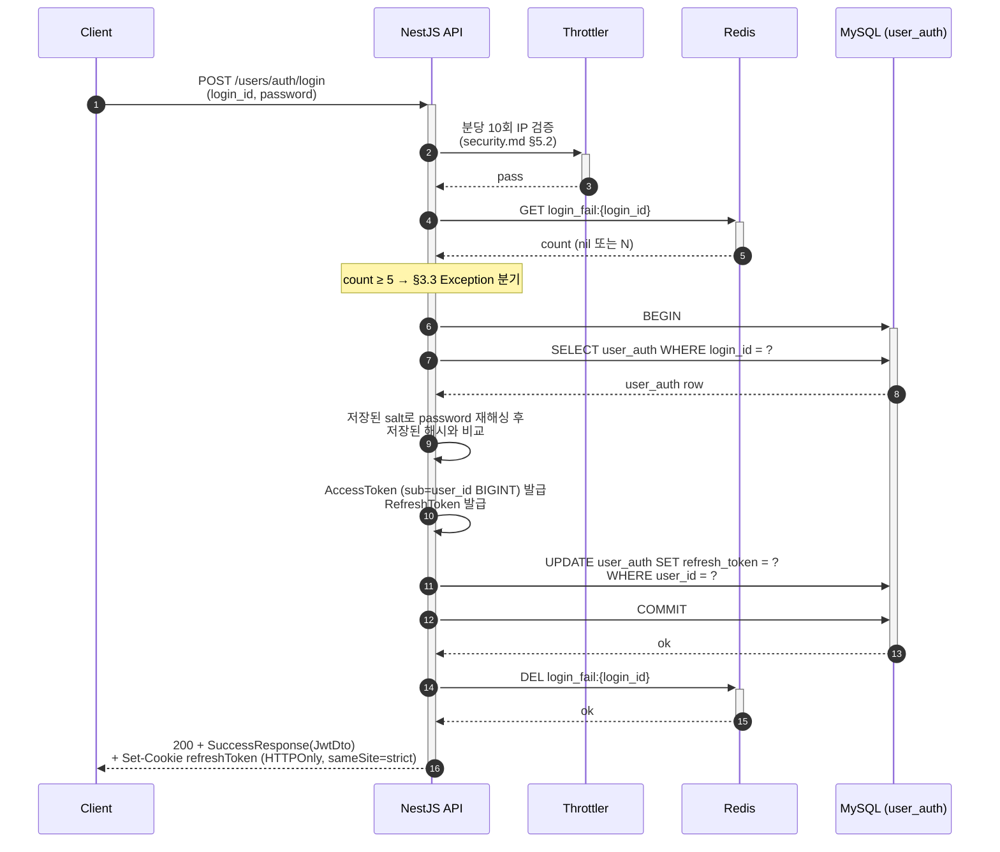
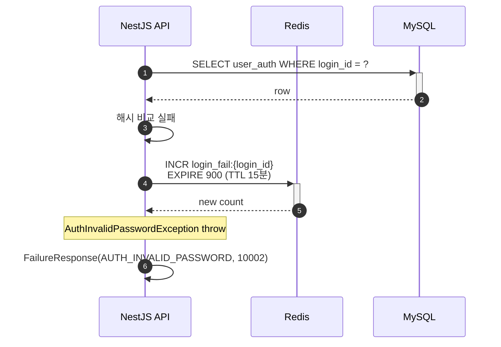

# Flow: user-login

## 헤더

- flow-id: user-login
- 커버 UC: UC-2 (Main Success Scenario + Extensions 2a, 3a, 3a-1)
- 관련 Aggregate: User (UserAuth — RefreshToken Rotation 원자성)
- runtime-behavior 참조: 없음 (단순 검증 흐름. RefreshToken Rotation은 user-token-refresh와 공유 패턴)
- Endpoint Variants: 없음

## 1. 정상 흐름 (Main Success Scenario)

login flow는 Idempotency-Key 적용 대상 아님 (async-deployment.md §대상 엔드포인트 표 — login 미포함. 인증 자격 검증 자체가 멱등 처리 의미 모호).

## 2. Alternate 분기

해당 없음.

## 3. Exception 분기

### 3.1 UC-2 Extension 2a (UserAuth 미존재)

조건: `SELECT user_auth WHERE login_id = ?` 결과 empty.

처리: `UserNotFoundException` throw → `200 + FailureResponse(USER_NOT_FOUND)`. DB 상태 불변. 계정 열거 방지 관점에서는 401로 응답 통일하는 옵션도 있으나, 본 프로젝트는 기존 컨벤션 유지 (학습 프로젝트 단순성).

### 3.2 UC-2 Extension 3a (비밀번호 불일치)

조건: 재해싱된 해시 ≠ 저장된 해시.

처리:
1. Redis INCR `login_fail:{login_id}` + EXPIRE 900 (security.md §7 + security-deployment.md §로그인 실패 카운트)
2. `AuthInvalidPasswordException` throw → `200 + FailureResponse(AUTH_INVALID_PASSWORD)`
3. DB 상태 불변

### 3.3 UC-2 Extension 3a-1 (로그인 실패 카운트 ≥ 5 잠금)

조건: 정상 흐름 step 4(`GET login_fail`) 또는 §3.2 step 1 후 count ≥ 5.

처리: security-deployment.md "선택지 2 (Phase 1 권장)" 적용 — `AuthInvalidPasswordException` 통합 처리 (잠금 사실 외부 노출 금지, 계정 열거 방지). 응답: `200 + FailureResponse(AUTH_INVALID_PASSWORD)` + `Retry-After: 900` 헤더. Winston 구조화 로그에 `event: auth.login.failure_locked` 기록 (Phase 2 audit_log INSERT로 전환 예정).

비밀번호 검증 단계 자체를 건너뛰므로 DB SELECT 미수행 (사이드 채널 timing 차이 최소화 — security.md §7 의도와 정합).

## 4. Endpoint Variants

없음.

## 5. 인터페이스 계약

| 노드 | 메시지 | 인터페이스 | implementation-guide.md 섹션 |
|------|--------|-----------|------------------------------|
| Controller→Service | login(dto) | `UserAuthService.login(LoginDto): Promise<JwtDto>` | §3.1 user-auth.service |
| Service→Repository | findByLoginId | `UserAuthRepository.findByLoginId(loginId): Promise<UserAuthEntity \| null>` | §3.2 |
| Service→JwtUtil | sign | `JwtService.issueTokens(userId, role): { accessToken, refreshToken }` | §6.2 |
| Service→Repository | updateRefreshToken | `UserAuthRepository.updateRefreshToken(userId, token, qr): Promise<void>` | §3.2 |
| Service→Redis | login_fail get/incr/del | `LoginFailCounter.get/incr/del(loginId)` (security 유틸) | §6.3 |
| Controller→Interceptor | refresh cookie 응답 | `SetRefreshTokenCookieInterceptor` (기존 유지) | §4.1 |

## 6. 테스트 매핑

| TC-N | 커버 노드/분기 | 종류 |
|------|---------------|------|
| TC-07 | §1 정상 흐름 (JwtDto + Set-Cookie refreshToken) | E2E |
| TC-08 | §1 RefreshToken DB 갱신 원자성 (트랜잭션 실패 시 토큰 발급 취소) | 통합 |
| TC-09 | §3.1 UserAuth 미존재 → USER_NOT_FOUND | E2E |
| TC-10 | §3.2 비밀번호 불일치 → AUTH_INVALID_PASSWORD + login_fail INCR | E2E (security) |
| TC-11 | §3.3 5회 실패 후 6회째 요청 → AUTH_INVALID_PASSWORD + Retry-After 900 + 비밀번호 검증 skip | E2E (security) |
| TC-12 | Throttler 분당 10회 IP 제한 초과 → COMMON_TOO_MANY_REQUESTS | E2E (security) |

## Sources

- docs/problem/use-cases.md §UC-2
- docs/problem/domain-spec.md INV-4, INV-10, INV-11, DT-2
- docs/solution/common/application-arch.md §User Aggregate (LoginUser → UserLoggedIn)
- docs/solution/common/data-design.md §user_auth, §Redis 키 구조 (login_fail)
- docs/solution/common/security.md §1 토큰 수명·회전, §5 Rate Limiting, §7 로그인 실패 카운트
- docs/solution/phase-1/security-deployment.md §로그인 실패 카운트, §@nestjs/throttler
