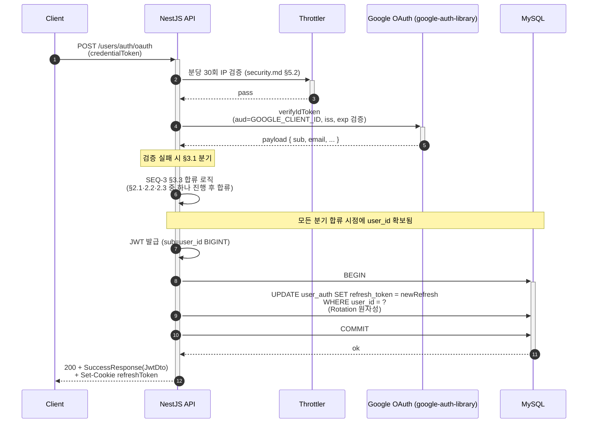
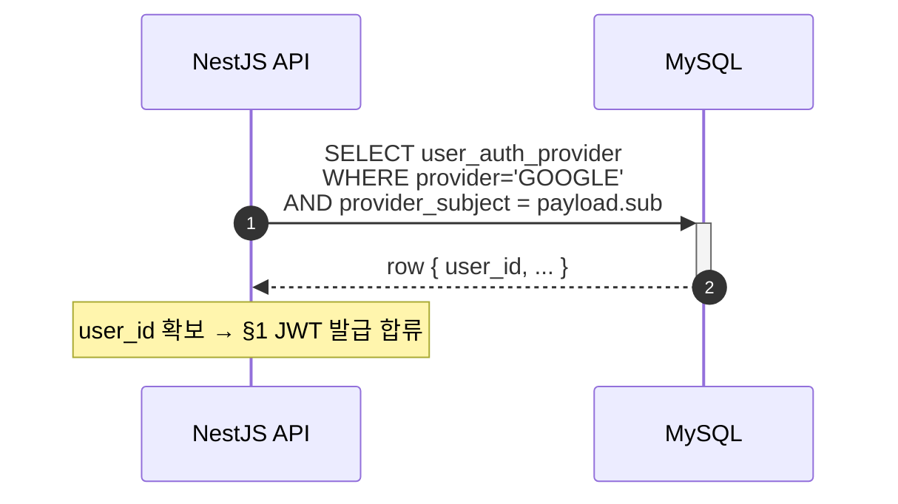
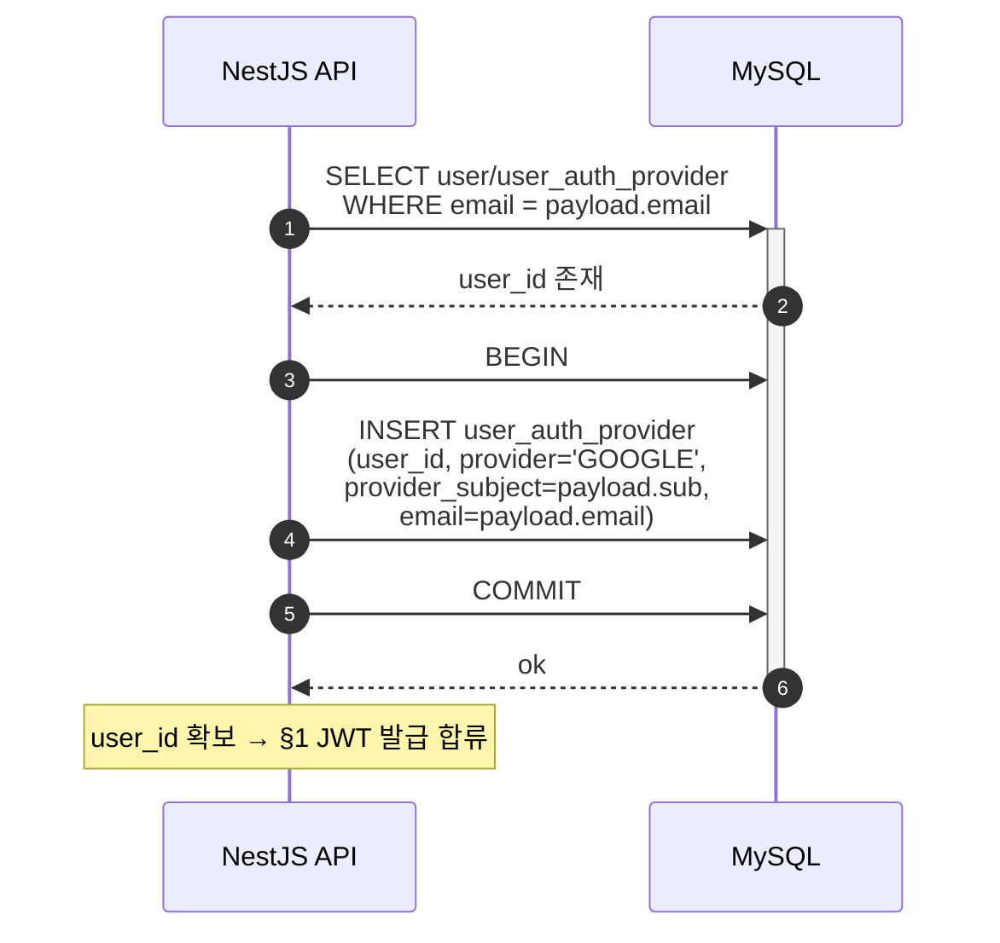
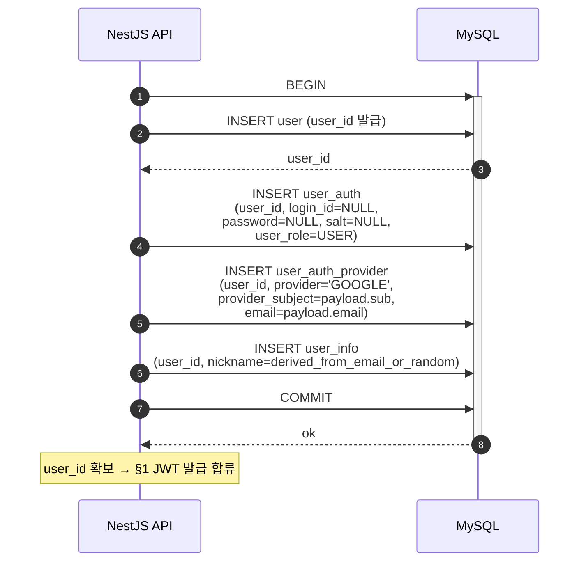

# Flow: user-oauth-login

## 헤더

- flow-id: user-oauth-login
- 커버 UC: UC-3 (Main Success Scenario + Extensions 2a, 4a, 4a Linking 분기)
- 관련 Aggregate: User (UserAuthProvider 신설 / Account Linking — application-arch.md §Identity Separation + Account Linking [확정])
- runtime-behavior 참조: **SEQ-3 (common/runtime-behavior.md §3.3) instantiation**. SEQ-3가 설계 측 cross-Aggregate UC 시각화, 본 flow는 구현 측 instantiation. 다이어그램 재시각화 금지 — 본 flow는 §1·§2·§3에서 SEQ-3의 분기를 텍스트로 분해하고, 구현 결정(트랜잭션 경계, JWT 발급 통합 지점)을 명시
- Endpoint Variants: 없음

## 1. 정상 흐름 (Main Success Scenario, SEQ-3의 핵심 합류 분기)

SEQ-3 다이어그램은 4개 입력 분기(검증실패 / 기존 OAuth / Account Linking / 완전 신규)가 JWT 발급 공통 경로로 합류하는 구조. 본 flow는 합류 시점 이후의 JWT 발급 + RefreshToken Rotation 흐름을 정상 흐름으로 정의한다.

OAuth 전용 사용자(login_id NULL) 처리: user_auth row가 존재하는 가입 경로에서는 동일 UPDATE 가능. login_id NULL인 OAuth-only 사용자도 user_auth row 자체는 존재(data-migration.md §3 단계). 단, 기존 OAuth 분기(§2.1)에서 user_auth row 부재 가능성이 있으면 INSERT 분기를 추가해야 하나, 본 Phase 1 설계에서는 모든 user_auth_provider가 user_auth row와 1:1로 묶이도록 보장 — §2.2·2.3 신규 가입 시 user_auth row를 INSERT (data-migration.md §3 INSERT 패턴 참고: OAuth 가입자도 user_auth row 생성, password/salt NULL).

본 flow는 Idempotency-Key 대상 아님 (login/refresh와 동일 사유 — 자격 검증 응답 캐싱 부적합).

## 2. Alternate 분기 (SEQ-3 분기 instantiation)

### 2.1 UC-3 Extension 4a (기존 OAuth 사용자 — provider_subject 일치)

조건: `SELECT user_auth_provider WHERE provider='GOOGLE' AND provider_subject = payload.sub` 결과 row 존재.

처리: 추가 DB 쓰기 없이 user_id 즉시 확보 → §1 합류 시점으로 진행.

### 2.2 UC-3 Extension 4a Linking 분기 (자동 Account Linking — 동일 email 기존 User)

조건: provider_subject 미일치 + `SELECT user WHERE email = payload.email` 결과 row 존재 (현 구현 단순화: user 테이블에 email 컬럼 없으므로 user_auth_provider.email 또는 별도 lookup 경로 — application-arch.md §Identity Separation 결정에 따라 email 기반 매칭 가능 경로 확보. 정확한 lookup 출처는 implementation-guide.md §3.1에서 결정).

처리: 기존 user_id에 신규 UserAuthProvider INSERT만 수행 (User 신규 생성 없음).

UNIQUE 충돌 처리: `(provider, provider_subject)` UNIQUE 제약(INV — data-design.md §user_auth_provider)이 동시 가입 race에서 두 번째 요청 INSERT 실패 → 503 또는 retry 안내. 학습 프로젝트 단순성으로 `UnexpectedCodeException` 매핑 + 클라이언트 재시도 안내.

### 2.3 UC-3 신규 가입 분기 (완전 신규 — provider_subject 미일치 + email 미일치)

조건: 두 SELECT 모두 empty.

처리: User + UserAuth(login_id NULL, password/salt NULL) + UserAuthProvider + UserInfo 4개 row를 단일 트랜잭션 내 INSERT.

nickname 충돌 처리: `user_info.nickname` UNIQUE 제약(INV-2) 충돌 시 무작위 suffix 추가 후 재시도(최대 3회) — implementation-guide.md §6.6 nickname-derivation 알고리즘 결정.

## 3. Exception 분기

### 3.1 UC-3 Extension 2a (ID Token 검증 실패)

조건: `google-auth-library.verifyIdToken` throw (signature invalid / expired / audience mismatch / issuer mismatch).

처리: `AuthInvalidOauthTokenException` throw → `200 + FailureResponse(AUTH_INVALID_OAUTH_TOKEN)`. DB 접근 없음. 트랜잭션 미시작.

외부 호출 회복력 (security.md §외부 서비스 회복력):
- Connect timeout 3s, Read timeout 10s (google-auth-library 기본값)
- Retry 1회 (jitter 500ms) — google-auth-library는 자체 retry 미내장. UserAuthService 레벨에서 try/catch + setTimeout 구현
- Fallback 없음 — OAuth 불가 시 일반 가입 경로 안내

## 4. Endpoint Variants

없음.

## 5. 인터페이스 계약

| 노드 | 메시지 | 인터페이스 | implementation-guide.md 섹션 |
|------|--------|-----------|------------------------------|
| Controller→Service | oauth(dto) | `UserAuthService.oauthLogin(credentialToken: string): Promise<JwtDto>` | §3.1 user-auth.service |
| Service→Google | verifyIdToken | `OAuth2Client.verifyIdToken({ idToken, audience }): LoginTicket` | §6.7 google-auth wrapper |
| Service→Repository | findByProviderSubject | `UserAuthProviderRepository.findByProviderSubject(provider, sub): Promise<UserAuthProviderEntity \| null>` | §3.5 user-auth-provider.repository |
| Service→Repository | findUserByEmail | `UserAuthProviderRepository.findUserIdByEmail(email): Promise<bigint \| null>` (또는 user-auth-provider 경유) | §3.5 |
| Service→Repository | createOAuthUserOrLink | `UserRepository.createOAuthUser(...) / linkProvider(userId, provider, sub, email)` | §3.3 |
| Service→Util | deriveNickname | `nicknameUtils.deriveFromEmail(email): Promise<string>` (UNIQUE 충돌 시 suffix retry) | §6.6 |
| Service→JwtUtil | issueTokens | (user-login flow §5 공유) | §6.2 |
| Service→Repository | updateRefreshToken | (user-login flow §5 공유) | §3.2 |

## 6. 테스트 매핑

| TC-N | 커버 노드/분기 | 종류 |
|------|---------------|------|
| TC-21 | §1 + §2.1 (기존 OAuth 사용자 로그인) | E2E |
| TC-22 | §1 + §2.2 (Account Linking — 동일 email 일반 가입 사용자에 Provider 추가) | E2E |
| TC-23 | §1 + §2.3 (완전 신규 — 4개 row INSERT 트랜잭션 원자성) | E2E |
| TC-24 | §3.1 ID Token 서명 무효 → AUTH_INVALID_OAUTH_TOKEN | E2E |
| TC-25 | §3.1 audience 불일치 → AUTH_INVALID_OAUTH_TOKEN | 단위 (mock google-auth-library) |
| TC-26 | §2.2 (provider, provider_subject) UNIQUE 동시 race → 두 번째 요청 503/재시도 | 통합 (PBT 후보) |
| TC-27 | §2.3 nickname UNIQUE 충돌 → suffix retry 후 성공 | 통합 |
| TC-28 | Throttler 분당 30회 IP 제한 초과 → COMMON_TOO_MANY_REQUESTS | E2E (security) |

## Sources

- docs/problem/use-cases.md §UC-3
- docs/problem/domain-spec.md INV-1, INV-2, INV-3, INV-10, INV-11 (INV-5/INV-12는 Phase 1 폐기)
- docs/solution/common/application-arch.md §Identity Separation + Account Linking [확정]
- docs/solution/common/data-design.md §user_auth_provider, §user_auth (login_id NULL 허용)
- docs/solution/common/runtime-behavior.md §3.3 SEQ-3 (instantiation 본체)
- docs/solution/common/security.md §1 토큰 수명, §외부 서비스 회복력, §5 Rate Limiting
- docs/solution/phase-1/arch-increment.md §user 모듈 재편 §OAuth 로그인 흐름 재작성
- docs/solution/phase-1/data-migration.md §3 user_auth_provider 신설
