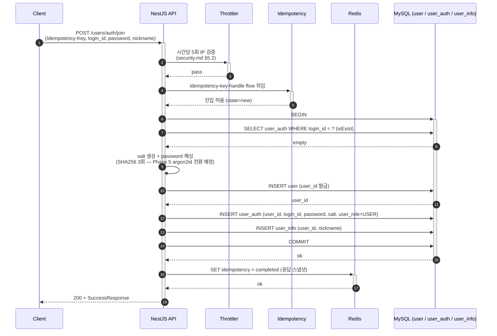
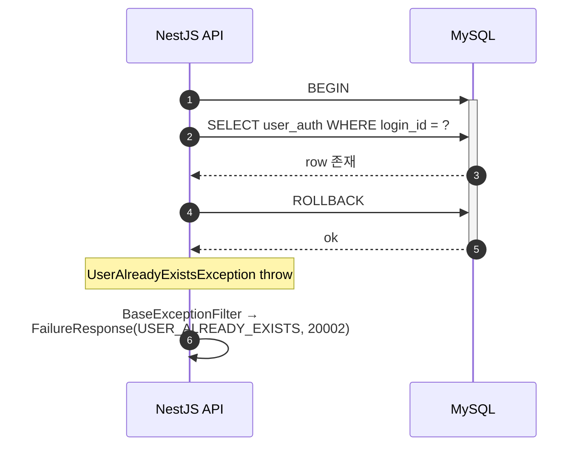

# Flow: user-register

## 헤더

- flow-id: user-register
- 커버 UC: UC-1 (Main Success Scenario + Extensions 2a, *a)
- 관련 Aggregate: User (UserAuth + UserInfo + User Root)
- runtime-behavior 참조: 없음 (단일 Aggregate 단순 CRUD, 시각화 가치 낮음 — runtime-behavior.md §2 인벤토리 정합)
- Endpoint Variants: 없음

본 flow는 일반 가입 경로(login_id + password) 전담. OAuth 가입은 user-oauth-login flow가 별도로 다룬다.

## 1. 정상 흐름 (Main Success Scenario)

## 2. Alternate 분기

해당 없음 (UC-1 Main Success Scenario는 단일 경로).

## 3. Exception 분기

### 3.1 UC-1 Extension 2a (login_id 중복)

조건: `SELECT user_auth WHERE login_id = ?` 결과 row 존재.

처리: `UserAlreadyExistsException` throw → BaseExceptionFilter가 `200 + FailureResponse(USER_ALREADY_EXISTS)` 변환. user/user_auth/user_info INSERT 미수행. DB 상태 불변. Idempotency 상태는 completed로 마킹(실패 응답 스냅샷 저장).

### 3.2 UC-1 Extension *a (Idempotency-Key 4분기)

DT-1(domain-spec.md §Decision Tables) 본체는 idempotency-key-handle flow에 단일 정의. 본 flow는 Interceptor 진입 결과로 다음 4 분기 중 1개로 진입:

- R1 (키 미제공): 정상 처리, 캐시 미사용 → 위 §1 진행
- R2 (키 제공 + miss): pending 마킹 후 §1 진행, 완료 시 응답 스냅샷 저장
- R3 (키 제공 + hit-stored): 저장된 응답 즉시 반환 (핸들러 진입 없음)
- R4 (키 제공 + hit-in-flight): `200 + FailureResponse(IDEMPOTENCY_IN_PROGRESS) + Retry-After: 5`

상세는 idempotency-key-handle.md §1·§2 참조.

## 4. Endpoint Variants

없음.

## 5. 인터페이스 계약

| 노드 | 메시지 | 인터페이스 | implementation-guide.md 섹션 |
|------|--------|-----------|------------------------------|
| Controller→Service | join(dto) | `UserAuthService.join(JoinDto): Promise<void>` | §3.1 user-auth.service |
| Service→Repository | findByLoginId | `UserAuthRepository.findByLoginId(loginId): Promise<UserAuthEntity \| null>` | §3.2 user-auth.repository |
| Service→Repository | createUserWithAuth | `UserRepository.createWithAuthAndInfo(user, auth, info, qr): Promise<UserEntity>` | §3.3 user.repository |
| Service→Util | hashPassword | `cryptoUtils.hashPassword(password, salt): string` | §6.1 crypto utility |

## 6. 테스트 매핑

| TC-N | 커버 노드/분기 | 종류 |
|------|---------------|------|
| TC-01 | §1 정상 흐름 전체 (200 + UserAuth+UserInfo 생성) | E2E |
| TC-02 | §1 비밀번호 해싱 결정성 (salt 동일 시 동일 해시) | 단위 |
| TC-03 | §1 user/user_auth/user_info 트랜잭션 원자성 (중간 INSERT 실패 시 user도 rollback) | 통합 |
| TC-04 | §3.1 login_id 중복 → USER_ALREADY_EXISTS | E2E |
| TC-05 | §3.2 R2·R3·R4 (Idempotency 4분기) | E2E (idempotency-key-handle TC와 공유) |
| TC-06 | Throttler 시간당 5회 IP 제한 초과 → COMMON_TOO_MANY_REQUESTS | E2E (security) |

## Sources

- docs/problem/use-cases.md §UC-1
- docs/problem/domain-spec.md INV-1, INV-3, INV-4
- docs/solution/common/application-arch.md §User Aggregate (RegisterUser → UserRegistered)
- docs/solution/common/data-design.md §user, §user_auth, §user_info
- docs/solution/common/security.md §1 인증, §5 Rate Limiting, §8 Idempotency-Key
- docs/solution/phase-1/arch-increment.md §user 모듈 재편
- docs/solution/phase-1/security-deployment.md §@nestjs/throttler
- docs/solution/phase-1/async-deployment.md §API 수신 측 Idempotency-Key
