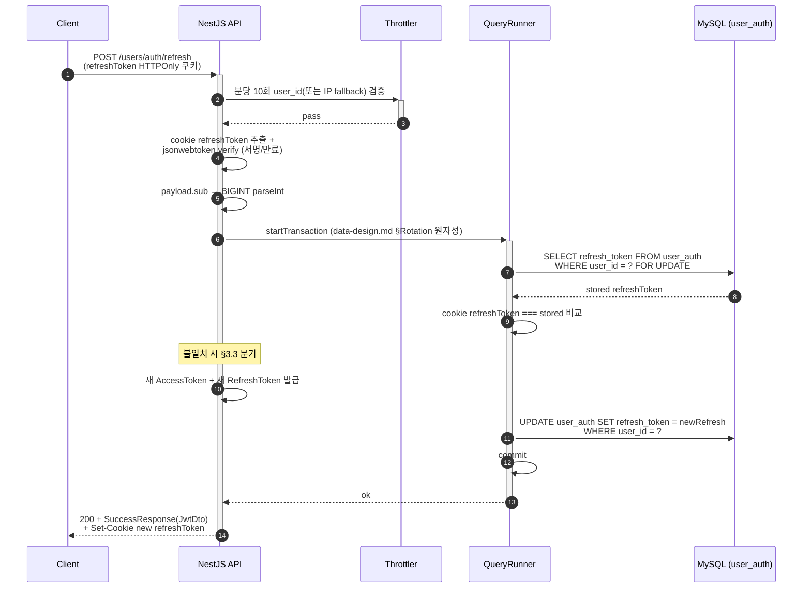
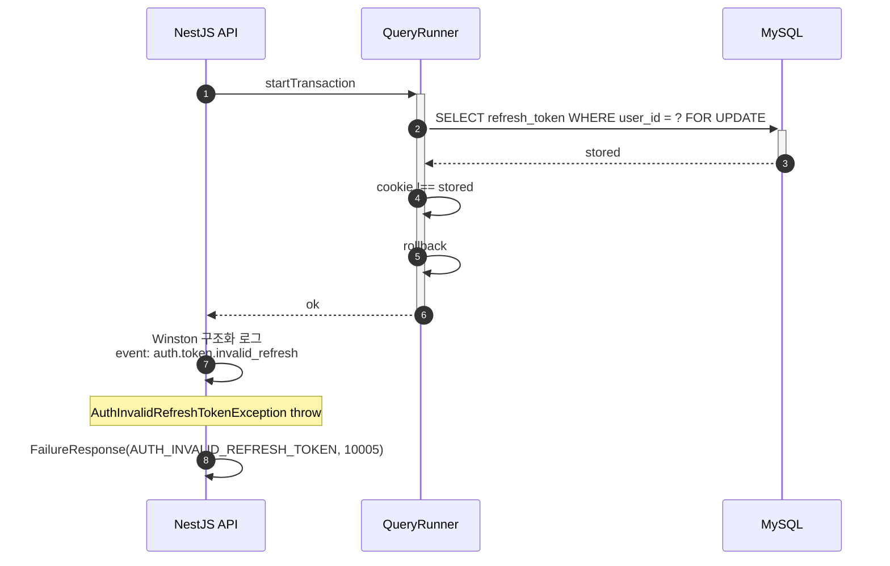

# Flow: user-token-refresh

## 헤더

- flow-id: user-token-refresh
- 커버 UC: UC-4 (Main Success Scenario + Extensions 1a, 2a, 3a, 5a)
- 관련 Aggregate: User (UserAuth — RefreshToken Rotation 원자성 INV-11)
- runtime-behavior 참조: 없음. DT-2(토큰 이중 검증)의 R5·R6 분기 본체. AuthGuard 진입 흐름은 runtime-deployment.md §1.1에 별도 시각화
- Endpoint Variants: 없음

본 flow는 만료된 AccessToken을 새 토큰 쌍으로 갱신하는 전담 엔드포인트. AuthGuard 통과 흐름(보호 엔드포인트 진입의 이중 검증)은 cross-cutting이라 본 flow에 미포함 — implementation-guide.md §3.1 AuthGuard 섹션 참조.

## 1. 정상 흐름 (Main Success Scenario, DT-2 R6)

본 flow는 Idempotency-Key 대상 아님 (async-deployment.md §대상 엔드포인트 표 — refresh 미포함. 매 호출이 새 토큰 발급이라 멱등 의미 모호 + 보안상 재발급 응답 캐싱 회피).

## 2. Alternate 분기

해당 없음.

## 3. Exception 분기

### 3.1 UC-4 Extension 1a (RefreshToken 쿠키 누락, DT-2 R2)

조건: `req.cookies.refreshToken` undefined.

처리: `AuthRefreshTokenRequiredException` throw → `200 + FailureResponse(AUTH_REFRESH_TOKEN_REQUIRED)`. DB 접근 없음. 트랜잭션 미시작.

### 3.2 UC-4 Extension 2a (RefreshToken 서명/만료 검증 실패, DT-2 R4)

조건: `jsonwebtoken.verify` throw (signature invalid / expired).

처리: `AuthInvalidRefreshTokenException` throw → `200 + FailureResponse(AUTH_INVALID_REFRESH_TOKEN)`. DB 접근 없음.

### 3.3 UC-4 Extension 3a (DB 저장값 불일치, DT-2 R5 — 탈취 의심)

조건: `cookie refreshToken !== stored refreshToken` (이전 Rotation 후 잔존 또는 탈취 가능성).

처리:
1. QueryRunner rollback
2. Winston 구조화 로그 `event: auth.token.invalid_refresh` 기록 (Phase 2 audit_log INSERT로 전환 예정 — DT-2 audit_log 알림 분기)
3. `AuthInvalidRefreshTokenException` throw → `200 + FailureResponse(AUTH_INVALID_REFRESH_TOKEN)`
4. 새 토큰 미발급 + DB.refresh_token 불변 (Rotation 원자성)

### 3.4 UC-4 Extension 5a (갱신 트랜잭션 실패)

조건: UPDATE 또는 commit 단계에서 DB 오류 (예: 커넥션 손실).

처리:
1. QueryRunner rollback → 이전 DB.refresh_token 보존 (INV-11 Rotation 원자성)
2. 새 토큰 미발급 (클라이언트에 전달되지 않음)
3. `AuthInvalidRefreshTokenException` throw → `200 + FailureResponse(AUTH_INVALID_REFRESH_TOKEN)`

부분 성공(새 토큰 발급됐는데 DB는 이전 값) 발생 금지 — 트랜잭션 경계 내 발급/저장 원자 결합.

## 4. Endpoint Variants

없음.

## 5. 인터페이스 계약

| 노드 | 메시지 | 인터페이스 | implementation-guide.md 섹션 |
|------|--------|-----------|------------------------------|
| Controller→Service | refresh(cookie) | `UserAuthService.refresh(refreshToken: string): Promise<JwtDto>` | §3.1 user-auth.service |
| Service→Util | verifyRefreshToken | `JwtService.verifyRefreshToken(token): JwtPayload` (#70 흡수 — throw 방식 통일) | §6.2 |
| Service→QueryRunner | startTransaction | `dataSource.createQueryRunner()` | §6.4 트랜잭션 패턴 |
| Service→Repository | findRefreshTokenForUpdate | `UserAuthRepository.findRefreshTokenForUpdate(userId, qr): Promise<string \| null>` | §3.2 |
| Service→Repository | updateRefreshToken | `UserAuthRepository.updateRefreshToken(userId, token, qr): Promise<void>` | §3.2 |
| Controller→Interceptor | refresh cookie 응답 | `SetRefreshTokenCookieInterceptor` (기존 유지) | §4.1 |

### #70 흡수: verifyRefreshToken 에러 시그널링 통일

현 구현은 `verifyRefreshToken`이 `{ valid, payload }` 형태로 반환하거나 throw가 혼재. Phase 1에서 throw 방식으로 통일 (implementation-guide.md §6.2):
- 성공 시: `JwtPayload` 반환
- 실패 시: `AuthInvalidRefreshTokenException` 또는 `AuthRefreshTokenRequiredException` throw

호출 측(`refresh` / `AuthGuard`)은 try/catch로 처리.

## 6. 테스트 매핑

| TC-N | 커버 노드/분기 | 종류 |
|------|---------------|------|
| TC-13 | §1 정상 흐름 (DT-2 R6 — 새 토큰 + DB 갱신 + Set-Cookie) | E2E |
| TC-14 | §1 새 RefreshToken !== 이전 RefreshToken (Rotation) | E2E |
| TC-15 | §3.1 쿠키 누락 (DT-2 R2) → AUTH_REFRESH_TOKEN_REQUIRED | E2E |
| TC-16 | §3.2 서명 무효 (DT-2 R4) → AUTH_INVALID_REFRESH_TOKEN | E2E |
| TC-17 | §3.2 만료 (DT-2 R4) → AUTH_INVALID_REFRESH_TOKEN | E2E |
| TC-18 | §3.3 DB 불일치 (DT-2 R5) → AUTH_INVALID_REFRESH_TOKEN + 로그 event=auth.token.invalid_refresh | 통합 |
| TC-19 | §3.4 UPDATE 실패 → rollback + 이전 DB 값 보존 (Rotation 원자성) | 통합 |
| TC-20 | verifyRefreshToken throw 통일 (#70 흡수): success returns payload / failure throws | 단위 |

## Sources

- docs/problem/use-cases.md §UC-4
- docs/problem/domain-spec.md INV-10, INV-11, DT-2
- docs/solution/common/application-arch.md §User Aggregate (RefreshToken → TokenRotated)
- docs/solution/common/data-design.md §트랜잭션/동시성 §RefreshToken Rotation 원자성
- docs/solution/common/security.md §1 토큰 수명·회전, §5 Rate Limiting
- docs/solution/phase-1/runtime-deployment.md §1.1 인증 흐름 재작성
- GitHub Issue #70 (verifyRefreshToken throw 방식 통일 — Phase 1 흡수)
