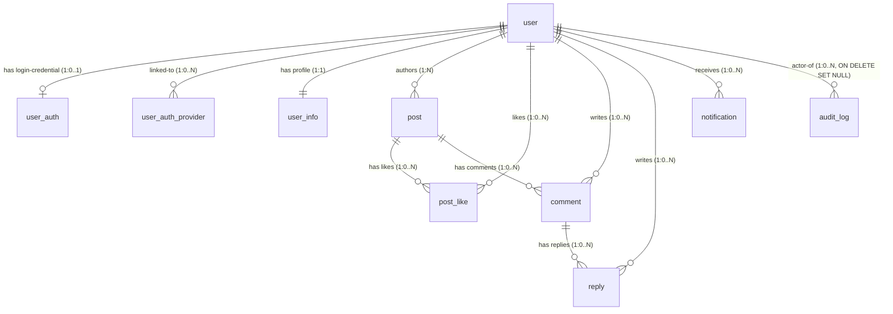

# Data Design

## 소유권 경계

이 파일은 **스키마(DDL), 관계 모델, 인덱스, FK, 트랜잭션 격리 수준**을 다룬다 (실체 기술 레이어 규칙 — 스키마 레이어).

- 정책 레이어(수집 범위·보존 기간·알림 정책·감사 대상·Rate Limit 값 등)는 각 primary 파일 참조:
  - 감사 로그 정책 → observability.md
  - Rate Limit / 시크릿 / 백업·복구 정책 → security.md
  - 이벤트 아웃박스 정책·Saga coordinator → async.md
- Aggregate 정의 및 Invariant는 application-arch.md §Aggregates 참조
- Phase별 스키마 마이그레이션 절차는 ../phase-{N}/data-migration.md 참조
- 관계 표 수정 시 application-arch.md Aggregate 외부 참조도 동기화 필수 (아래 경고 주석 참조)

## DB 설계 개요

### [확정] RDB 엔진 — MySQL 8.0 (InnoDB)

결정: MySQL 8.0 InnoDB 유지 [확정]

근거: context.md [기술 스택 제약] 기존 Docker Compose 구성 (MySQL 8.0) + application-arch.md Aggregate 간 참조 무결성을 FK 제약으로 DB-level 보증 필요 + 학습 프로젝트 스코프에서 기술 전환 불필요

기각 대안: (1) PostgreSQL — 기능적 이점(JSON 연산, 부분 인덱스, MVCC 우위) 있으나 학습 목표가 DB 기술 전환 아님 + 기존 마이그레이션 인프라(TypeORM mysql2, Phase 0 InitialSchema) 재작성 비용 과다. (2) MariaDB — MySQL fork로 의미적 동등성은 있으나 스택 유지(원본 MySQL 8.0) 정책 위배 + JSON/Window Function 등 일부 차이로 마이그레이션 시 비호환 리스크. (3) NoSQL(MongoDB) — 관계형 무결성·트랜잭션·복합 PK(post_like) 손실, application-arch.md Aggregate 외부 참조 cascade 정책과 충돌. (4) SQLite — 단일 파일 동시성·복합 PK·풀스택 트랜잭션 한계로 학습 목표 비동기 처리 검증에 부적합

파급 효과: 트랜잭션 격리 수준 기본 REPEATABLE READ (MySQL 기본). TypeORM MySQL 드라이버(mysql2 ^3.6.3) 기반 마이그레이션 파일 생성. JSON 컬럼은 MySQL JSON 타입 사용 (PostgreSQL JSONB 대비 인덱싱 제약 — outbox.payload는 JSON으로 저장하되 인덱스는 별도 정규 컬럼인 event_type/aggregate_type/aggregate_id에 의존).

### [확정] 캐시/부가 저장소 — Redis

결정: Redis 유지. 용도: 애플리케이션 캐시 / Idempotency Key 저장소 / 로그인 실패 카운터 / 작업 큐 일부 [확정]

근거: context.md [기술 스택 제약] 기존 구성 + TP3 처방 패턴(Idempotency Key 저장) + application-arch.md §Idempotency Key Pattern

기각 대안: Memcached — Redis 대비 자료구조/Streams/pub-sub 표현력 부족

파급 효과: Redis의 key prefix 전략(`cache:`, `idempotency:`, `login_fail:`, `queue:` 등)은 async / security Extension에서 상세. 외부 저장소(DDL 개념 없음)이므로 키 구조와 TTL은 정책 primary 파일에서 기술.

### [확정] 인덱스/FK 전략 기본 방침

결정: Aggregate 외부 참조(다른 Aggregate Root ID)는 FK + ON DELETE CASCADE 허용 (학습 프로젝트 단순성 예외) [확정]

근거: application-arch.md §User Aggregate / §Post Aggregate 파급 효과 항목 + Vernon Rule 4의 "Aggregate 간 application-level ON DELETE 기본" 원칙에 대한 명시적 완화 예외 선언

기각 대안: 완전 application-level 삭제 전파 (이벤트 기반) — Phase 3 async 인프라 도입 전까지는 DB-level cascade로 단순화. Phase 3 이후 이벤트 기반 전파로 전환 검토 가능

파급 효과: 모든 User 외래키(post.userId / post_like.userId / comment.userId / reply.userId / user_auth.userId / user_auth_provider.userId / user_info.userId / notification.recipient_user_id)는 ON DELETE CASCADE. audit_log.actor_user_id만 ON DELETE SET NULL (감사 보존). 관계 표에 반영.

## 스키마 (최종 형상)

### user (Aggregate Root, Phase 1 신설)

```sql
CREATE TABLE user (
  user_id         BIGINT        NOT NULL AUTO_INCREMENT PRIMARY KEY,
  created_datetime DATETIME(3)  NOT NULL DEFAULT CURRENT_TIMESTAMP(3),
  modified_datetime DATETIME(3) NOT NULL DEFAULT CURRENT_TIMESTAMP(3) ON UPDATE CURRENT_TIMESTAMP(3)
);
```

- 용도: 내부 영구 식별자. 모든 User 관련 참조의 외래키 주체
- PK: `user_id` BIGINT AUTO_INCREMENT. UUID 대안 검토했으나 학습 프로젝트 단순성(FK 인덱스 성능·가독성) 및 MySQL AUTO_INCREMENT 관행에 맞춰 BIGINT 채택

### user_auth (Phase 1 재구성)

```sql
CREATE TABLE user_auth (
  user_id         BIGINT        NOT NULL PRIMARY KEY,
  login_id        VARCHAR(100)  NULL UNIQUE,
  password        VARCHAR(1000) NULL,
  salt            VARCHAR(50)   NULL,
  refresh_token   VARCHAR(500)  NULL,
  user_role       ENUM('USER','ADMIN') NOT NULL DEFAULT 'USER',
  created_datetime  DATETIME(3) NOT NULL DEFAULT CURRENT_TIMESTAMP(3),
  modified_datetime DATETIME(3) NOT NULL DEFAULT CURRENT_TIMESTAMP(3) ON UPDATE CURRENT_TIMESTAMP(3),
  CONSTRAINT fk_user_auth_user FOREIGN KEY (user_id) REFERENCES user(user_id) ON DELETE CASCADE
);
```

- 용도: 일반 가입 사용자의 로그인 자격. OAuth 전용 사용자는 이 테이블에 레코드가 없을 수 있음 (login_id NULL UNIQUE로 허용)
- 비고: `password` / `salt` / `refresh_token`은 정책 상세(해싱 알고리즘, 쿠키 전송 규칙, Rotation 원자성)는 security.md 참조

### user_auth_provider (Phase 1 신설)

```sql
CREATE TABLE user_auth_provider (
  provider_id         BIGINT        NOT NULL AUTO_INCREMENT PRIMARY KEY,
  user_id             BIGINT        NOT NULL,
  provider            ENUM('GOOGLE') NOT NULL,
  provider_subject    VARCHAR(255)  NOT NULL,
  email               VARCHAR(320)  NULL,
  created_datetime    DATETIME(3)   NOT NULL DEFAULT CURRENT_TIMESTAMP(3),
  modified_datetime   DATETIME(3)   NOT NULL DEFAULT CURRENT_TIMESTAMP(3) ON UPDATE CURRENT_TIMESTAMP(3),
  CONSTRAINT uq_provider_subject UNIQUE (provider, provider_subject),
  CONSTRAINT fk_uap_user FOREIGN KEY (user_id) REFERENCES user(user_id) ON DELETE CASCADE
);
```

- 용도: 외부 IdP(현재 Google) 매핑. (provider, provider_subject) 복합 UNIQUE으로 전역 유일성 스키마 강제 (Invariant)
- `provider_subject`는 OAuth `sub` 클레임(Google의 고유 사용자 ID — 변경 불가). email보다 안정적
- `email` 컬럼은 email 기반 기존 User 탐지 시 사용. UNIQUE 제약 없음 (한 사람이 여러 provider에 같은 email 사용 가능)
- ENUM은 `GOOGLE`만 정의 (현재). 향후 provider 추가 시 ENUM 확장

### user_info (Phase 1 외래키 변경)

```sql
CREATE TABLE user_info (
  user_id           BIGINT       NOT NULL PRIMARY KEY,
  nickname          VARCHAR(100) NOT NULL UNIQUE,
  introduce         VARCHAR(500) NULL,
  created_datetime  DATETIME(3)  NOT NULL DEFAULT CURRENT_TIMESTAMP(3),
  modified_datetime DATETIME(3)  NOT NULL DEFAULT CURRENT_TIMESTAMP(3) ON UPDATE CURRENT_TIMESTAMP(3),
  CONSTRAINT fk_user_info_user FOREIGN KEY (user_id) REFERENCES user(user_id) ON DELETE CASCADE
);
```

### post (Phase 1 외래키 변경 + 커서 페이징 인덱스)

```sql
CREATE TABLE post (
  post_id           BIGINT        NOT NULL AUTO_INCREMENT PRIMARY KEY,
  user_id           BIGINT        NOT NULL,
  title             VARCHAR(500)  NOT NULL,
  contents          TEXT          NOT NULL,
  hits              INT           NOT NULL DEFAULT 0,
  write_datetime    DATETIME(3)   NOT NULL DEFAULT CURRENT_TIMESTAMP(3),
  created_datetime  DATETIME(3)   NOT NULL DEFAULT CURRENT_TIMESTAMP(3),
  modified_datetime DATETIME(3)   NOT NULL DEFAULT CURRENT_TIMESTAMP(3) ON UPDATE CURRENT_TIMESTAMP(3),
  CONSTRAINT fk_post_user FOREIGN KEY (user_id) REFERENCES user(user_id) ON DELETE CASCADE,
  INDEX idx_post_cursor (write_datetime DESC, post_id DESC),
  INDEX idx_post_user (user_id, write_datetime DESC, post_id DESC)
);
```

- `idx_post_cursor` — 전체 글 목록 최신순 커서 페이징 (TP4)
- `idx_post_user` — 특정 사용자 글 목록 (GET /posts/users/:userId) 커서 페이징

### post_like (Phase 1 외래키 변경)

```sql
CREATE TABLE post_like (
  post_id           BIGINT      NOT NULL,
  user_id           BIGINT      NOT NULL,
  created_datetime  DATETIME(3) NOT NULL DEFAULT CURRENT_TIMESTAMP(3),
  PRIMARY KEY (post_id, user_id),
  CONSTRAINT fk_pl_post FOREIGN KEY (post_id) REFERENCES post(post_id) ON DELETE CASCADE,
  CONSTRAINT fk_pl_user FOREIGN KEY (user_id) REFERENCES user(user_id) ON DELETE CASCADE
);
```

- 복합 PK (post_id, user_id)는 "1인 1회" Invariant 스키마 강제

### comment (Phase 1 신설)

```sql
CREATE TABLE comment (
  comment_id        BIGINT        NOT NULL AUTO_INCREMENT PRIMARY KEY,
  post_id           BIGINT        NOT NULL,
  user_id           BIGINT        NOT NULL,
  content           VARCHAR(1000) NOT NULL,
  created_datetime  DATETIME(3)   NOT NULL DEFAULT CURRENT_TIMESTAMP(3),
  modified_datetime DATETIME(3)   NOT NULL DEFAULT CURRENT_TIMESTAMP(3) ON UPDATE CURRENT_TIMESTAMP(3),
  CONSTRAINT fk_comment_post FOREIGN KEY (post_id) REFERENCES post(post_id) ON DELETE CASCADE,
  CONSTRAINT fk_comment_user FOREIGN KEY (user_id) REFERENCES user(user_id) ON DELETE CASCADE,
  INDEX idx_comment_post_cursor (post_id, created_datetime ASC, comment_id ASC)
);
```

- 용도: Post 내부 Entity. Post 삭제 시 cascade
- `idx_comment_post_cursor` — 특정 Post 내 댓글 오래된순 커서 페이징

### reply (Phase 1 신설, Adjacency List)

```sql
CREATE TABLE reply (
  reply_id          BIGINT        NOT NULL AUTO_INCREMENT PRIMARY KEY,
  comment_id        BIGINT        NOT NULL,
  user_id           BIGINT        NOT NULL,
  content           VARCHAR(1000) NOT NULL,
  created_datetime  DATETIME(3)   NOT NULL DEFAULT CURRENT_TIMESTAMP(3),
  modified_datetime DATETIME(3)   NOT NULL DEFAULT CURRENT_TIMESTAMP(3) ON UPDATE CURRENT_TIMESTAMP(3),
  CONSTRAINT fk_reply_comment FOREIGN KEY (comment_id) REFERENCES comment(comment_id) ON DELETE CASCADE,
  CONSTRAINT fk_reply_user FOREIGN KEY (user_id) REFERENCES user(user_id) ON DELETE CASCADE,
  INDEX idx_reply_comment (comment_id, created_datetime ASC, reply_id ASC)
);
```

- 용도: Adjacency List (application-arch.md §Adjacency List for Reply). 깊이 1단계 — Reply → Reply 불가(parent_reply_id 불필요)
- Comment 삭제 시 cascade

### audit_log (Phase 2 신설, observability.md §5 정책 primary)

```sql
CREATE TABLE audit_log (
  audit_id          BIGINT       NOT NULL AUTO_INCREMENT PRIMARY KEY,
  occurred_at       DATETIME(3)  NOT NULL DEFAULT CURRENT_TIMESTAMP(3),
  action            VARCHAR(100) NOT NULL,
  actor_user_id     BIGINT       NULL,
  actor_role        ENUM('USER','ADMIN','ANONYMOUS') NOT NULL DEFAULT 'ANONYMOUS',
  resource_type     VARCHAR(50)  NULL,
  resource_id       VARCHAR(100) NULL,
  result            ENUM('SUCCESS','FAILURE') NOT NULL,
  reason_code       VARCHAR(50)  NULL,
  client_ip         VARCHAR(45)  NULL,
  user_agent        VARCHAR(500) NULL,
  correlation_id    CHAR(36)     NULL,
  changes           JSON         NULL,
  CONSTRAINT fk_audit_actor FOREIGN KEY (actor_user_id) REFERENCES user(user_id) ON DELETE SET NULL,
  INDEX idx_audit_actor (actor_user_id, occurred_at DESC),
  INDEX idx_audit_action (action, occurred_at DESC),
  INDEX idx_audit_resource (resource_type, resource_id, occurred_at DESC)
);
```

- 용도: 감사 로그. 정책(대상 이벤트 8종, 4W1H 의미, 보존 30일, 무결성 보장)은 observability.md §5 참조
- `actor_user_id` ON DELETE SET NULL — 사용자 삭제 후에도 감사 로그 보존 (append-only Invariant 보호). 다른 user 외래키(post / comment 등)의 CASCADE와 의도적 차이
- `resource_type`은 자유 문자열 (ENUM 미사용) — Phase 확장 시 ALTER 회피
- `client_ip` VARCHAR(45) — IPv6 최대 길이
- `user_agent` VARCHAR(500) — 일반적 User-Agent 길이 충분, 초과 시 truncate
- `changes` JSON — PII 마스킹 적용 후 저장
- application-level INSERT-only contract (observability.md §5.4) — Repository에 UPDATE/DELETE 메소드 미노출. 보존 30일 배치 삭제는 별도 admin 권한
- 인덱스 3종은 observability.md §5.3 조회 패턴 정책(행위자별 / action별 / 리소스별 시간 역순) 정합

### outbox (Phase 3 신설, async.md §3.4 Transactional Outbox primary)

```sql
CREATE TABLE outbox (
  outbox_id         BIGINT       NOT NULL AUTO_INCREMENT PRIMARY KEY,
  event_id          CHAR(36)     NOT NULL UNIQUE,
  event_type        VARCHAR(100) NOT NULL,
  schema_version    INT          NOT NULL DEFAULT 1,
  aggregate_type    VARCHAR(50)  NOT NULL,
  aggregate_id      BIGINT       NOT NULL,
  sequence_number   BIGINT       NOT NULL,
  occurred_at       DATETIME(3)  NOT NULL,
  payload           JSON         NOT NULL,
  published_at      DATETIME(3)  NULL,
  publish_attempts  INT          NOT NULL DEFAULT 0,
  created_datetime  DATETIME(3)  NOT NULL DEFAULT CURRENT_TIMESTAMP(3),
  UNIQUE KEY uq_aggregate_sequence (aggregate_type, aggregate_id, sequence_number),
  INDEX idx_outbox_pending (published_at, outbox_id)
);
```

- 용도: 원본 Aggregate 트랜잭션과 원자적으로 이벤트를 INSERT. Relay Worker가 `published_at IS NULL` 레코드를 polling(1초 간격)하여 Kafka 발행 후 `published_at` 업데이트
- `event_id`: UUID v4. 이벤트 envelope의 멱등 키
- `aggregate_type + aggregate_id + sequence_number` UNIQUE: Aggregate 내 이벤트 단조 증가 시퀀스 보장 (async.md §5.3 sequence_number gap 검출 기반)
- `idx_outbox_pending`: Relay Worker polling 쿼리 최적화 (`WHERE published_at IS NULL ORDER BY outbox_id LIMIT 100`)
- 정책(발행 보장 전략, relay 동작, Backpressure) 상세는 async.md 참조

### processed_events (Phase 3 신설, async.md §6 이벤트 수신 측 Idempotency primary)

```sql
CREATE TABLE processed_events (
  event_id         CHAR(36)     NOT NULL,
  consumer_group   VARCHAR(100) NOT NULL,
  processed_at     DATETIME(3)  NOT NULL DEFAULT CURRENT_TIMESTAMP(3),
  PRIMARY KEY (event_id, consumer_group),
  INDEX idx_processed_at (processed_at)
);
```

- 용도: Kafka consumer가 이벤트 처리 시작 전 `INSERT ... ON DUPLICATE KEY IGNORE`로 중복 검출. UNIQUE 충돌 = 이미 처리됨
- 복합 PK `(event_id, consumer_group)`: 동일 이벤트를 여러 consumer group이 독립 처리
- `idx_processed_at`: 주 1회 배치 `DELETE WHERE processed_at < NOW() - INTERVAL 30 DAY` 효율화
- 보존 기간 30일: async.md §6.4 (DLQ 재시도 최대 기간 ≤ 중복 검출 보존 기간 정합성 규칙)
- 정책(중복 감지 시 동작, 멱등 키 규약) 상세는 async.md 참조

### notification (Phase 3 신설, async.md §3.1 BullMQ notification 큐 소비 대상)

```sql
CREATE TABLE notification (
  notification_id        BIGINT       NOT NULL AUTO_INCREMENT PRIMARY KEY,
  recipient_user_id      BIGINT       NOT NULL,
  type                   VARCHAR(50)  NOT NULL,
  payload                JSON         NOT NULL,
  state                  ENUM('PENDING','SENT','FAILED') NOT NULL DEFAULT 'PENDING',
  triggered_by_event_id  CHAR(36)     NULL,
  created_datetime       DATETIME(3)  NOT NULL DEFAULT CURRENT_TIMESTAMP(3),
  sent_at                DATETIME(3)  NULL,
  CONSTRAINT fk_notif_user FOREIGN KEY (recipient_user_id) REFERENCES user(user_id) ON DELETE CASCADE,
  INDEX idx_recipient_state (recipient_user_id, state, created_datetime DESC)
);
```

- 용도: BullMQ `notification` 큐의 `SendNotification` job이 처리되면서 INSERT. job 재시도/완료에 따라 `state` / `sent_at` 갱신. 수신자별 알림 목록 API가 이 테이블 조회
- `type`: 'COMMENT', 'REPLY' 등 향후 확장 대상 (ENUM이 아닌 VARCHAR로 유연성 확보)
- `state` 전이: PENDING → SENT (성공) / FAILED (재시도 3회 소진)
- `triggered_by_event_id`: 발생 Kafka 이벤트의 event_id. 관측성 분산 추적 연계
- `idx_recipient_state`: 수신자별 PENDING 알림 조회 최적화
- User Aggregate 외부 참조 — application-level 정리 원칙이나 학습 프로젝트 단순성 예외로 DB-level CASCADE

## Redis 키 구조 (외부 저장소 — MySQL DDL 없음)

실체 기술 레이어 규칙 — 외부 저장소는 정책 primary가 키 구조/TTL 기술 허용.

- `login_fail:{loginId}` — 로그인 실패 카운터 (Phase 1 도입). 값: integer. TTL 15분. INCR로 증가, 로그인 성공 시 DEL. 카운트 5 도달 시 계정 잠금. 정책 primary: security.md §7
- `idempotency:{user_id}:{idempotency_key}` — API 수신 Idempotency 응답 캐시 (Phase 1 도입). 값: JSON `{ statusCode, responseBody, method, path, processedAt, state: "pending"|"completed" }`. TTL 24시간. 정책 primary: security.md §8

## 관계 모델

⚠ **경고**: 이 관계 표는 application-arch.md §Aggregates의 외부 참조/내부 Entity 카디널리티 정의의 구현 투영이다. 의미 변경은 application-arch.md를 선행 수정한 뒤 이 표를 동기화하라. 불일치 시 Aggregate 정의 우선.

### ER 다이어그램 (Mermaid)



### 관계 표

| From | To | 카디널리티 | 참조 방향 | ON DELETE | 구현 위치 |
|------|-----|-----------|----------|-----------|-----------|
| user | user_auth | 1:0..1 | user owns | cascade | FK on user_auth.user_id (PK이자 FK) |
| user | user_auth_provider | 1:0..N | user owns | cascade | FK on user_auth_provider.user_id |
| user | user_info | 1:1 | user owns | cascade | FK on user_info.user_id (PK이자 FK) |
| user | post | 1:N | post references | cascade (학습 프로젝트 예외) | FK on post.user_id |
| user | post_like | 1:0..N | post_like references | cascade | FK on post_like.user_id |
| user | comment | 1:0..N | comment references | cascade | FK on comment.user_id |
| user | reply | 1:0..N | reply references | cascade | FK on reply.user_id |
| user | notification | 1:0..N | notification references | cascade (학습 프로젝트 예외) | FK on notification.recipient_user_id |
| user | audit_log | 1:0..N | audit_log references | **set null** (감사 보존) | FK on audit_log.actor_user_id |
| post | post_like | 1:0..N | post owns | cascade | FK on post_like.post_id (복합 PK 일부) |
| post | comment | 1:0..N | post owns | cascade | FK on comment.post_id |
| comment | reply | 1:0..N | comment owns | cascade | FK on reply.comment_id |

### 관계 주석

- **user → user_auth**: "owns" — UserAuth는 User의 로그인 자격 Value-like 내부 Entity. 1:0..1(OAuth 전용 사용자는 미존재). PK=FK로 1:1 관계 스키마 강제
- **user → user_auth_provider**: "owns" — (provider, provider_subject) 복합 UNIQUE로 계정 연동 Invariant 스키마 강제
- **user → user_info**: "owns" — 1:1 필수 (신규 User는 UserInfo도 함께 생성). PK=FK
- **user → post**: Aggregate 간 참조이나 학습 프로젝트 단순성 예외로 DB-level cascade 채택 (application-arch.md §Post Aggregate 외부 참조 파급 효과 참조). Vernon Rule 4의 application-level 기본 원칙에 대한 명시적 완화
- **post → post_like/comment**: "owns" — Post 내부 Entity. Post 삭제와 생명주기 일치
- **comment → reply**: "owns" — Adjacency List 구조. 깊이 1 제한은 애플리케이션 레벨 규칙 (스키마로 강제 불가)
- **user → notification**: "references" — 알림은 User와 연결되나 Aggregate 간 참조(알림 수신자). User 삭제 시 수신자의 알림도 함께 삭제 (학습 프로젝트 단순성 예외)
- **user → audit_log**: "references" — 감사 로그의 행위자(actor) 외래키. **ON DELETE SET NULL** — 사용자 삭제 후에도 감사 기록 보존(append-only Invariant 보호). 다른 user 외래키의 CASCADE와 의도적 차이. 정책 상세는 observability.md §5 참조

## 트랜잭션/동시성

### [확정] 트랜잭션 격리 수준 — REPEATABLE READ (MySQL 기본)

결정: 기본 REPEATABLE READ 유지. 특수 구간만 명시적 잠금/트랜잭션 [확정]

근거: MySQL InnoDB 기본 + Invariant 중 동시성 검증이 강하게 요구되는 구간은 제한적(RefreshToken Rotation, 좋아요 1인 1회)이라 격리 수준 상향(SERIALIZABLE) 대비 일반 작업 성능 저하가 큼

기각 대안: READ COMMITTED (phantom read 허용) — MySQL에서는 REPEATABLE READ가 기본이자 gap lock을 통한 phantom 방지 제공. 하향 불필요

### [확정] RefreshToken Rotation 원자성

결정: `QueryRunner` 기반 명시적 트랜잭션 내에서 access 재발급 + refresh 재발급 + DB refresh_token 갱신을 원자 수행 [확정]

근거: problem.md Invariant "Rotation 원자성 (부분 성공 금지)" + UC-4 Failed End Condition "DB 상태 불변" + CLAUDE.md [NestJS/TypeORM 특화 규칙] "다중 쓰기는 QueryRunner 기반 명시적 트랜잭션"

기각 대안:
- (1) 암묵적 트랜잭션 (단일 Repository save 호출에 의존) — TypeORM cascade가 의도와 다른 순서로 동작할 수 있고 rollback 경로가 명시적이지 않음. 부분 성공 금지 Invariant를 코드로 보장 어려움
- (2) 두 번의 독립 트랜잭션 (access 발급 → refresh 갱신 별도 commit) — 중간 실패 시 access는 이미 발급되었으나 DB refresh_token이 갱신 안 된 상태로 부분 성공 발생. UC-4 Failed End Condition 위반
- (3) DB 트랜잭션 없이 application-level 보상 로직 — Eventually Consistent 처리는 인증 흐름에 부적합 (즉시 일관성 요구)

파급 효과: user-auth.service의 refresh 메소드는 명시 트랜잭션으로 구현. 실패 시 rollback 후 AuthInvalidRefreshTokenException

### [확정] 좋아요 동시성

결정: PostLike 복합 PK (post_id, user_id) UNIQUE 제약으로 "1인 1회" 동시 요청 중복 방지. INSERT 실패 시 PostLikeAlreadyExistsException 매핑 [확정]

근거: problem.md Invariant "PostLike 1인 1회" + 업계 관행 (중복 방지를 DB 제약으로 강제)

기각 대안: SELECT FOR UPDATE — 낙관적 락(DB 제약) 대비 비관적 락은 동시성 과다 소모. Phase 3 비동기 집계 도입 시 재검토 대상

### [확정] 조회수 동시성 (Phase 3 이전)

결정: Phase 3 이전까지는 hits UPDATE 동시성을 DB-level 원자 연산 `UPDATE post SET hits = hits + 1 WHERE post_id = ?`로 처리. 경쟁 조건은 row lock으로 해소 [확정]

근거: problem.md Invariant "hits 단조 증가" + MySQL row-level lock 관행

기각 대안:
- (1) SELECT 후 application-level 증가 (SELECT hits → +1 → UPDATE) — 동시 요청 간 lost update 발생 (두 트랜잭션이 같은 hits를 읽고 각자 +1하여 한 번만 증가). Invariant "hits 단조 증가" 위반
- (2) SELECT FOR UPDATE 비관적 락 — 명시적 lock 획득 비용 + 동시 조회 직렬화. UPDATE 원자 연산이 동등 효과를 row-level lock으로 자동 보장
- (3) Redis INCR 후 주기적 DB sync — 학습 가치 있으나 Phase 3 비동기 집계 방향과 충돌. Phase 3 진입 시 이벤트 기반 집계로 일관 전환 예정이므로 중간 단계 도입 불필요

파급 효과: Phase 3에서 ViewPost → PostViewed 이벤트 기반 비동기 집계로 전환되면 DB-level UPDATE는 집계 consumer가 수행 (이벤트 수신 Idempotency는 async.md §Idempotency 참조). hits 트랜잭션 비용이 조회 응답 경로에서 제거됨

## 트리거 조건 시 편입 대상 스키마

현재 out-of-scope이지만 트리거 조건 충족 시 스키마 추가 대상:

- **ADMIN 권한 확장**: role_permissions, permissions 테이블 — Out-of-scope "ADMIN vs USER 역할 차등 권한 정의" 트리거(관리자 기능 필요 시점) 충족 시 편입
- **사용자 관리 기능**: account_status, ban 테이블 — 동일 트리거
- **알림 fine-grained 정책**: notification_preferences 테이블 — 알림 수신 여부/채널 설정 도입 시
- **scheduler / job history**: 배치 작업 도입 시
- **외부 서비스 연동 메타데이터**: 결제/SMS 등 외부 연동 추가 시

## Sources

- docs/context/{overview,domain,constraints,unknowns}.md
- docs/problem/{overview,use-cases,domain-spec,threat-model}.md (BP3, TP3·TP4·TP5·TP8, Invariant 12, UC-5·6·7)
- docs/solution/common/application-arch.md (Aggregate 정의 + 외부 참조 카디널리티가 본 관계 표의 선행 정의)
- docs/meeting-logs/2026-04-24.md
- 방법론 근거:
  - Chen 1976 ER Model, UML 2.5.1 Class Diagram multiplicity, Crow's Foot notation
  - Vernon "IDDD" (2013) 4 Rules (Rule 4의 application-level cascade 완화 예외 선언)
  - Fowler "Expand-Contract" 리팩토링 패턴
