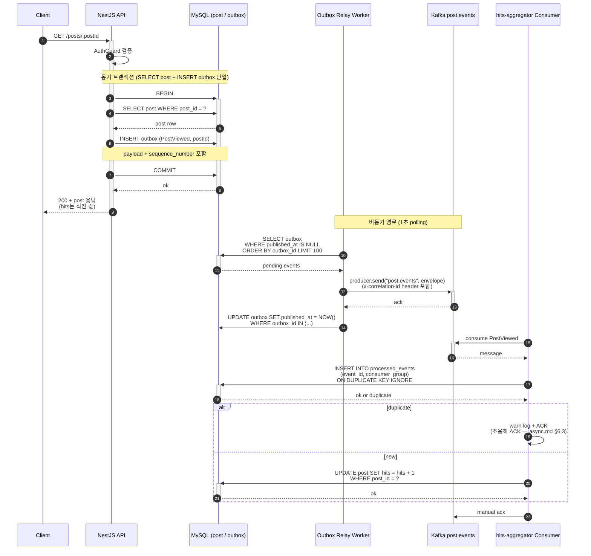
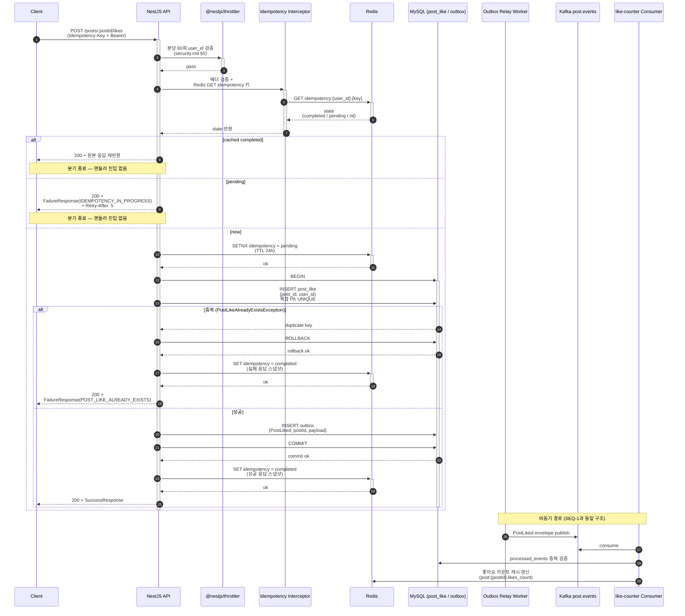
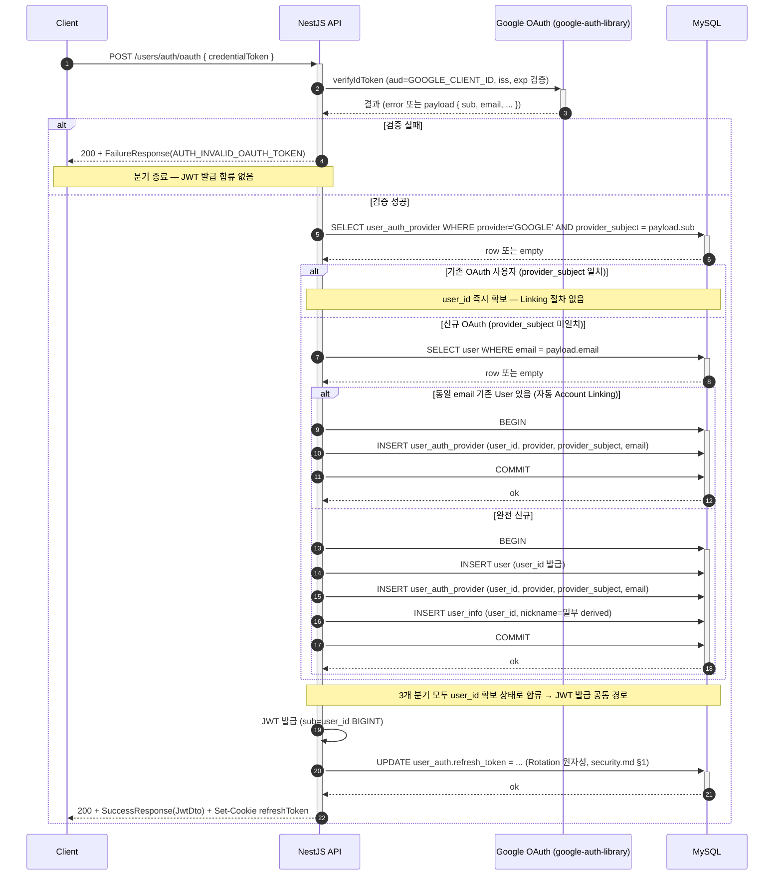
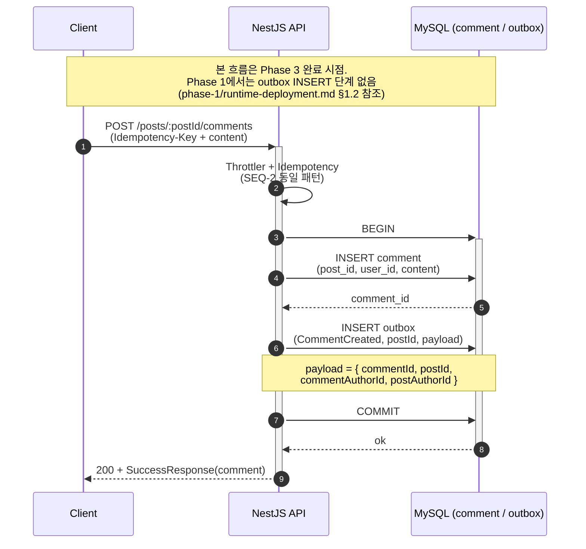
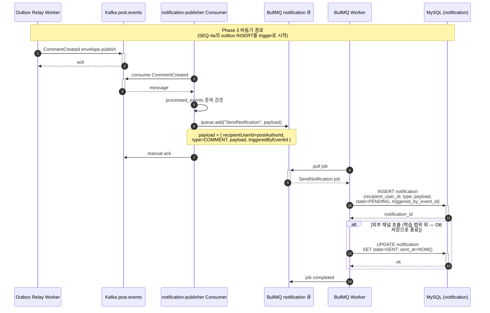
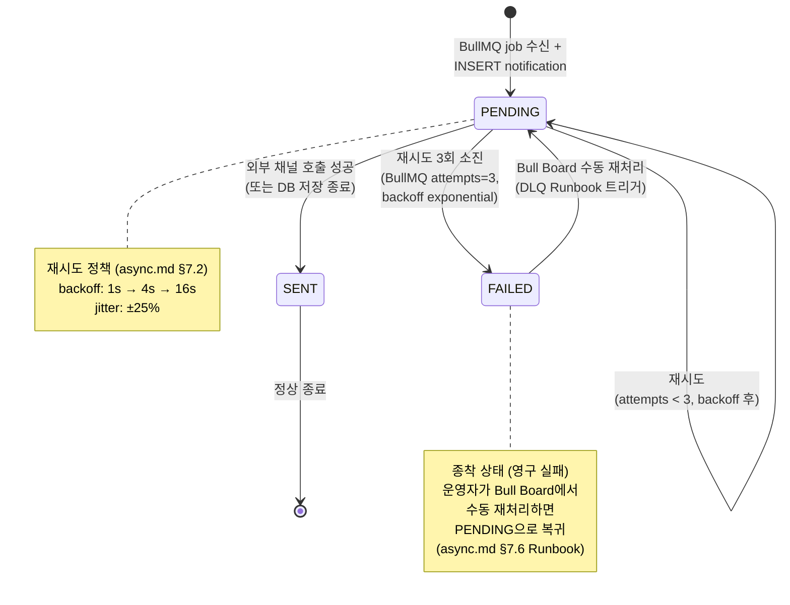
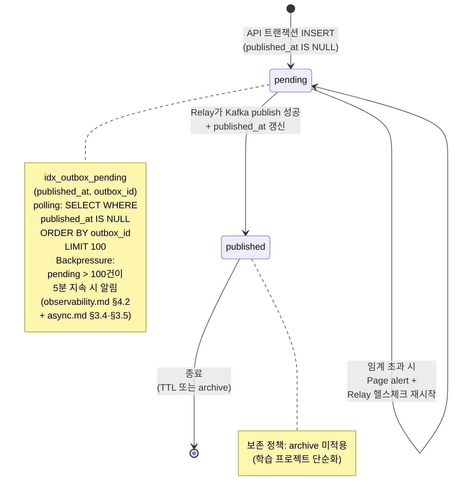

# Runtime Behavior

## 소유권 경계

이 파일은 Sequence/State Machine/Saga 흐름의 시각화(다이어그램)와 다이어그램 진단 신호 발화·매핑, 부하/장애 시뮬레이션 시나리오를 다룬다.

- Saga coordinator 정책·이벤트 카탈로그 → async.md
- Aggregate 경계·Command→Event 매핑 → application-arch.md
- ER 다이어그램·테이블 DDL → data-design.md
- 정적 도메인 규칙·State×Event 매트릭스 → problem/domain-spec.md (측면: 도메인 규칙 vs 구현 측 시간축)
- 인증/인가/감사/네트워크 흐름의 정책 → security.md / observability.md / (infra 미적용)

## 1. 표기법 선택

### [확정] 다이어그램 표기법 — Mermaid

결정: 본 파일의 모든 다이어그램은 Mermaid 사용 [확정]

근거: data-design.md §관계 모델 §ER 다이어그램(Mermaid)과의 표기법 일관성 + GitHub 자동 렌더링 공식 지원 (Mermaid v8.13+ since 2022-02) + 학습 프로젝트 단순성 (별도 PlantUML 서버/플러그인 불필요)

기각 대안:
- PlantUML — Composite State / Region / History Pseudostate 등 UML 2.5.1 표현력은 우위이나 GitHub 자동 렌더링 미지원(외부 서버 또는 IDE 플러그인 필요). 본 프로젝트 State Machine은 단순 (Composite/Region 미사용)이라 표현력 격차 무관
- ASCII art / 텍스트 다이어그램 — async.md §대표 처리 흐름도가 이미 텍스트 모델 보유. 시각적 가독성·도구 호환성 우위로 Mermaid 채택

파급 효과: 모든 다이어그램 코드 블록은 ` ```mermaid ... ``` ` 형식. 신규 다이어그램 추가 시 Mermaid 문법 준수. 향후 Composite/Region 표현 필요 시 PlantUML로 supersede 결정 가능.

## 2. 시각화 인벤토리

### Sequence Diagram ↔ Use Case 매핑

| ID | 대상 UC | 흐름 요약 | 적용 Phase |
|---|---|---|---|
| SEQ-1 | UC-5 글 상세 조회 | 동기 응답 + Outbox INSERT → PostViewed 비동기 hits 집계 | Phase 3 |
| SEQ-2 | UC-6 좋아요 | 좋아요 INSERT + Outbox INSERT → PostLiked 비동기 캐시 갱신 | Phase 3 |
| SEQ-3 | UC-3 OAuth 로그인 (Account Linking) | Google ID Token 검증 → email 기반 기존 User 탐지 → UserAuthProvider 연결 또는 신규 User 생성 | Phase 1 |
| SEQ-4 | 댓글 작성 (Phase 1 신규 UC) | Comment INSERT + Outbox INSERT → CommentCreated 비동기 notification 발행 | Phase 1 (DB 동기 부분) + Phase 3 (이벤트/큐 부분) |

단순 단일 Aggregate CRUD(글 작성/수정, 닉네임 변경 등)는 시각화 생략 — 컴포넌트 1~2개 흐름은 Sequence Diagram 가치 낮음 [가이드]. 근거: UML 2.5.1 §17 Interaction에서 흐름이 자명한 단일 노드 상호작용은 시각화 우선순위 낮음.

### State Machine ↔ Aggregate / Entity 매핑

| ID | 대상 | 시각화 사유 | 적용 Phase |
|---|---|---|---|
| STM-Notification | notification.state | PENDING→SENT/FAILED life-cycle 명확, BullMQ job 재시도와 연결 | Phase 3 |
| STM-Outbox | outbox.published_at | pending(NULL)→published(timestamp) life-cycle, Relay Worker 동작 시각화 | Phase 3 |

User/Post Aggregate는 명시적 state 컬럼 없음(CRUD life-cycle만). State Machine 시각화 대상 아님.

### Saga 흐름 시각화

해당 없음. async.md §2.1 Saga 미적용 [확정] — Forces 미존재, 모든 Write UC가 단일 Aggregate 경계 내 완결. 외부 서비스 트랜잭션 경계 부재.

## 3. 핵심 Sequence Diagram

### 3.1 SEQ-1 (UC-5 글 상세 조회 + hits 비동기 집계, Phase 3 대표)



트랜잭션 경계 결정: 옵션 (a) SELECT + INSERT outbox 단일 트랜잭션 채택. 근거: 게시글 부재(404) 시 outbox INSERT 미발생을 동일 트랜잭션 내 일관성으로 보장하고, REPEATABLE READ 격리 수준에서 SELECT 시점 post 상태를 outbox payload가 그대로 반영(읽기-쓰기 일관성).

근거: async.md §대표 처리 흐름도 §흐름 1 텍스트 모델의 시각화 + UML 2.5.1 §17 Interaction. Phase 3 진입 전까지는 hits UPDATE가 동기(data-design.md §조회수 동시성), Phase 3 진입 시 본 다이어그램 흐름으로 전환.

### 3.2 SEQ-2 (UC-6 좋아요 + 비동기 캐시 갱신, Phase 3)



근거: application-arch.md §Post Aggregate Command LikePost → PostLiked + §Idempotency Key Pattern + security.md §5·§8 정합.

### 3.3 SEQ-3 (UC-3 OAuth 로그인 — Account Linking, Phase 1 핵심)



근거: application-arch.md §Identity Separation + Account Linking [확정] + security.md §1 토큰 흐름 + data-design.md §user_auth_provider Invariant (provider, provider_subject) UNIQUE. Phase 1 핵심 시나리오로 본 다이어그램이 §3방향 리팩토링 5단계의 최종 흐름을 시각화.

### 3.4 SEQ-4 (댓글 작성 → 알림 비동기 발송, Phase 1+3 결합)

본 흐름은 참가자 8명·메시지 라벨 길이로 인해 단일 다이어그램으로 표현 시 가독성이 저하되어 (a) 동기 트랜잭션 + (b) 비동기 알림 발송 두 다이어그램으로 분할한다. 두 다이어그램은 outbox 테이블을 매개로 연결.

#### 3.4.1 SEQ-4a (Comment 작성 동기 흐름)



#### 3.4.2 SEQ-4b (Phase 3 비동기 알림 발송)



근거: async.md §대표 처리 흐름도 §흐름 2 텍스트 모델 + application-arch.md §Post Aggregate Command CreateComment → CommentCreated + data-design.md §notification 스키마 + Phase 1 phase-1/arch-increment.md (Comment 신설). Phase 1에는 INSERT comment 까지만 동기 수행(SEQ-4a 전반부), Outbox INSERT/Kafka/BullMQ 흐름(SEQ-4a 후반부 outbox 라인 + SEQ-4b 전체)은 Phase 3에서 추가 (phase-1/async-deployment.md "Phase 3 위임" 정합).

## 4. Aggregate State Machine

### 4.1 STM-Notification (Phase 3 신설)

측면 분리: 도메인 규칙 측 정적 State×Event 매트릭스는 problem/domain-spec.md (해당 시점에 작성 — 현재 problem/domain-spec.md는 User/Post Aggregate 중심이라 notification은 미작성. Phase 3 진입 시 problem 재작성으로 추가). 본 섹션은 시간축/구현 측 전이.



근거: data-design.md §notification 스키마 `state ENUM('PENDING','SENT','FAILED')` + async.md §7.2 재시도 정책 + async.md §7.6 Runbook. UML 2.5.1 §14 State Machines.

미정의 전이 처리: SENT → PENDING / FAILED → SENT 등 비정상 전이는 application-level에서 차단 (NotificationRepository에 명시적 transition 메소드만 노출). FAILED → PENDING은 다이어그램에 명시되어 있으나 Bull Board 수동 재처리 경로(DLQ Runbook)에서만 호출 가능하며 자동 트리거 없음.

### 4.2 STM-Outbox (Phase 3 신설)



근거: data-design.md §outbox 스키마 `published_at DATETIME(3) NULL` + async.md §3.4 Transactional Outbox + §3.5 Backpressure 임계 (`outbox_pending_count > 100` 5분 지속 → observability.md §4.2 알림 룰).

미정의 전이: published → pending 전이 없음. Outbox는 단방향 life-cycle. Relay Worker 장애 시 pending 상태가 누적되며 observability.md §4.2 Outbox 적체 Page 알림 발화.

## 5. Saga 흐름 시각화

미적용. async.md §2.1 Saga 미적용 [확정] 인용:

> 현재 도메인의 모든 Write UC가 단일 Aggregate 경계 내에서 완결. OAuth 가입은 User Aggregate 내부(User + UserAuth + UserInfo + UserAuthProvider 단일 트랜잭션), 글/댓글/답글/좋아요는 Post Aggregate 내부. 외부 서비스 호출이 트랜잭션 경계를 넘는 UC 부재 (Google OAuth는 ID Token 검증 후 단발 종료).

재검토 트리거: 외부 결제/이메일 서비스 도입, 멀티 BC 분화 시 별도 Phase에서 재검토.

## 6. 진단 신호 점검 결과

11종 신호(DS-01~DS-11) 점검. 신호 정의는 mcpsi-solution-runtime/references/diagnostic-signals.md 기준 (본 작성 시점에는 일반 다이어그램 진단 가이드 — Visual Paradigm Diagram Smells / Fowler "UML Distilled" 3e §17 Common Patterns 기반).

| 신호 ID | 신호 이름 | 활성 여부 | 측정값/정성 | 발화 여부 | 분류 | S-0 트리거 매핑 |
|---|---|---|---|---|---|---|
| DS-01 | 다이어그램 비대 (lifeline ≥10) | 활성 | SEQ-1~4 모두 lifeline ≤8 | 미발화 | 단계 내 | - |
| DS-02 | 시각화 누락 (cross-Aggregate인데 미작성) | 활성 | SEQ-1·SEQ-2·SEQ-4 모두 작성, UserDeleted cascade는 단순 DB-level (별도 시각화 가치 낮음) | 미발화 | 단계 내 | - |
| DS-03 | Command→Event 매핑 불일치 | 활성 | SEQ-1 PostViewed / SEQ-2 PostLiked / SEQ-4 CommentCreated 모두 application-arch.md §Post Aggregate Command→Event 매핑과 일치 | 미발화 | 단계간 (불일치 시 Aggregate 변경 트리거) | - |
| DS-04 | 상태 폭증 (State ≥7) | 활성 | STM-Notification 3상태, STM-Outbox 2상태 | 미발화 | 단계 내 | - |
| DS-05 | 미정의 전이 누락 | 활성 | STM-Notification 합법 전이(FAILED→PENDING 수동 재처리 포함) 전부 다이어그램에 명시. SENT→PENDING / FAILED→SENT 등 비정상 전이는 NotificationRepository에서 application-level 차단. STM-Outbox는 단방향 life-cycle (published→pending 없음) | 미발화 | 단계간 (도메인 규칙 누락 시 problem/domain-spec 트리거) | - |
| DS-06 | 보상 없는 외부 호출 | 활성 | Google OAuth 호출(SEQ-3)은 단발 검증 + 재시도 1회 + fallback 일반 가입 권장 (security.md §외부 서비스 회복력). 트랜잭션 경계 미초과로 보상 불필요 | 미발화 | 단계간 (외부 트랜잭션 추가 시 risk 트리거) | - |
| DS-07 | UC 분기 가독성 (Extensions ≥7) | 활성 | problem/use-cases.md UC-1~7 Extensions 평균 ≤5 (회원가입 4분기, 로그인 3분기 등). SEQ-3 OAuth 흐름의 분기 4개(검증실패/기존 OAuth/email Linking/완전 신규)는 가독성 임계 미달 | 미발화 | 단계 내 | - |
| DS-08 | 동기/비동기 혼재 | 활성 | SEQ-1·SEQ-2·SEQ-4에서 동기 응답 부분과 비동기 경로를 명시적으로 `Note over` 블록과 점선으로 구분 표기 | 미발화 | 단계 내 | - |
| DS-09 | 외부 의존 누락 | 활성 | Google OAuth 외부 의존 SEQ-3에 명시 노드 등장. Kafka/BullMQ는 자체 인프라이나 SEQ-1·2·4에 명시 | 미발화 | 단계 내 | - |
| DS-10 | SLA 임박/위반 표기 부재 | 활성 (NFR 비활성 조건 하) | NFR 비활성으로 정량 SLA 부재. 정성 임계(observability.md §4.2 알림 룰)는 다이어그램 외 별도 §6 메트릭에 위임 | 발화 (정보성) | 단계간 (NFR 활성 전환 시 problem-nfr 트리거) | Phase 4 진입 시 NFR 활성화로 자연 해소 |
| DS-11 | 부하/장애 시뮬레이션 시나리오 부재 | 활성 (적용 조건 비충족) | NFR 비활성 + Saga 없음 + 안전 중대 비해당 → 적용 조건 0건. 본 파일 §7 미작성 정당화됨 | 미발화 (정당 미적용) | 단계간 (적용 조건 충족 시 risk 트리거) | Phase 4 진입 시 NFR 활성화 시 재점검 |

발화 신호 보고:
- DS-10 (SLA 임박/위반 표기 부재) — 정보성 발화. NFR 비활성으로 인한 구조적 미작성이며 단계간 재통과 트리거 즉시 발화 없음. Phase 4 진입 시점에 problem-nfr 활성 전환으로 자연 해소 예정.

## 7. 부하/장애 시뮬레이션 시나리오

비활성. 적용 조건 0건:
- problem/nfr-qas.md 가용성 QAS-N — 비활성 (problem/overview.md §NFR 비활성 판정)
- common/async.md 핵심 Saga — §2.1 미적용
- 안전 중대 도메인 — 해당 없음 (개인 학습 프로젝트, 블로그 도메인)

Phase 4 진입 시점에 NFR 활성 전환(problem/overview.md §Phase 4 진입 시 본 판정을 활성으로 전환하고 problem-nfr 호출하여 QAS 6요소 작성 예정)되면 본 섹션 활성. k6 부하 시나리오 + 장애 주입(Chaos Mesh/Litmus는 학습 프로젝트 규모 대비 과다이므로 단순 컨테이너 다운/네트워크 지연 모의 정도) 후보.

## Core / async 재동기화 요청

요청 없음. SEQ-1~4 / STM-Notification / STM-Outbox 모두 기존 common/application-arch.md Command→Event 매핑 + common/async.md §3.4 Outbox + §6 Idempotency + common/data-design.md §notification·§outbox 스키마와 일관.

## Sources

- docs/context/{overview,domain,constraints,unknowns}.md
- docs/problem/{overview,use-cases,domain-spec,threat-model}.md (UC-1~7, Phase 1 신규 UC, NFR 비활성 판정)
- docs/solution/common/{overview,application-arch,data-design,async,security,observability}.md
- docs/solution/phase-1/{scope,arch-increment,data-migration,async-deployment,security-deployment,observability-deployment}.md
- docs/meeting-logs/2026-04-24.md (MCPSI 수립)
- ~/.claude/skills/mcpsi-solution-runtime/references/diagnostic-signals.md (11종 신호 정의)
- 방법론:
  - UML 2.5.1 §14 State Machines / §17 Interactions
  - Fowler "UML Distilled" 3rd ed. §13 Sequence Diagrams / §14 State Machine Diagrams
  - Garcia-Molina & Salem "Sagas" SIGMOD 1987 (미적용 사유 인용)
  - Mermaid 공식 문서 (sequenceDiagram, stateDiagram-v2)
