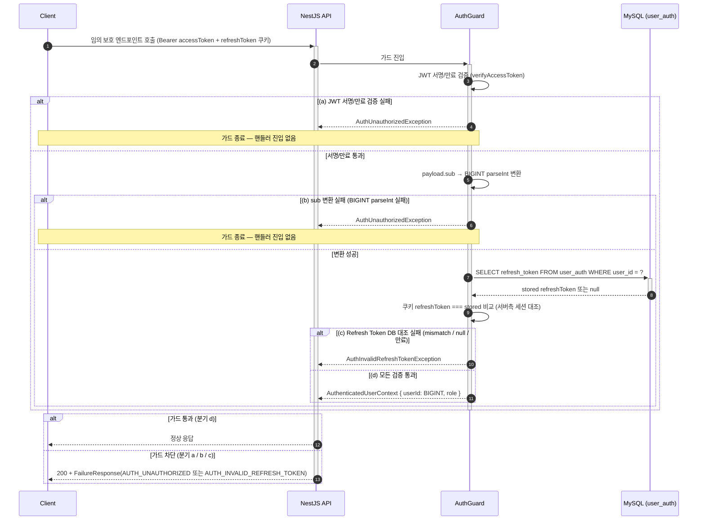
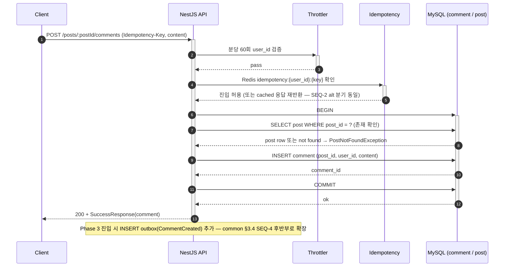

# Runtime Deployment — Phase 1

## 소유권 경계

이 파일은 Phase 1의 신규/변경 Sequence/Saga 흐름과 부하/장애 시뮬레이션 시나리오 추가/조정을 다룬다. common/runtime-behavior.md의 골격은 변경 없음 (touch 안 함).

- common/runtime-behavior.md §3.3 SEQ-3 (OAuth Account Linking)이 Phase 1 핵심 흐름이며 본 파일에서 동일 다이어그램을 재기술하지 않음. Phase 1 절차/배포 측면만 본 파일이 다룸
- Phase 3 비동기 흐름(SEQ-1·SEQ-2·SEQ-4의 Outbox→Kafka→Consumer 경로)은 Phase 3 진입 시 phase-3/runtime-deployment.md에서 활성화 절차 기술

## 1. Phase 1 신규/변경 시각화

### 1.1 신규 — 인증 흐름 재작성 (User Aggregate 재설계 후)

Phase 1에서 JWT payload sub가 uid(VARCHAR) → user_id(BIGINT)로 변경되고, 인증 자격 검증 흐름이 user_auth_provider 테이블을 경유하도록 재작성된다. 본 흐름은 common/runtime-behavior.md §3.3 SEQ-3의 일부로 시각화되어 있으나, Phase 1 배포 시 추가 검토 포인트:

Phase 1 배포 시점 검증 포인트:
- 기존 사용자가 발급받은 JWT(sub=uid VARCHAR)는 무효 → 클라이언트 재로그인 강제
- AuthGuard 코드가 sub를 BIGINT로 parseInt 처리하는지
- user_auth 테이블의 PK가 user_id BIGINT로 전환되어 SELECT 쿼리가 정합한지

### 1.2 신규 — Comment/Reply CRUD 동기 흐름 (Outbox는 Phase 3 위임)

Phase 1에서 Comment/Reply는 DB INSERT/UPDATE만 동기 수행. common/runtime-behavior.md §3.4 SEQ-4 다이어그램의 "Phase 1: 여기서 종료" 블록 이전까지가 본 Phase 범위.

Reply도 동일 패턴. Comment 수정/삭제는 IDOR 방어 Service 레이어 소유권 검증(Comment.userId === authUserId) 후 진행.

### 1.3 변경 — 기존 Post API 외래키 영향

`POST/PATCH/DELETE /posts*`, `POST/DELETE /posts/:postId/likes`는 외래키가 post_uid VARCHAR → user_id BIGINT로 변경. 흐름 자체는 동일하나 다음 코드 영향:
- DTO/Entity의 user_id 타입 변경
- IDOR 검증 비교 (Post.userId === authUserId, BIGINT 비교)
- E2E 테스트가 user_id 기반으로 fixture 재작성

별도 Sequence Diagram 미작성 (단순 외래키 타입 변경, 흐름 불변).

## 2. Phase 1 시뮬레이션 시나리오

비활성. common/runtime-behavior.md §7과 동일 사유 (NFR 비활성 + Saga 없음 + 안전 중대 비해당).

Phase 1 신규 기능(Comment/Reply/OAuth Account Linking/Rate Limiting)에 대한 부하 측정은 Phase 4 시점에 baseline + load + stress 사이클로 일괄 수행.

## 3. 진단 신호 재점검 (Phase 1 한정)

common/runtime-behavior.md §6 점검 결과 11종 신호 중 Phase 1 진입으로 인한 신호 변동:

| 신호 ID | common 결과 | Phase 1 변동 | 변동 사유 |
|---|---|---|---|
| DS-02 시각화 누락 | 미발화 | 미발화 | Phase 1 신규 흐름 4종(인증 재작성, Comment/Reply CRUD, Post 외래키 영향, OAuth Linking)이 본 파일 §1.1·§1.2 또는 common §3.3에 시각화 완료 |
| DS-03 Command→Event 매핑 불일치 | 미발화 | 미발화 | Phase 1에서 신설되는 Comment/Reply 도메인 Command(CreateComment/UpdateComment/DeleteComment/CreateReply/UpdateReply/DeleteReply)가 application-arch.md §Post Aggregate Command→Event 매핑에 사전 등재됨 |
| DS-07 UC 분기 가독성 | 미발화 | 미발화 | §1.1 인증 흐름 4분기 세분화(JWT 서명/만료 실패, sub 변환 실패, RefreshToken 대조 실패, 통과)도 임계 ≥7 미달. §1.2 Comment CRUD는 단일 분기 |
| DS-08 동기/비동기 혼재 | 미발화 | 미발화 | Phase 1은 전부 동기 흐름(Outbox INSERT조차 Phase 3 위임) — 혼재 가능성 없음. §1.2에 BEGIN/COMMIT 트랜잭션 경계 명시로 SEQ-1 보정과 일관 |
| DS-10 SLA 임박/위반 부재 | 정보성 발화 | 정보성 발화 유지 | NFR 비활성 상태 동일 (Phase 4 진입 시 해소) |
| DS-11 시뮬레이션 부재 | 미발화 (정당) | 미발화 (정당) | 적용 조건 0건 유지 |

신규 발화 없음. Phase 1 진입으로 인한 단계간 재통과 트리거 발화 없음.

## 4. Phase 1 종료 시 점검 권고

Phase 1 종료 시점(20건 작업 단위 머지 완료)에 다음 항목 재점검:
- common/runtime-behavior.md §3.3 SEQ-3 (OAuth Account Linking) 실제 구현이 다이어그램과 일치하는지
- common/runtime-behavior.md §3.4 SEQ-4의 Phase 1 부분(comment INSERT)이 다이어그램과 일치하는지
- 인증 흐름 E2E 테스트가 §1.1 다이어그램 흐름 전수 커버
- IDOR 방어가 §1.2 패턴으로 Service 레이어에서 강제됨

불일치 발견 시 Type B 회고 블로그 소재로 기록 또는 common/runtime-behavior.md supersede 절차 진행.

## Sources

- ../common/runtime-behavior.md (전체 골격)
- ../common/application-arch.md §3방향 리팩토링 (User Aggregate Refactoring Towards Patterns)
- ../common/data-design.md §스키마 (Phase 1 신설 user/user_auth_provider/comment/reply)
- ../common/security.md §2.2 IDOR 방어 / §5 Rate Limit / §7 로그인 실패 / §8 Idempotency
- scope.md, arch-increment.md, data-migration.md, async-deployment.md, security-deployment.md, observability-deployment.md
