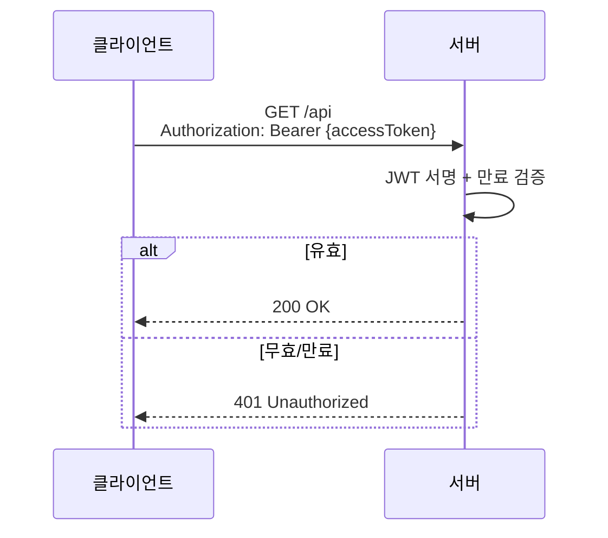
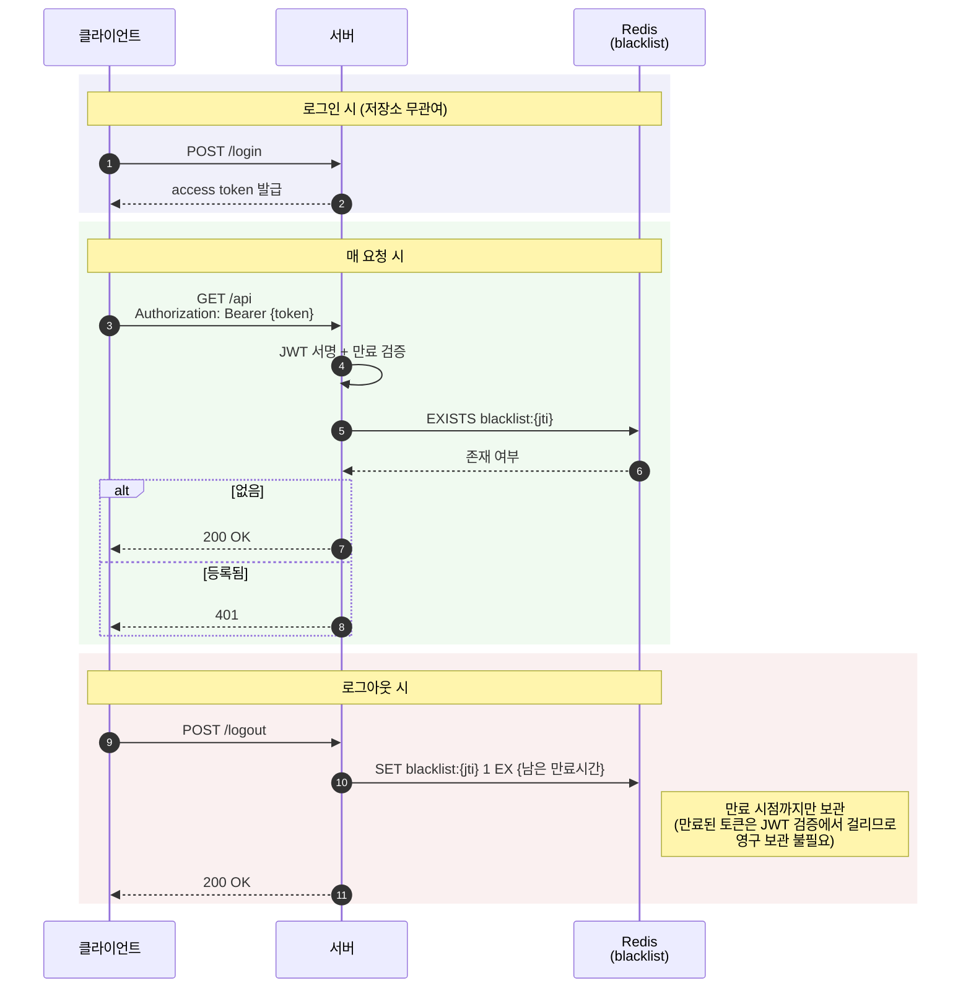
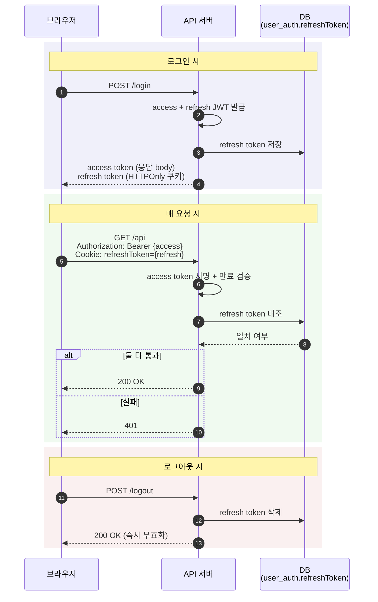
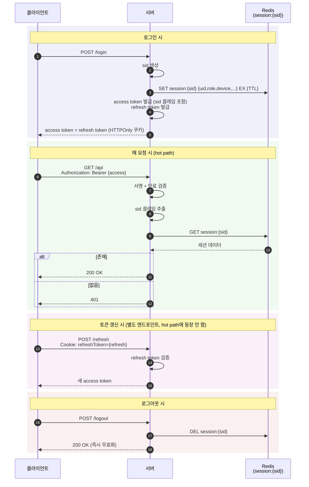
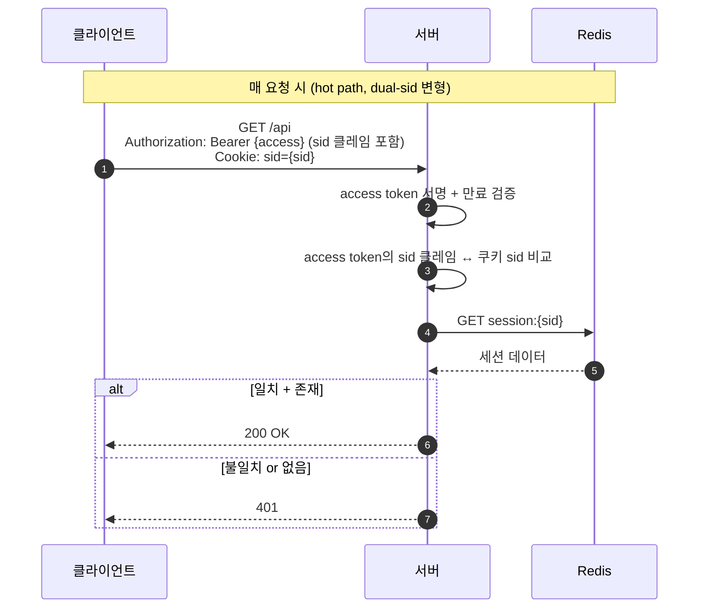

# 토큰 검증 전략 비교

## 개요

JWT 기반 인증에서 access token만으로는 즉시 세션 무효화가 불가능한 한계가 있다. 이를 보완하는 세 가지 전략을 비교한다.

배치 순서는 토큰 보완 방식의 발전 흐름을 따른다. 가장 단순한 발상(블랙리스트)에서 시작해, "항상 서버 측 값을 대조한다"는 발상 전환(Refresh Token 검증)을 거쳐, "세션을 1급 엔티티로 분리한다"는 구조적 발상(Allowlist)으로 나아간다. 본 프로젝트는 두 번째 단계를 채택했고, 이 글은 그 근거와 다음 단계로의 진화 경로를 함께 정리한다.

## Access Token만 사용하는 표준 방식의 한계

표준 JWT 인증 흐름은 stateless하다. 서버는 access token의 서명과 만료만 검증하며, 별도 저장소를 조회하지 않는다.



이 방식의 근본적인 문제는 **발급된 토큰을 즉시 무효화할 수 없다**는 것이다.

| 시나리오 | 기대 동작 | 실제 동작 |
|---|---|---|
| 사용자 로그아웃 | 즉시 접근 차단 | 만료까지 토큰 유효 |
| 비밀번호 변경 | 기존 세션 무효화 | 기존 토큰으로 계속 접근 가능 |
| 관리자 계정 차단 | 즉시 차단 | 만료까지 API 호출 가능 |
| 권한 변경 | 즉시 반영 | 토큰 내 클레임이 만료까지 유지 |

access token 만료 시간을 짧게(5~15분) 설정하여 위험 노출 구간을 줄일 수 있지만, 그 시간 동안은 여전히 노출된다.

## 용어 정리

본문에서 사용하는 기술 용어들을 먼저 짧게 정의한다.

| 용어 | 의미 |
|---|---|
| Hot path | 매 요청마다 반드시 거치는 핵심 처리 경로. 성능에 직접 영향을 미치는 구간 (예: 인증 검증) |
| Fast path / Slow path | 흔한 정상 케이스를 빠르게 처리하는 경로(fast)와 예외/에러 케이스를 처리하는 경로(slow)의 구분. Hot path는 보통 fast path와 일치 |
| Cache-aside (Look-aside) | 애플리케이션이 캐시를 먼저 조회하고, miss 시 DB에서 읽어 캐시에 채워두는 패턴. Redis 같은 캐시를 DB 앞단에 두는 흔한 방식 |
| JS 접근 가능 토큰 | JavaScript 코드(브라우저 런타임)에서 읽을 수 있는 위치에 보관된 토큰. 예: 메모리 변수, localStorage, sessionStorage, Authorization 헤더에 실어 보내기 위해 JS가 보유한 값 |
| HTTPOnly 쿠키 | 브라우저가 HTTP 요청에 자동 포함시키지만 JavaScript에서는 읽을 수 없도록 표시된 쿠키. XSS로 자바스크립트가 탈취해도 못 가져감 |
| IDP (Identity Provider) | 인증을 전담하는 별도 서버/서비스. 여러 서비스가 동일 사용자 인증을 공유해야 할 때(SSO) 인증을 한 곳에서 처리하고 다른 서비스들은 그 결과를 받아 사용. 예: Google 로그인, Auth0, Keycloak |
| MSA (Microservice Architecture) | 하나의 애플리케이션을 여러 작은 서비스로 분리한 아키텍처. 서비스 간 사용자 인증 공유 문제가 흔히 발생 |
| SSO (Single Sign-On) | 한 번 로그인하면 여러 서비스를 추가 로그인 없이 사용할 수 있는 방식 |
| Replay 공격 | 정상 요청을 가로채 그대로 재전송해서 같은 효과를 얻으려는 공격 |
| Step-up 인증 | 평소엔 약한 인증(토큰)으로 통과시키고, 민감 작업 시 강한 인증(OTP, FIDO 등)을 추가 요구하는 방식 |
| sid (session id) | 세션을 식별하는 고유 ID. Allowlist 모델에서 세션 저장소의 키로 사용 |
| CSRF (Cross-Site Request Forgery) | 사용자가 의도하지 않은 요청을 다른 사이트에서 자동 전송시키는 공격. 쿠키 기반 인증의 주요 위협 |
| First-party 쿠키 | 사용자가 현재 접속한 도메인 자체가 설정한 쿠키. 예: example.com 방문 시 example.com이 발급한 쿠키. 외부 도메인이 설정한 third-party 쿠키와 구분되며, 브라우저들이 third-party 차단 추세에서도 first-party는 정상 동작 |
| Third-party 쿠키 | 현재 접속한 사이트에 임베드된 외부 도메인이 설정한 쿠키. 예: example.com 안의 ads.tracker.com이 설정한 쿠키. Safari ITP, Firefox ETP, Chrome 단계적 차단 정책의 대상 |
| BFF (Backend-for-Frontend) | 프론트엔드 전용 백엔드 계층. 브라우저와 백엔드 API 사이에 두어 토큰을 브라우저 대신 서버 측에서 관리. 현대 OAuth2 브라우저 앱 가이드의 권장 패턴 |

## 전략 1: 블랙리스트 (Denylist)

무효화된 토큰만 등록하고, 매 요청마다 블랙리스트에 없는지 확인하는 방식이다.



블랙리스트에 등록되는 시점:

| 시점 | 동작 |
|---|---|
| 로그아웃 | 현재 access token의 jti를 등록 |
| 비밀번호 변경 | 해당 사용자의 기존 토큰을 등록 |
| 관리자 강제 차단 | 해당 사용자의 토큰을 등록 |

**한계**: 등록 전까지는 탈취된 토큰이 유효하다. 이상 행동을 감지하기 전까지 서비스가 위험에 노출된다.

이 한계는 "무효화된 것만 골라 등록한다"는 발상의 본질적 약점이다. 이를 "항상 서버 측 값을 대조한다"는 발상 전환으로 푸는 것이 다음 두 전략이다.

## 전략 2: Refresh Token 서버 측 검증

매 요청마다 refresh token을 서버 저장소의 값과 대조하는 방식이다. refresh token이 세션 식별자 역할까지 겸한다.



refresh token은 HTTPOnly 쿠키에 저장되므로 XSS로 접근할 수 없다. access token이 탈취되어도 refresh token 없이는 API 호출이 불가능하다. Token Rotation 적용 시 갱신마다 자동으로 검증 키가 변경되어 replay 공격을 봉쇄한다.

### 현 구현 상태 (캐시 적용 여부)

본 프로젝트의 현재 구현은 매 요청마다 `user_auth.refreshToken` 컬럼을 DB에서 직접 조회한다. Redis 같은 캐시는 끼어 있지 않다.

이 글에서 "Refresh Token 검증 방식은 cache-aside를 동반한다"는 일반화는 하지 않는다. 캐시 도입 여부는 성능 최적화 결정이며, Refresh Token 검증의 본질("서버 측 저장값 대조")과 직교한다. 동일한 저장값을 DB에서 읽든 Redis에서 읽든 검증 알고리즘 자체는 그대로다. 캐시는 §"이 프로젝트의 선택과 진화 경로"에서 진화 옵션으로 다룬다.

### 이 방식의 구조적 한계

이 방식이 잘 작동하는 조건은 **"1 user = 1 session"** 가정이다. refresh token이 사용자 테이블의 컬럼 1개에 저장되는 본질이 이 가정을 강제한다.

```
USER_AUTH 테이블
+------+-------------+
| uid  | refreshToken|
+------+-------------+
| 123  | "rt_abc..."  |  ← 슬롯 1개
+------+-------------+
```

가정이 깨지는 트리거는 다음 세 가지다.

**1. 멀티 디바이스 동시 로그인**

PC에서 로그인 후 모바일에서 다시 로그인하면, refreshToken 컬럼이 새 값으로 덮어쓰기된다. PC가 다음 요청을 보내면 자신이 보유한 refresh token이 DB의 새 값과 일치하지 않아 즉시 로그아웃된다. 슬롯이 1개라서 두 디바이스가 공존할 수 없다.

**2. 다중 서비스 세션 공유**

인증 도메인 외 다른 서비스(예: 알림 서비스, 검색 서비스)가 세션 유효성을 확인하려면 user 테이블의 refreshToken 컬럼을 읽어야 한다. 이는 인증 도메인과 다른 도메인의 강결합을 만든다. MSA 환경에서 이 강결합은 운영 부담이 된다.

**3. 권한 변경 즉시 반영**

JWT 페이로드에 role이 박혀 있으면, 권한이 변경되어도 토큰 만료까지 옛 role이 유지된다. refresh token 방식에서는 이 lag을 줄이려면 강제 로그아웃(refresh token 삭제) 외에는 방법이 없다.

이 세 가정이 모두 유효하면 refresh token 방식이 단순하고 충분하다. 어느 하나라도 깨지는 시점이 오면, user 테이블 컬럼을 다중 슬롯으로 확장해야 하고, 결국 별도 세션 테이블이 필요해진다. 그 시점에 도달하는 것이 다음 전략(Allowlist)이다.

## 전략 3: Allowlist (sid 모델)

Allowlist는 유효한 세션만 허용하는 방식이다. 본질은 **세션을 사용자와 별개의 1급 도메인 엔티티로 분리**하는 데 있다. 메커니즘 자체보다 이 구조적 결정이 핵심이다.

### 발상 전환: 세션을 1급 엔티티로 분리

Refresh Token 방식이 "사용자 행에 세션 슬롯 1개를 추가"하는 구조라면, Allowlist는 **사용자와 별개로 session 엔티티를 둔다.**

```
Refresh Token 방식 (1 user = 1 session 가정):
  USER_AUTH
  +------+-------------+
  | uid  | refreshToken|
  +------+-------------+

Allowlist 방식 (1 user = N sessions):
  USER (인증 식별만 담당)
  +------+
  | uid  |
  +------+

  SESSION (세션 자체가 별도 엔티티, 보통 Redis)
  +------+------+------------+----------------------+
  | sid  | uid  | refreshToken| metadata (device, ...)|
  +------+------+------------+----------------------+
  | s1   | 123  | "rt_abc"    | { device:"PC", ... }  |
  | s2   | 123  | "rt_xyz"    | { device:"Mobile",... }|
  +------+------+------------+----------------------+
```

이 분리가 만드는 변화가 Allowlist 모델의 모든 이점의 원천이다.

### 세션을 1급 엔티티로 분리할 때 생기는 특징

세션이 사용자와 분리된 독립 객체가 되면 다음 네 가지 특징이 자연스럽게 생긴다.

| 특징 | 설명 |
|---|---|
| 다중 슬롯 | 한 사용자가 여러 세션을 동시 보유 가능. sid가 디바이스/접속 단위로 발급됨 |
| 메타데이터 보유 | 세션 단위로 컨텍스트(디바이스, 로그인 시각, 마지막 활동 시각, 권한 스냅샷, IP 등) 부착 가능 |
| 외부 공유 가능 | 세션 저장소가 별도 인프라(Redis/IDP)이므로 여러 서비스가 동일 인터페이스로 접근 가능 |
| 독립적 라이프사이클 | 사용자 라이프사이클(가입/탈퇴)과 세션 라이프사이클(로그인/로그아웃)이 분리됨 |

### 특징을 활용한 기능들

위 네 가지 특징이 다음 기능들을 자연스럽게 가능하게 만든다.

**다중 슬롯 활용**
- 멀티 디바이스 동시 로그인 (PC + 모바일 + 태블릿)
- "내 활성 세션 목록" UI (GitHub Settings → Sessions, Google 계정 활동)
- "다른 디바이스에서 로그아웃" 기능 (해당 sid만 삭제, 현재 세션은 유지)
- "최대 N대 동시 로그인" 정책 (Netflix 4대 제한 같은 구현)

**메타데이터 활용**
- 운영/감사 추적 ("이 사용자가 언제 어디서 로그인했는가")
- 권한 즉시 반영 (sid 메타데이터의 role을 갱신하면 다음 요청부터 새 권한 적용)
- 위험 신호 입력 (risk-based authentication의 신호로 활용 — 차단 조건이 아니라 step-up 트리거)

**외부 공유 활용**
- MSA에서 여러 서비스가 동일 sid로 세션 검증
- SSO/IDP 패턴 (한 번 로그인하면 여러 서비스 사용 가능)
- Token introspection (RFC 7662)으로 다른 서비스가 IDP에 위임 검증

**독립 라이프사이클 활용**
- 세션 단위 강제 종료 (사용자 계정은 살아 있지만 특정 세션만 무효화)
- 정책별 세션 만료 (관리자 세션은 짧게, 일반 사용자 세션은 길게)

### 메커니즘

Allowlist 메커니즘에는 두 가지 변형이 있다. **표준 Allowlist**(sid를 JWT 클레임에만 두는 일반적인 형태)와 **Dual-sid 변형**(sid를 HTTPOnly 쿠키에도 별도로 두는 defense-in-depth 형태).

**표준 Allowlist (가장 흔함)**



여기서 중요한 차이는 **refresh token이 매 요청 hot path에 등장하지 않는다**는 점이다. 세션 식별의 책임은 sid가 가져가고, refresh token은 access token 갱신용 보조 도구로 역할이 축소된다. 이 점이 Refresh Token 방식과의 구조적 차이를 만든다.

**Dual-sid 변형 (XSS defense-in-depth)**

표준 Allowlist에서 XSS로 access token이 탈취되면 만료까지 API 호출이 가능하다(이는 모든 JWT 시스템의 공통 한계). 이를 추가로 막으려는 변형이 sid를 HTTPOnly 쿠키에도 별도 발급하는 방식이다.



이 변형은 access token만 새도 HTTPOnly 쿠키가 빠져나가지 않으면 통과 불가하게 만든다. 본 프로젝트의 Refresh Token 검증 방식과 방어 모델이 수렴하는 지점이 바로 이 변형이다. 표준 Allowlist는 매 요청에 JS 접근 가능 토큰(access token)만 보므로 XSS 노출 면이 본 프로젝트 방식보다 넓다.

### sid를 어디에 둘 것인가 (JWT 클레임 vs HTTPOnly 쿠키)

Allowlist를 채택했다면 sid는 어딘가에 보관되어야 한다. 어디에 둘지는 두 가지 옵션이 있고, **두 옵션의 XSS 방어 강도는 동등하지 않다.**

| | sid를 JWT 클레임에만 (표준 Allowlist) | sid를 HTTPOnly 쿠키에 (dual-sid 변형) |
|---|---|---|
| XSS로 access token 탈취 시 | API 호출 가능 (access token 만료까지) | API 호출 원천 불가 (쿠키의 sid를 못 가져옴) |
| CSRF 부담 | 없음 (Authorization 헤더 기반) | 있음 (SameSite=strict 또는 CSRF 토큰 필요) |
| 클라이언트 복잡도 | 토큰 하나 | 토큰 + 쿠키 동기 관리 |
| 방어 강도 | 약함 — access token TTL이 1차 방어선 | 강함 — XSS로 access token이 새도 즉시 차단 |

순수 XSS 방어 관점에서는 **dual-sid가 엄격히 우월하다.** access token만으로는 통과 불가하게 만들기 때문에 XSS로 토큰이 탈취돼도 API 호출 자체가 막힌다.

### 그럼 왜 표준 Allowlist는 sid를 JWT 클레임에만 두나

답은 "안전성 동등"이 아니라 **실용적 트레이드오프**다. 표준 Allowlist 패턴은 다음 이유로 sid를 JWT 클레임에만 두는 선택을 받아들인다.

1. **단순성** — 클라이언트가 별도 쿠키를 관리하지 않음. OAuth2의 conceptual 단순성과 일치
2. **짧은 access token TTL이 1차 방어선** — OAuth2 표준 권장은 access token을 5-15분으로 짧게. "XSS는 완전 방어 불가, 노출 창을 줄이는 게 합리적"이라는 사고
3. **쿠키 패턴의 CSRF 부담 회피** — HTTPOnly 쿠키 도입은 SameSite=strict나 CSRF 토큰 도입을 함께 요구
4. **현대 OAuth2 BCP는 더 강한 방향으로 이동** — OAuth 2.0 for Browser-Based Apps 가이드는 **BFF (Backend-for-Frontend) 패턴 + HTTPOnly 세션 쿠키**를 권장. "브라우저에 JWT를 보관하는 것 자체가 XSS 위험이므로, 브라우저에는 first-party 세션 쿠키만 두고 JWT는 BFF가 서버 측에서 관리하자"는 방향

즉 JWT-only Allowlist는 **historical/pragmatic 선택**이지 XSS 방어 측면의 optimal 선택은 아니다. 더 강한 방어가 필요하면 dual-sid 또는 BFF 패턴으로 옮겨가는 것이 현대 가이드다.

### 참고: BFF 패턴은 더 강한 방향

이전 절 item 4에서 언급한 BFF (Backend-for-Frontend) 패턴은 브라우저에 JWT 자체를 보관하지 않고 first-party HTTPOnly 세션 쿠키만 두는 architecture 패턴이다. XSS로 토큰 자체를 탈취할 수 없게 만들어 본 문서에서 다룬 어떤 토큰 보관 패턴보다도 강한 방어를 제공한다. 자세한 설명과 본 프로젝트와의 관계는 [BFF 패턴과 first-party 쿠키](./bff-pattern-and-first-party-cookies.md) 참조.

### identifier vs credential 비대칭

위에서 다룬 sid의 "JWT 클레임에 둘 수 있는 옵션"은 sid가 **identifier(식별자)** 이기 때문에 가능하다. refresh token이 그 옵션을 갖지 못하는 이유와 대비된다.

| 구분 | refresh token | sid |
|---|---|---|
| 본질 | 새 access token을 발급받을 수 있는 자격증명 (credential) | 서버 상태(Redis 세션)를 가리키는 포인터 (identifier) |
| 단독 보유로 가능한 일 | 새 access token 발급 (Rotation 시 sliding window로 사실상 무한 연장) | 없음 — 새 access token을 만들려면 서버만 가진 JWT 서명 키가 필요 |
| access token과 함께 노출된 경우 추가 피해 | 큼 — 공격자가 새 access token을 무한 발급받아 access token 만료를 우회 | 작음 — 어차피 access token 자체로 API 호출 가능하므로 추가 권한 없음 |
| JWT 클레임에 둘 수 있는가 | 불가 — 추가 공격 벡터(만료 우회) 발생 | 가능 — marginal 위험 증가 작음 |

**이 비대칭은 "sid가 JWT 클레임에 있을 때 안전하다"를 의미하지 않는다.** 단지 "sid는 JWT 클레임에 두는 옵션이 존재한다(refresh token은 그 옵션조차 없다)"는 의미다. sid를 JWT 클레임에 둘지 HTTPOnly 쿠키에 둘지의 선택은 위의 §"sid를 어디에 둘 것인가"에서 다룬 트레이드오프에 따른다.

### 메타데이터의 실제 용도 (매 요청 차단 vs 위험 신호)

sid에 메타데이터를 부착했다고 해서, 매 요청마다 메타데이터를 헤더와 비교해 차단 조건으로 쓰는 건 표준 패턴이 아니다.

- **User-Agent 비교**: 브라우저 자동 업데이트만 돼도 값이 바뀜 → 정상 사용자가 강제 로그아웃
- **IP 비교**: 모바일이 셀룰러 ↔ Wi-Fi 전환만 해도 변경. VPN, 사내망 NAT 등도 마찬가지
- **둘 다 위조 가능**: 공격자가 토큰을 탈취했다면 헤더도 같이 복제 가능 → 실질적 방어력 약함

매 요청 hot path는 단순히 "sid가 Redis에 존재하는가"만 확인한다. 메타데이터의 1차 용도는 다음 두 가지다.

**1. 운영/감사/UX** — 활성 세션 목록, 다른 디바이스 로그아웃, 감사 로그 등 사용자/관리자 인터페이스용
**2. 위험 신호 입력** — 별도 risk engine에서 비정상 패턴 감지 시 step-up 인증을 트리거하는 신호로 활용. 차단이 아니라 추가 검증 요청

Google이 "새 디바이스에서의 로그인이 감지되었습니다" 메일을 보내는 게 두 번째 패턴이다. 차단이 아니라 사용자 알림 + 필요 시 step-up.

### sid 모델이 정당화되는 조건

sid 모델은 "대규모 트래픽"이라서 도입하는 게 아니다. 결정 변수는 트래픽이 아니라 **기능 요구 + 아키텍처 형태**다.

다음 중 하나라도 Yes면 sid 모델이 가치를 갖는다.

- 멀티 디바이스 동시 로그인 지원이 필요한가
- 다중 서비스/도메인이 동일 사용자 세션을 공유해야 하는가 (MSA/SSO)
- 세션 단위 audit/감사 추적이 비즈니스 요구인가
- 권한 변경의 즉시 반영이 필요한가 (SaaS의 B2B 권한 관리 등)
- 본 시스템이 IDP 역할을 수행하는가

모두 No면 Refresh Token 방식으로 충분하다. 별도 세션 인프라를 도입할 비용 대비 이득이 작다.

## 두 방식의 본질적 수렴과 분기점

### XSS 방어 모델의 수렴 (단, dual-sid 변형에 한정)

본 프로젝트의 Refresh Token 검증 방식과 Allowlist의 **dual-sid 변형**은 다음 공통 패턴을 공유한다.

```
[JS(JavaScript) 접근 가능 토큰] + [HTTPOnly 쿠키의 서버 측 검증 키] = 통과
```

Refresh Token 방식:
- JS 접근 가능: access token (Authorization 헤더용)
- HTTPOnly: refresh token 쿠키
- 서버 측 검증: DB의 refreshToken 컬럼

Allowlist dual-sid 변형:
- JS 접근 가능: access token (sid 클레임 포함)
- HTTPOnly: sid 쿠키
- 서버 측 검증: Redis의 session:{sid}

이 두 패턴은 XSS로 access token이 탈취되어도 HTTPOnly 쿠키는 함께 빠져나가지 않으므로, 서버 측 검증값과의 대조가 깨져 즉시 차단된다는 점이 동등하다.

**중요한 단서**: 이 수렴은 **표준 Allowlist 전체가 아니라 dual-sid 변형에 한해서만** 성립한다. 표준 Allowlist는 매 요청 hot path에 JS 접근 가능 토큰(access token)만 보므로, XSS로 access token이 새면 만료까지 API 호출이 가능하다 — 이는 본 프로젝트 방식보다 XSS 노출 면이 넓다.

| XSS로 access token만 탈취 시 | 본 프로젝트 (Refresh Token 검증) | 표준 Allowlist | Allowlist dual-sid 변형 |
|---|---|---|---|
| 즉시 API 호출 가능? | 불가 (쿠키의 refresh token 없음) | 가능 (access token 만료까지) | 불가 (쿠키의 sid 없음) |

표준 Allowlist를 채택할 때 XSS 노출 구간을 줄이려면 access token TTL을 매우 짧게(5-15분) 잡는 것이 일반적 보완책이다.

### 구조적 분기점

XSS 방어 모델과는 별개로, 두 방식은 구조에서 다음 조건들에 의해 갈린다.

| 조건 | Refresh Token 방식 | Allowlist (sid) |
|---|---|---|
| 멀티 디바이스 동시 로그인 | 슬롯 1개 한계, 새 로그인이 기존 덮어쓰기 | 자연스럽게 지원 |
| 다중 서비스 세션 공유 | user 테이블 강결합 | Redis/IDP 인터페이스로 분리 |
| 세션 메타데이터 부착 | user 테이블 확장 필요 (점차 정규화 깨짐) | 세션 객체에 자연스럽게 부착 |
| 권한 변경 즉시 반영 | 강제 로그아웃 외 방법 없음 | sid 메타데이터 갱신으로 가능 |

구조적 분기는 **§"sid 모델이 정당화되는 조건"의 항목이 활성화될 때** 발생한다. 그 전까지 두 방식은 단일 사용자/단일 디바이스/단일 서비스 환경에서 기능적으로 거의 동등한 결과를 만든다.

## 전략 비교

### 보안 비교

| 항목 | 블랙리스트 | Refresh Token 검증 | Allowlist (sid) |
|---|---|---|---|
| 즉시 무효화 | 등록 후 가능 | 삭제 즉시 | 삭제 즉시 |
| 감지 전 위험 노출 | 있음 (등록 전까지) | 없음 | 없음 |
| XSS 탈취 시 | access token으로 API 호출 가능 | access token만으로 호출 불가 (HTTPOnly 쿠키의 refresh token 필요) | 표준: access token만으로 호출 가능 / dual-sid 변형: 호출 불가 |
| 저장소 장애 시 | 모든 요청 통과 (위험) | 모든 요청 거부 (안전) | 모든 요청 거부 (안전) |

### 구현/운영 비교

| 항목 | 블랙리스트 | Refresh Token 검증 | Allowlist (sid) |
|---|---|---|---|
| 저장소 데이터 | 무효화된 토큰 수 (보통 적음) | 활성 사용자 수 | 활성 세션 수 (사용자 × 디바이스) |
| 조회 비용 | EXISTS 조회 | DB row 조회 (캐시 도입 시 Redis 조회) | Redis 조회 |
| 전체 강제 로그아웃 | 개별 토큰 등록 필요 (복잡) | DB에서 해당 uid 삭제 | 해당 uid의 sid 전체 삭제 |
| 추가 인프라 | 없음 (기존 토큰에 jti 추가) | 없음 (기존 user 테이블 컬럼 활용) | 세션 저장소 + sid 발급 체계 |

### 적합한 서비스 유형

| 전략 | 적합한 경우 | 부적합한 경우 |
|---|---|---|
| 블랙리스트 | 무효화가 드문 서비스, 읽기 위주 API | 즉시 차단이 중요한 서비스 (금융, 결제) |
| Refresh Token 검증 | 단일 서비스, 1 user = 1 session 가정 유효, 추가 인프라 부담 회피 | 멀티 디바이스/MSA/SSO 요구가 있는 서비스 |
| Allowlist (sid) | 세션 관리가 기능 요구인 서비스, 멀티 디바이스/MSA/SSO | 1 user = 1 session 가정으로 충분하면 과잉 |

## 이 프로젝트의 선택과 진화 경로

이 프로젝트는 **Refresh Token 서버 측 검증** 방식을 채택했다. AuthGuard에서 매 요청마다 access token과 refresh token을 모두 검증한다.

### 채택 이유

- 기존 `UserAuthEntity.refreshToken` 필드를 활용하여 **추가 스키마 변경 없이** 세션 검증 구현
- HTTPOnly 쿠키 기반으로 XSS에 대한 **추가 방어 계층** 확보
- Token Rotation 적용으로 **replay 방어 내장**
- 블로그 서비스는 초저지연이 요구되는 대규모 서비스가 아니며, 첫 요청의 refresh token 검증 오버헤드가 허용 가능한 수준이라고 추정. 정량 측정은 Phase 0~1 단계에서 수행해 본 추정을 검증할 것

### "1 user = 1 session" 가정의 유효성

본 프로젝트는 현재 다음 모두에 해당한다.

- 단일 모놀리식 서비스 (인증 도메인이 외부에 노출되지 않음)
- 멀티 디바이스 동시 로그인 정책 부재 (1 user = 1 session으로 운영 가능)
- 권한 모델이 단순 (USER 단일 role, 변경 빈도 낮음)
- IDP 역할 미수행

이 조건들 하에서 Refresh Token 방식의 단순함이 장점으로 작용한다. 별도 세션 인프라를 도입할 만한 기능 요구가 없다.

### 진화 경로 두 가지 (독립적)

가정이 깨지는 시점이 오면 두 방향의 진화가 가능하다. 두 경로는 **독립적**이다 — 성능만 개선하고 구조는 그대로 둘 수도 있고, 구조 전환만 할 수도 있다.

**경로 1: 성능 개선 (구조 유지)**

매 요청 DB 조회가 부담되면 Redis cache-aside를 도입할 수 있다.

- Refresh Token 검증 방식은 그대로 유지
- DB의 refreshToken 컬럼을 Redis에 캐시 (TTL = refresh token 만료시간)
- 매 요청에서 Redis 먼저 조회 → miss 시 DB → Redis 채우기
- 무효화 시 DB + Redis 둘 다 삭제

이 경로는 검증 알고리즘을 바꾸지 않고 조회 비용만 줄인다. 구현 변경 범위가 작다.

**경로 2: 구조 전환 (sid 모델로 마이그레이션)**

다음 트리거 중 하나가 발생하면 sid 모델로 전환을 검토한다.

- Phase 1 이후 멀티 디바이스 정책 도입 요구
- Phase 2-3에서 다른 도메인(notification 등)이 사용자 인증을 직접 참조해야 하는 경우
- 외부 서비스 연동으로 IDP 역할 필요 시

마이그레이션 점진성:

1. user_session 테이블 신설 (또는 Redis session:{sid} 키 도입)
2. 로그인 시 sid 발급 + 기존 refreshToken 컬럼과 병행 운영
3. 신규 검증 경로 단계적 전환
4. 기존 refreshToken 컬럼 제거

본 프로젝트의 현 단계는 경로 1조차 적용 전이다. Phase 0에서 성능 측정 후 필요 시 경로 1을 검토하고, Phase 1 이후 기능 요구를 보며 경로 2를 검토하는 것이 자연스러운 진화 순서다.

## 본 프로젝트에서 고려할 수 있는 보안 강화 방향

추가 보안 강화가 필요해질 때 어떤 선택지가 있는지 가이드 차원에서 정리한다. 본 절은 **현재 Refresh Token 방식 위에서 적용 가능한 방안**부터 다룬다 — Allowlist 전환을 전제하지 않는다.

### 현 방식 위에서 우선 검토할 강화

지금 채택한 방식을 유지하면서 즉시/단기에 적용할 수 있는 항목들이다.

| 항목 | 현 상태 | 강화 내용 |
|---|---|---|
| Refresh Token Rotation | 이미 적용 | 갱신 시 매번 회전하여 replay 봉쇄. PR #44에서 도입 |
| Refresh Token 해시 저장 | 평문 저장 | DB 침해 시 직접 토큰 노출. 단방향 해시 저장 + 검증 시 해시 비교로 전환 가능 |
| Access Token 수명 단축 | 1시간 | 30분~15분으로 단축하면 노출 구간 축소. refresh 빈도 증가와 트레이드오프 |
| SameSite=strict 유지 | 이미 strict | refresh token 쿠키가 자동 전송되므로 CSRF 방어를 위해 strict 유지 필수 (운영 환경에서 변경하지 않도록) |
| TLS 강제 + HSTS | 운영 환경 정책에 따름 | HTTPS 미적용은 MITM에 노출. HSTS 헤더로 HTTP 다운그레이드 방지 |
| 로그인 실패 카운트 + Rate Limit | Phase 1 계획 | brute-force 방어. `@nestjs/throttler` 도입 예정 (TP6) |

이 항목들은 본 프로젝트의 현 구조 안에서 직접 적용 가능하고, MCPSI Phase 0~1 범위에서 점진적으로 다룰 수 있다.

### 같은 차원의 검증을 추가하는 것은 한계 효용이 작다

흔히 떠올리는 강화 방식 중 하나는 "검증값을 하나 더 두자"이다. 예를 들어 Refresh Token 방식에 추가로 sid를 발급해서 매 요청마다 둘 다 검증하는 형태. 이런 방식은 **한계 효용이 작다.**

이유는 두 검증값이 **같은 위협 모델**에 묶여 있기 때문이다. 둘 다 HTTPOnly 쿠키에 있다면 XSS도 둘 다 못 빼앗고, MITM은 둘 다 노출시키고, 디바이스 도난은 둘 다 함께 넘어간다. 하나가 새고 다른 하나는 안 새는 시나리오가 거의 없으므로, 추가 검증값이 막아주는 새로운 공격 벡터가 거의 없다.

진짜 보안 강화는 **다른 차원의 자산을 도입**해 공격자가 별도로 갖춰야 하는 자산을 늘리는 방향이다.

### 더 나아간 강화 방안

본 문서에서 다룬 토큰 검증 전략 영역을 벗어나, 인증 자산 자체를 더 견고하게 보호하는 패턴들이 별도로 존재한다. DPoP (토큰 키 바인딩), mTLS (디바이스 인증서 바인딩), WebAuthn/FIDO2 (하드웨어 키 step-up), Risk-based Authentication 등이 여기에 해당한다.

본 프로젝트의 현 단계에서는 §"현 방식 위에서 우선 검토할 강화"의 항목들이 비용 대비 효용이 가장 크고, 더 나아간 패턴들은 본 서비스가 다루는 데이터 민감도와 위협 모델이 더 커질 때 검토할 영역이다. 자세한 비교는 [인증 보안 강화 패턴](./authentication-hardening-patterns.md) 참조.
