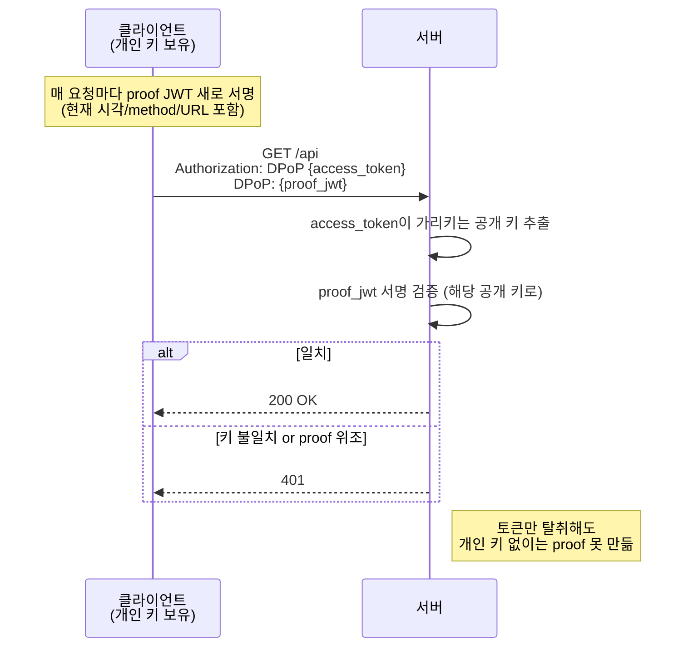
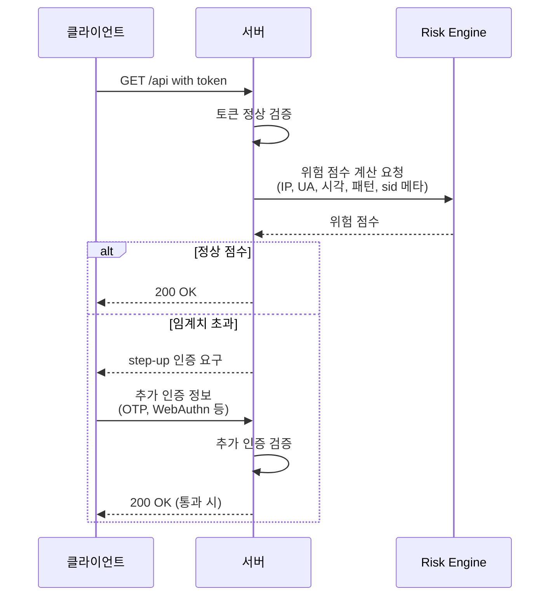

# 인증 보안 강화 패턴

> 보조 문서 / 토큰 검증 전략 비교 묶음
> 관련 메인 문서: [토큰 검증 전략 비교](./README.md)

## 이 문서의 위치

메인 문서([토큰 검증 전략 비교](./README.md))는 **이미 발급된 토큰을 어떻게 검증하고 무효화할 것인가**를 다룬다. 블랙리스트, Refresh Token 검증, Allowlist(sid) 세 전략의 트레이드오프를 비교하고 본 프로젝트의 선택을 정리한다.

이 문서는 거기서 한 단계 나아가 **토큰 자체를 더 견고하게 만들거나, 다른 자산을 추가로 요구해서 인증 강도를 높이는 패턴들**을 다룬다. 즉 토큰 검증 알고리즘과 다른 layer의 결정이다.

본 문서가 다루는 패턴들은 본 프로젝트의 현 단계에 즉시 적용할 후보가 아니다. 메인 문서 §"본 프로젝트에서 고려할 수 있는 보안 강화 방향"의 §"현 방식 위에서 우선 검토할 강화"가 즉시 적용 후보이고, 본 문서는 그보다 더 강한 환경에서 검토할 옵션들의 catalog 역할이다.

## 일반 원칙: 같은 차원 검증 누적은 효용이 작다

흔히 떠올리는 보안 강화 방식 중 하나는 "검증값을 하나 더 두자"이다. 예를 들어 Refresh Token 방식에 추가로 sid를 발급해서 매 요청마다 둘 다 검증하는 형태. 이런 방식은 **한계 효용이 작다.**

이유는 두 검증값이 **같은 위협 모델**에 묶여 있기 때문이다. 둘 다 HTTPOnly 쿠키에 있다면 XSS도 둘 다 못 빼앗고, MITM은 둘 다 노출시키고, 디바이스 도난은 둘 다 함께 넘어간다. 하나가 새고 다른 하나는 안 새는 시나리오가 거의 없으므로, 추가 검증값이 막아주는 새로운 공격 벡터가 거의 없다.

진짜 보안 강화는 **다른 차원의 자산을 도입**해 공격자가 별도로 갖춰야 하는 자산을 늘리는 방향이다. 본 문서가 소개하는 패턴들은 모두 이 원칙을 따른다 — 토큰만 탈취해서는 부족하게 만들고, 별도 자산(암호 키, 디바이스 인증서, 하드웨어 키, 또는 별개 인증 요소)이 함께 갖춰져야 통과하도록 설계한다.

일반 원칙으로 정리하면:

> 추가하는 방어가 기존 방어와 같은 공격 벡터에 묶여 있으면 의미가 작고, 독립적인 공격 벡터를 강제할 때 의미가 크다.

## 패턴 카탈로그

본 프로젝트의 현 단계에서는 과한 옵션이지만, 더 강한 보안이 요구되는 환경에서 검토할 수 있는 방향들이다.

### DPoP (Demonstrating Proof-of-Possession, RFC 9449)

토큰을 클라이언트가 보유한 암호 키에 바인딩한다. 매 요청마다 클라이언트가 보유한 개인 키로 서명한 proof JWT를 함께 전송하고, 서버는 토큰에 기록된 공개 키와 proof 서명이 일치해야 통과시킨다.

- 효과: 토큰만 탈취해도 클라이언트의 개인 키 없이는 사용 불가
- 적합 상황: 외부 API 노출, OAuth2 신규 표준을 따르는 환경
- 도입 시 주의: 클라이언트 측 키 보관 메커니즘 설계 필요. 브라우저에서는 WebCrypto + IndexedDB 등 보관 전략 결정 필요

### mTLS (Mutual TLS)

서버 인증서뿐 아니라 클라이언트 인증서까지 검증하는 TLS 핸드셰이크. 클라이언트 인증서가 디바이스에 묶여 있으면 토큰 탈취만으로는 무력화된다.

- 효과: 디바이스 단위 강한 인증. 토큰 탈취 + 인증서 탈취가 둘 다 필요
- 적합 상황: 금융권 OpenAPI, B2B 환경, 엔터프라이즈 서비스 간 통신
- 도입 시 주의: 클라이언트 인증서 발급/관리/폐기 PKI 운영 필요. 일반 사용자 대상 서비스에는 도입 부담이 큼

### WebAuthn / FIDO2

하드웨어 키(YubiKey, Titan Key 등) 또는 생체 인증(Touch ID, Windows Hello)을 기반으로 한 step-up 인증. 평소에는 토큰 기반으로 통과시키고, 민감 작업에서만 WebAuthn 인증을 추가로 요구한다.

- 효과: 토큰 탈취 + 물리적 디바이스 접근이 모두 필요해짐
- 적합 상황: 민감 작업(비밀번호 변경, 결제, 관리자 권한 사용) 시 추가 인증
- 도입 시 주의: 사용자 디바이스에 WebAuthn 등록 절차 필요. 모든 작업에 요구하면 UX 부담이 크므로 step-up 시점 정책 설계 필요. 일반적으로 "권한 상승을 동반하거나 자산 이동을 일으키는 쓰기 작업"이 step-up 후보 (계정 정보 변경, 결제 승인, 토큰/세션 발급·삭제 등)

### Risk-based Authentication

요청의 위험 점수를 별도 risk engine으로 계산하고, 임계치 초과 시 step-up 인증을 트리거한다. 위험 신호 입력으로 IP, User-Agent, 시간대, 사용 패턴, sid 메타데이터 등을 활용할 수 있다.

- 효과: 비정상 패턴 감지 시에만 추가 인증 부담. 정상 사용자 UX 영향 최소
- 적합 상황: 대형 SaaS, 보안 점수 기반 인증을 운영할 수 있는 규모. Google "새 디바이스에서 로그인이 감지되었습니다" 알림이 대표 사례
- 도입 시 주의: risk engine 구축/운영 부담. 위험 신호 false positive 관리 필요

## 본 프로젝트와의 관계

본 프로젝트의 현 단계에서는 위 네 패턴 모두 **과한 옵션**이다.

- 학습 프로젝트로 위협 모델과 데이터 민감도가 낮음
- 외부 API 노출이 없거나 제한적
- 즉시 적용 가능한 강화 항목(메인 문서 §"현 방식 위에서 우선 검토할 강화")이 비용 대비 효용이 더 크다 — refresh token 해시 저장, access token TTL 단축, HSTS, Rate Limit 등

본 서비스가 다음 방향으로 진화하면 위 패턴들이 검토 영역에 진입한다.

- 외부 API 노출이 시작되면 → DPoP 검토
- B2B/엔터프라이즈 고객 대상으로 확장되면 → mTLS 검토
- 결제/금융 기능이 추가되면 → WebAuthn step-up 검토
- 대규모 사용자 기반으로 성장하고 보안 감지 운영이 필요해지면 → Risk-based Authentication 검토

각 패턴은 별도의 도입 결정 + Type A 설계 블로그가 필요한 규모의 변화다. 본 문서는 카탈로그일 뿐 도입 결정의 결과물이 아니다.

## 참조

- 메인 문서: [토큰 검증 전략 비교](./README.md) — 본 문서가 분리된 출처
- RFC 9449 — OAuth 2.0 Demonstrating Proof-of-Possession (DPoP)
- RFC 8705 — OAuth 2.0 Mutual-TLS Client Authentication
- W3C Web Authentication (WebAuthn) Level 3 — FIDO2 표준
