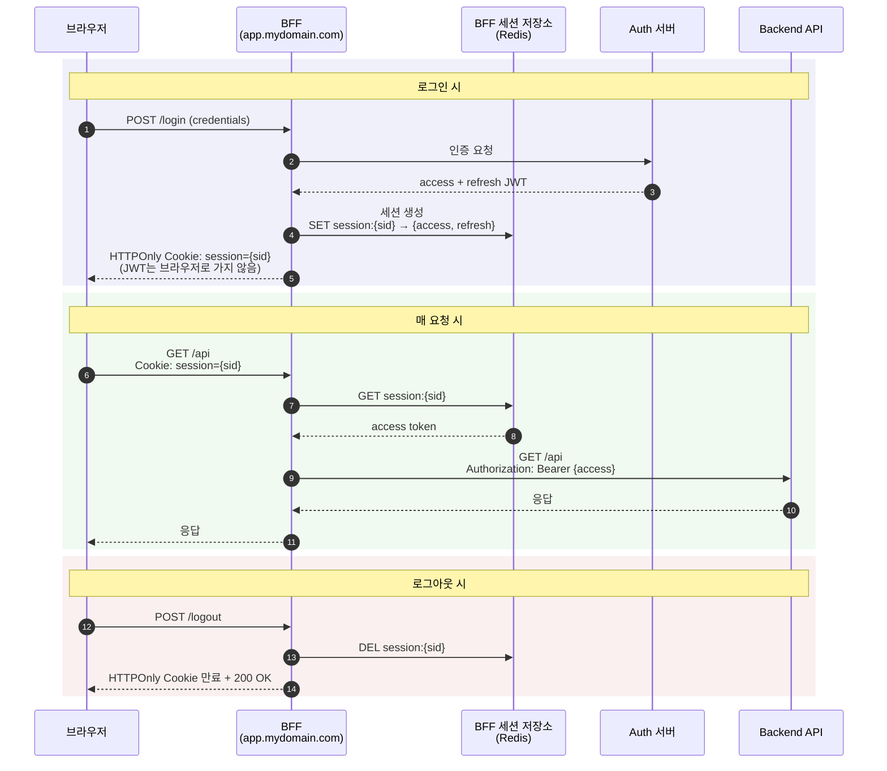

# BFF 패턴과 first-party 쿠키

> 보조 문서 / 토큰 검증 전략 비교 묶음
> 관련 메인 문서: [토큰 검증 전략 비교](./README.md)

## 이 문서의 위치

메인 문서([토큰 검증 전략 비교](./README.md))는 JWT 기반 인증에서 **어떤 토큰을 어떻게 검증할 것인가**를 다룬다. 블랙리스트, Refresh Token 서버 측 검증, Allowlist(sid) 세 전략을 비교하고 본 프로젝트의 선택 근거를 정리한다.

이 문서는 거기서 한 단계 나아가 **토큰을 브라우저에 보관할 것인가, 아니면 보관 자체를 회피할 것인가**라는 architecture 측면을 다룬다. 즉 메인 문서가 토큰 검증 알고리즘을 다룬다면, 이 문서는 토큰 보관 위치 설계를 다룬다. 다른 layer의 결정이다.

본 문서는 다음 두 가지를 정리한다.

1. **BFF (Backend-for-Frontend) 패턴** — 브라우저에 JWT를 보관하지 않는 architecture
2. **First-party / Third-party 쿠키** — 브라우저가 쿠키를 다르게 취급하는 정책과 그것이 인증 설계에 미치는 영향

## First-party 쿠키와 Third-party 쿠키

쿠키는 누가 설정했느냐에 따라 두 종류로 나뉘고, 브라우저는 둘을 다르게 취급한다.

| 종류 | 설명 | 예시 |
|---|---|---|
| First-party | 사용자가 접속한 사이트 자체가 설정한 쿠키 | example.com 방문 → example.com이 설정한 쿠키 |
| Third-party | 사이트에 임베드된 외부 도메인이 설정한 쿠키 | example.com 안의 ads.tracker.com이 설정한 쿠키 (광고 트래커) |

최근 브라우저들이 third-party 쿠키를 점진적으로 차단하는 추세다.

- **Safari ITP (Intelligent Tracking Prevention)** — 2017년부터 third-party 쿠키 격리/차단
- **Firefox ETP (Enhanced Tracking Protection)** — 기본 설정으로 알려진 트래커의 third-party 쿠키 차단
- **Chrome** — 단계적 third-party 쿠키 차단 정책 진행

First-party 쿠키는 이 차단 정책의 대상이 아니라 정상 동작한다. 인증 메커니즘이 third-party 쿠키에 의존하면(예: 외부 인증 서버 도메인의 SSO 쿠키) 브라우저 정책 변경에 따라 깨질 수 있고, first-party에 의존하면 안정적이다. 이것이 BFF 패턴이 first-party 쿠키를 명시적으로 강조하는 이유다.

## BFF (Backend-for-Frontend) 패턴

### BFF는 무엇이고 어디에 속하는가

이름 자체가 답을 담고 있다 — **Backend-for-Frontend**, 즉 "특정 frontend를 위한 backend".

토폴로지와 개념적 소유권을 분리해서 보면 정체가 명확해진다.

| 관점 | BFF의 위치 |
|---|---|
| 토폴로지 (네트워크/배포) | server-side. 별도 배포되는 백엔드 서비스 |
| 개념적 소유권 | frontend의 needs에 종속. 보통 frontend 팀이 소유 |

물리적으로는 backend의 일종이지만 존재 이유는 frontend를 섬기는 것이다. 프론트엔드 팀이 백엔드 한 조각을 자기 영역에 가져와서 운영하는 그림이다.

**일반 Backend API와의 차이**

| | 일반 Backend API | BFF |
|---|---|---|
| 설계 중심 | 도메인 (User, Order, Auth 등) | 특정 frontend (Web, Mobile, ...) |
| 클라이언트 | 여러 클라이언트가 공유 | 단일 frontend 전용 |
| 응답 형태 | 도메인 모델 그대로 | 그 frontend가 화면에 쓰기 좋은 형태로 가공 |
| 책임 | 도메인 로직, 데이터 무결성 | 다운스트림 aggregation, 토큰 관리, frontend별 어댑팅 |

같은 회사 서비스도 Web BFF와 Mobile BFF를 별도로 두기도 한다. 모바일은 데이터 절약을 위해 작은 응답, 웹은 풍부한 응답 — 같은 도메인 서비스를 다른 BFF가 다르게 묶어 제공한다.

**프레임워크 미들웨어와의 구분**

"미들웨어"라는 단어가 다의어라 혼란을 만든다.

| | 프레임워크 미들웨어 (NestJS/Express의 middleware) | BFF |
|---|---|---|
| 위치 | 한 애플리케이션의 요청 파이프라인 내 코드 | 별도 배포되는 독립 서비스 |
| 예시 | AuthGuard, LoggingInterceptor | app.mydomain.com 도메인의 별도 NestJS 인스턴스 |
| 배포 단위 | 본 애플리케이션과 함께 | 본 백엔드와 분리되어 독립 운영 |

"BFF는 미들웨어"라고 말할 때는 layer로서 "사이에 있다"는 의미이지 프레임워크 미들웨어가 아니다.

**전형적인 BFF 아키텍처**

```
브라우저 ────→ Web BFF ───┐
                          ├──→ Auth Service
모바일 앱 ───→ Mobile BFF ─┤    User Service
                          ├──→ Order Service
파트너 API ──→ Partner BFF ┘    ...
```

각 BFF가 자기 클라이언트의 needs에 맞춰 downstream 서비스들을 호출하고 응답을 가공한다. Downstream 서비스들은 BFF가 호출하는 대상이지 브라우저가 직접 호출하는 대상이 아니다.

### 역할 재배치 — 브라우저는 더 이상 Auth 서버의 클라이언트가 아니다

BFF 패턴의 본질은 단순히 계층을 추가하는 것이 아니라 **Auth 서버의 "클라이언트" 역할을 브라우저에서 BFF로 옮기는 것**이다. 이 역할 재배치가 이후 모든 보안 효과의 출발점이다.

| | 본 프로젝트 (Refresh Token 검증) | BFF 패턴 |
|---|---|---|
| Auth 서버의 클라이언트 | 브라우저 | BFF |
| JWT(access + refresh)를 받는 주체 | 브라우저 | BFF |
| JWT를 직접 다루는 주체 | 브라우저 + Backend API | BFF만 (브라우저는 토큰의 존재를 모름) |

### 각 자산이 어디에 저장되는가

| 자산 | 저장 위치 | 형태 |
|---|---|---|
| Access token (JWT) | **BFF 서버 측** (Redis/메모리) | 실제 JWT |
| Refresh token (JWT) | **BFF 서버 측** (Redis/메모리) | 실제 JWT |
| 세션 ID | 브라우저의 HTTPOnly 쿠키 | **JWT가 아닌 단순 식별자** (예: `s_a8f2k3...`) |

핵심: HTTPOnly 쿠키에 refresh token이 들어가는 게 아니다. 들어가는 것은 BFF의 세션 저장소를 가리키는 **세션 ID(단순 문자열 식별자)**다. 본 프로젝트의 refresh token 쿠키가 "토큰 자체가 HTTPOnly에 담긴" 형태라면, BFF 패턴의 세션 쿠키는 "토큰을 보관한 BFF 세션을 가리키는 핸들이 HTTPOnly에 담긴" 형태다. 둘은 본질적으로 다른 자산이다.

### 기본 흐름



요청 헤더만 떼어 본 프로젝트와 비교하면 브라우저가 보유하는 자산의 본질 차이가 드러난다.

**본 프로젝트 (Refresh Token 검증) — 매 요청**:
```
브라우저 → API 서버
  Authorization: Bearer {access_token_jwt}       ← 브라우저가 JWT 직접 보유
  Cookie: refreshToken={refresh_token_jwt}       ← 브라우저가 JWT 직접 보유 (HTTPOnly)
```

**BFF 패턴 — 매 요청**:
```
브라우저 → BFF
  Cookie: session=s_a8f2k3...                    ← 단순 식별자, JWT 아님

(BFF가 내부적으로 세션 저장소에서 JWT 조회 후 Backend API로 요청)
```

브라우저는 토큰의 존재를 모르고, 백엔드 API는 BFF로부터 토큰을 받는다. 토큰이 브라우저 컨텍스트에 한 번도 들어가지 않는다는 점이 핵심이다.

### 핵심 보안 효과

브라우저에 **JWT가 절대 들어가지 않는다.** 메인 문서에서 다룬 모든 패턴(블랙리스트, Refresh Token 검증, 표준 Allowlist, dual-sid Allowlist)은 브라우저가 access token을 보유한다는 전제 위에 있었고, 따라서 access token TTL 동안 XSS 노출이라는 한계가 존재했다. BFF 패턴은 이 전제 자체를 제거한다.

| 위협 | BFF 패턴의 방어 |
|---|---|
| XSS로 토큰 탈취 | 브라우저에 JWT 자체가 없음 → 탈취할 게 없음 |
| 쿠키 JS 접근 | HTTPOnly로 차단 |
| CSRF | SameSite=strict로 차단 |
| Third-party 쿠키 차단 정책 | 자기 도메인 발급 쿠키이므로 first-party → 영향 없음 |

XSS가 발생해도 공격자가 할 수 있는 일은 "이 사용자 세션을 빌려 BFF를 통해 API 호출"뿐이고, 그것도 **브라우저 컨텍스트 안에서만** 가능하다. 토큰을 외부로 빼내 다른 환경에서 재사용하는 시나리오가 봉쇄된다.

### 부가 이점: API 서버 격리 (gateway 패턴 일반의 이득)

BFF가 클라이언트와 API 사이에 자리하면서 발생하는 또 다른 이점은 **API 서버를 공개 네트워크에서 격리**할 수 있다는 점이다. 이는 BFF 고유의 이점이라기보다 **gateway 패턴 일반의 이득**이지만 BFF 도입 시 자연스럽게 따라온다.

전형적 구조:

```
인터넷 ──[방화벽]──→ BFF (DMZ/공개)
                       ↓
                  [내부 네트워크]
                       ↓
                  API 서버 (외부에서 직접 접근 불가)
```

| 효과 | 설명 |
|---|---|
| 공격면 축소 | API 서버가 인터넷에서 직접 도달 불가. 포트 스캔, 엔드포인트 정찰, 취약점 자동 스캔 모두 차단 |
| 보안 정책 집중 | Rate limiting, WAF, DDoS 방어를 BFF 한 곳에 적용 — 내부 API 서버마다 중복 구현 불필요 |
| 내부 API 설계 자유 | 외부 클라이언트 호환성 부담 없음. gRPC, 내부 protocol 사용 가능. 브라우저 친화 응답 포맷 강제 없음 |
| 서비스 간 신뢰 모델 단순화 | API 서버는 BFF로부터의 호출만 받음 → service-to-service 인증으로 단순화. 외부 클라이언트 다양성 고려 불필요 |

**중요한 단서 두 가지**

1. **네트워크 구성이 함께 따라줘야 효과 발현** — BFF만 배포하고 API 서버를 여전히 공개 네트워크에 두면 격리 효과는 없다. 격리는 BFF 패턴이 자동으로 주는 게 아니라 인프라 구성과 함께 설계해야 얻는 효과다.

2. **Gateway 패턴 일반의 효과** — API Gateway, reverse proxy(Nginx 등), Service Mesh ingress 같은 다른 gateway 패턴들도 같은 격리 효과를 제공한다. BFF만의 고유 이점이 아니다.

| 패턴 | API 격리 | Frontend 특화 가공 |
|---|---|---|
| Reverse Proxy (Nginx) | O | X (routing/SSL termination만) |
| API Gateway (Kong, AWS API Gateway) | O | △ (제한적 변환) |
| BFF | O | O (특정 frontend 전용 어댑팅) |

즉 격리만 원한다면 reverse proxy로 충분하다. BFF는 격리 + frontend 어댑팅을 함께 제공하는 게 차별점이다.

### BFF 도입의 이점 종합

위 두 이점을 정리하면 BFF 도입의 이득은 두 축으로 나뉜다. 본 문서는 이후 분석에서 이 두 항목을 각각 "1번 축", "2번 축"으로 부른다.

1. **1번 축 — 토큰 위치 재배치 (BFF 고유)** — 브라우저에 JWT가 없음. XSS 방어 강화. 본 문서가 주로 다룬 보안 효과
2. **2번 축 — API 서버 격리 (gateway 패턴 일반)** — 네트워크 공격면 축소, 보안 정책 집중. BFF가 자동으로 가져오는 부가 이점

본 문서는 메인 문서 §"이 프로젝트의 선택과 진화 경로"가 다루지 못한 보안 차원(브라우저 컨텍스트의 토큰 노출)을 중점적으로 다루므로 1번 축에 무게가 실린다. 그러나 BFF 도입 결정을 검토할 때는 2번 축도 비용/효용 산정에 포함해야 한다.

### 운영 부담

BFF는 강한 보안과 별도 운영 부담을 함께 가져온다.

- **별도 계층 운영** — BFF 인스턴스를 배포하고 모니터링해야 함. 단순 SPA + API 두 계층 구조에서 세 계층 구조로 확장
- **서버 측 세션 저장소** — Redis 등 세션 저장소가 운영 필수 의존성이 됨
- **세션-JWT 매핑 동기화** — BFF가 보관하는 JWT 갱신/만료를 세션 라이프사이클과 맞춰야 함

따라서 BFF는 보안 요구가 운영 부담을 정당화할 때 채택하는 패턴이다.

## 본 프로젝트와의 관계

본 프로젝트의 현재 refresh token 쿠키는 API 서버 도메인이 발급하므로 **이미 first-party**다. third-party 쿠키 차단 정책의 영향을 받지 않는다.

현 NestJS 앱은 **"브라우저를 위한 BFF" 역할까지 겸하고 있는 상태에 가깝다**. 인증 토큰 관리(refresh token DB 저장, 쿠키 발급), 응답 가공, 도메인 로직을 모두 한 layer에서 처리한다. BFF 패턴 도입은 이 책임들을 분리하는 작업이다.

```
현재:
  브라우저 → NestJS API (인증 + 도메인 로직 통합)

BFF 도입 후:
  브라우저 → Web BFF (신규, 인증/쿠키 관리) → 기존 NestJS API (도메인 서비스로 역할 변경)
```

분리 후 브라우저는 세션 ID만 보유하고 access token은 BFF 서버 측에만 존재하게 된다. 메인 문서의 §"이 프로젝트의 선택과 진화 경로"에서 다룬 두 진화 경로(성능 개선 / sid 모델 전환)와는 또 다른 축의 진화다 — 토큰 위치 자체를 재배치하는 architecture 변화.

현 단계 본 프로젝트는 BFF 도입 비용 대비 효용이 작다. 위에서 다룬 두 축의 이점 모두 현 단계에서는 절실하지 않다.

**1번 축(토큰 위치 재배치)**:
- 학습 프로젝트로 데이터 민감도가 낮음
- XSS 노출 구간은 access token TTL(1시간)에 한정되며 refresh token이 HTTPOnly로 분리되어 세션 무한 연장은 봉쇄됨

**2번 축(API 서버 격리)**:
- 단일 모놀리식 서비스이며 분리할 내부 도메인 서비스가 없음
- 학습 프로젝트로 운영 네트워크 분리(DMZ/내부망)를 정식 구성할 단계 아님

종합하면 단일 layer 구조의 단순함이 두 축의 이득보다 가치가 큰 상태다.

미래에 본 서비스가 다음과 같이 변할 때 BFF 도입이 검토 영역에 진입한다.

- 외부 사용자에게 공개되는 운영 서비스로 전환 (1번, 2번 모두 가치 상승)
- 민감 데이터(결제, 개인정보) 처리 비중 증가 (1번 가치 상승)
- 도메인 서비스 분리 또는 마이크로서비스 전환 (2번 가치 상승)
- XSS 방어를 access token TTL 단축이나 sid dual-binding으로 충분히 못 한다고 판단되는 시점 (1번 가치 상승)

## 참조

- 메인 문서: [토큰 검증 전략 비교](./README.md) — 본 문서가 분리된 출처
- OAuth 2.0 for Browser-Based Apps (IETF draft) — BFF 패턴 권장의 원천
- Safari ITP, Firefox ETP, Chrome 쿠키 정책 — third-party 차단 추세의 배경
